---
lab:
    title: '랩 1 - Azure AD Privileged Identity Management'
    module: '모듈 1: ID 및 액세스 관리'
---

# 모듈 1: 랩 1 - Azure AD Privileged Identity Management


**시나리오**

이 랩에서는 Azure PIM(Privileged Identity Management)을 사용하여 JIT(Just-in-Time) 관리를 사용하도록 설정하고 권한 있는 작업을 수행할 수 있는 사용자 수를 제어하는 방법을 알아봅니다. 그리고 사용 가능한 여러 디렉터리 역할과, PIM을 비롯한 최신 기능을 리소스 수준의 역할 할당으로 확장하는 방법도 알아봅니다. 이 랩에 포함된 단원은 다음과 같습니다.

- PIM 시작
- PIM 보안 마법사
- 디렉터리 역할용 PIM
- 역할 리소스용 PIM

✔️ ID 관리 과정에서도 Azure RBAC 및 Azure Active Directory에 대해 설명합니다. 과정 뒷부분의 내용을 쉽게 이해할 수 있는 상황 정보를 더 자세히 파악할 수 있도록 이 랩에도 해당 내용이 포함되었습니다.


## Azure AD Privileged Identity Management

## 연습 1 - Azure 리소스 검색 및 관리

### 태스크 1: 랩 설정


이 랩을 진행하려면 PIM에 사용할 사용자를 만들어야 합니다.


1.  **Azure Portal** 에서 **PowerShell** 모드로 **Cloud Shell** 을 엽니다. 메시지가 표시되면 **스토리지 만들기** 를 클릭합니다.

1.  다음 PowerShell 명령을 실행하여 기본 도메인에 AD 사용자 및 암호를 만듭니다.

    ```powershell
    $PasswordProfile = New-Object -TypeName Microsoft.Open.AzureAD.Model.PasswordProfile
    ```
    ```powershell
    $PasswordProfile.Password = "Pa55w.rd"
    ```
    ```powershell
    $domainObj = get-azureaddomain
    ```
    ```powershell
    $domain = $domainObj[0].name
    ```
    ```powershell
    New-AzureADUser -DisplayName "Isabella Simonsen" -PasswordProfile $PasswordProfile -UserPrincipalName "Isabella@$domain" -AccountEnabled $true -MailNickName "Isabella"
    ```
### 태스크 2:  Azure AD Premium P2 평가판을 사용하도록 설정하고 테스트 사용자 만들기

1.  Azure Portal의 허브 메뉴에서 **Azure Active Directory** 를 클릭합니다.

1.  **관리** 에서 **라이선스** 를 선택합니다.

    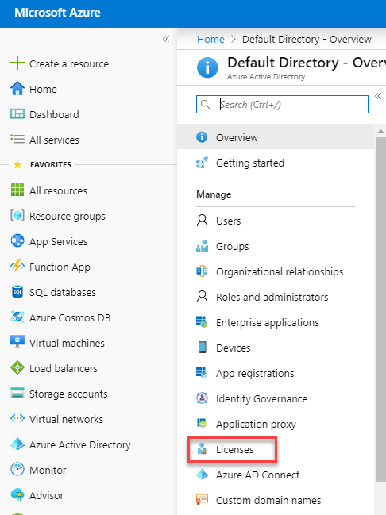

1.  **모든 제품** 을 선택합니다.

     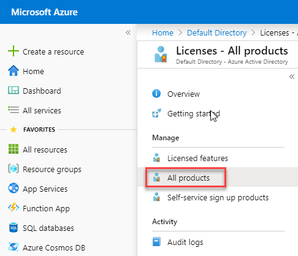


1.  **시용/구매** 를 클릭합니다.

     

1.  드롭다운 화살표를 클릭하고 **Azure AD Premium P2** 제품에서 **활성화** 를 선택합니다.

     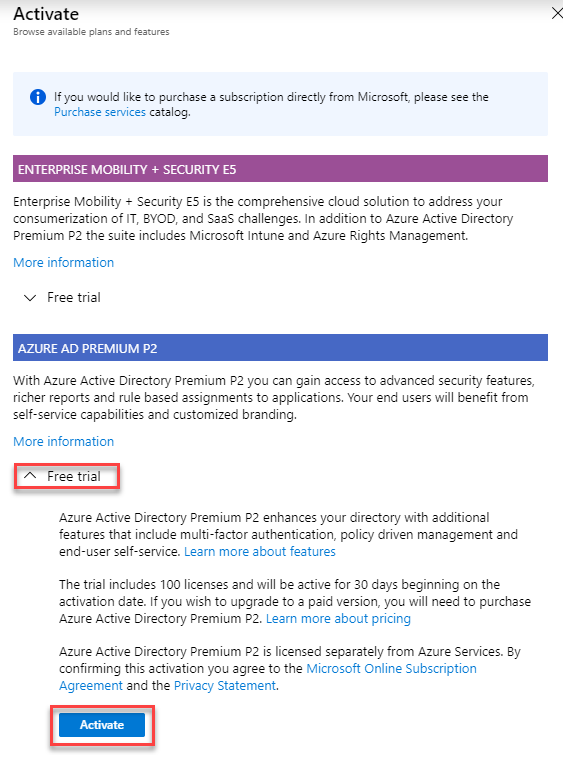

**이 화면을 새로 고치려면 Azure Portal에서 로그아웃했다가 다시 로그인해야 할 수 있습니다.**

### 태스크 3: 리소스 검색

1.  Azure Portal에서 **모든 서비스** 를 클릭하고 **Azure AD Privileged Identity Management** 를 검색하여 선택합니다.

     

1.  PIM에 동의를 클릭합니다.

     

1.  **ID 확인** 을 클릭합니다.

     

1.  **다음** 을 클릭합니다.

     

1.  휴대폰 세부 정보를 입력하고 **다음** 을 클릭합니다.

     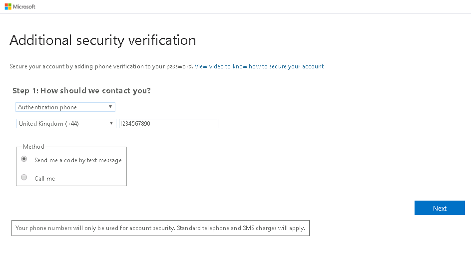
 
1.  코드가 SMS로 수신되면 입력하고 **확인** 을 클릭합니다.

     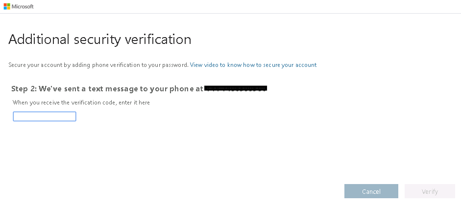

1. 확인이 정상적으로 완료되면 **완료** 를 클릭합니다.

1.  Azure Portal에서 **모든 서비스** 를 클릭하고 **Azure AD Privileged Identity Management** 를 검색하여 선택합니다.

     

1.  PIM에 동의를 클릭합니다.

     

1.  **PIM에 동의** 블레이드로 돌아와 **동의**, **예** 를 차례로 클릭합니다.

     

1.  **F5** 키를 눌러 Azure Portal을 새로 고칩니다.
   
    **참고**: 브라우저에서 Portal을 새로 고쳐도 PIM이 사용하도록 설정된 것으로 표시되지 않으면 Azure Portal에서 로그아웃했다가 다시 로그인합니다.

2.  **Azure 리소스** 를 클릭합니다.

     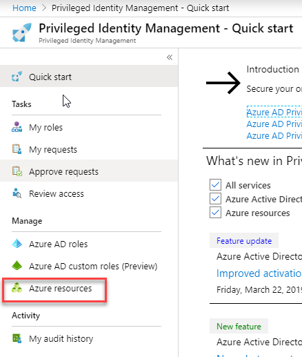


3.  **리소스 검색** 을 클릭하여 검색 환경을 시작합니다.

     


4.  검색 창에서 **리소스 상태 필터** 와 **리소스 종류 선택** 을 사용하여 쓰기 권한이 있는 관리 그룹 또는 구독을 필터링합니다. 처음에는 **모두** 를 사용하는 것이 가장 쉽스습니다.

     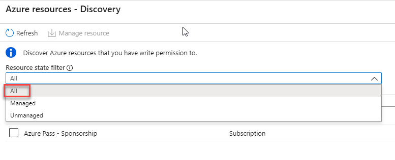

5.  사용자의 Azure 구독 옆에 있는 확인란을 선택합니다.
   
     
 
6.  **리소스 관리** 를 클릭하여 선택한 리소스 관리를 시작합니다.

     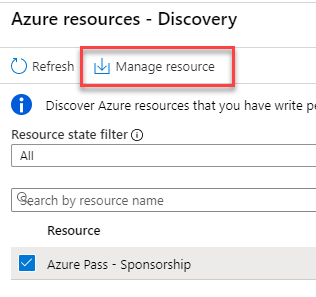

7.  메시지가 표시되면 **예** 를 클릭합니다.


    **참고**: PIM을 사용하여 관리 할 관리 그룹 또는 구독 리소스만 검색하여 선택할 수 있습니다. PIM에서 관리 그룹 또는 구독을 관리할 때는 해당 하위 리소스도 관리할 수 있습니다.


    **참고**: 관리됨으로 설정한 관리 그룹 또는 구독은 관리되지 않는 항목으로 설정할 수 없습니다. 그러므로 다른 리소스 관리자가 PIM 설정을 제거할 수 없습니다.


## 연습 2 - 디렉터리 역할 할당

### 태스크 1:  특정 역할을 할당할 수 있도록 사용자 설정


다음 태스크에서는 사용자에게 Azure AD 디렉터리 역할을 할당할 수 있도록 설정합니다.


1.  Azure Portal에 로그인합니다.

1.  Azure Portal에서 **모든 서비스** 를 클릭하고 **Azure AD Privileged Identity Management** 를 검색하여 선택합니다.

     

1.  **Azure AD 역할** 을 선택합니다.

     
 
1.  **Azure AD 역할에 대한 PIM 등록** 을 클릭합니다.

     


1.  **등록**, **예** 를 차례로 클릭합니다.

     

1.  **브라우저를 새로 고칩니다**.

1.  **역할** 을 클릭합니다.

     


1.  **구성원 추가** 를 클릭하여 관리되는 구성원 추가를 엽니다.

     

1.  **역할 선택**, **대금 청구 관리자**, **선택** 을 차례로 클릭합니다.

     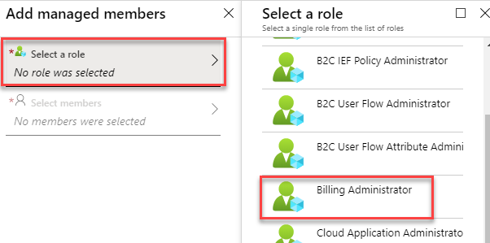

1.  **구성원 선택** 을 클릭하고 **Isabella** 를 선택한 다음 **선택** 을 클릭합니다.

     

1.  관리되는 구성원 추가에서 **확인** 을 클릭하여 사용자를 역할에 추가합니다.

1.  추가된 구성원을 검토합니다.

     

1.  역할이 할당되면 선택한 사용자가 구성원 목록에 해당 역할의 **적격** 구성원으로 표시됩니다.


### 태스크 2: 역할 영구 할당


기본적으로 새 사용자에게는 디렉터리 역할만 할당수 있습니다. 특정 역할을 영구적으로 할당하려면 다음 단계를 수행합니다.


1.  Azure Portal에서 **모든 서비스** 를 클릭하고 **Azure AD Privileged Identity Management** 를 검색하여 선택합니다.

     

1.  **Azure AD 역할** 을 클릭합니다.

     

1.  **구성원** 을 클릭합니다.

     

1.  영구적으로 할당할 **적격** 역할을 클릭합니다.

     
 
1.  **자세히**, **영구 상태로 만들기** 를 차례로 클릭합니다.

     
 

**결과**: 역할이 **영구** 항목으로 목록에 표시됩니다.


### 태스크 3: 역할에서 사용자 제거


역할 할당에서 사용자를 제거할 수 있습니다. 단, 영구 전역 관리자는 항상 한 명 이상 있어야 합니다.


1.  Azure Portal에서 **모든 서비스** 를 클릭하고 **Azure AD Privileged Identity Management** 를 검색하여 선택합니다.

     

1.  **Azure AD 역할** 을 클릭합니다.

     

1.  **구성원** 을 클릭합니다.

     

1.  제거할 역할 할당을 클릭합니다.

     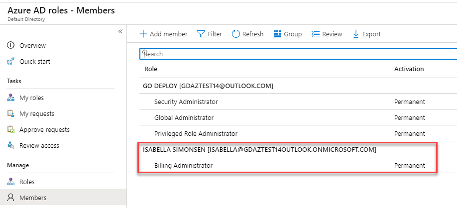
 
1.  **자세히**, **제거** 를 차례로 클릭합니다.

     
 
1.  제거를 확인하라는 메시지에서 **예** 를 클릭합니다. 역할 할당이 제거됩니다.


## 연습 3 - PIM 역할 활성화/비활성화

### 태스크 1: 역할 활성화


특정 Azure AD 디렉터리 역할을 맡아야 하는 경우 PIM에서 **내 역할** 탐색 옵션을 사용하여 활성화를 요청할 수 있습니다.


1.  Azure Portal에서 **모든 서비스** 를 클릭하고 **Azure AD Privileged Identity Management** 를 검색하여 선택합니다.

     

1.  **Azure AD 역할** 을 클릭합니다.

     
 
1.  **빠른 시작**, **자격 할당** 을 차례로 클릭합니다.

     

1.  **대금 청구 관리자** 를 클릭하고 Isabella를 **대금 청구 관리자** 역할에 다시 추가합니다.


1.  **InPrivate** 검색 세션을 열고 **`https://portal.azure.com`** 으로 이동한 다음 암호 **Pa55w.rd** 를 사용해 **Isabella** 로 로그인합니다.  메시지가 표시되면 Isabella의 암호를 변경합니다.

1.  Azure Portal에서 **모든 서비스** 를 클릭하고 **Azure AD Privileged Identity Management** 를 검색하여 선택합니다.

     

1.  Azure Portal에서 **모든 서비스** 를 클릭하고 **Azure AD Privileged Identity Management** 를 검색하여 선택합니다.

     

1.  **Azure AD 역할** 을 클릭합니다.

     

1.  **빠른 시작**, **역할 활성화** 를 차례로 클릭합니다.

     

1.  대금 청구 관리자 역할에서 오른쪽으로 스크롤하여 **활성화** 를 클릭합니다.

     

1.  **진행하기 전에 ID 확인** 을 클릭합니다. 세션당 한 번만 인증하면 됩니다. 마법사를 실행하여 Isabella를 인증합니다.

     
 
1.  Azure Portal로 돌아와 **모든 서비스** 를 클릭하고 **Azure AD Privileged Identity Management** 를 검색하여 선택합니다.

     

1.  **Azure AD 역할** 을 선택하고 빠른 시작 블레이드에서 **역할 활성화** 를 클릭합니다.

1.  대금 청구 관리자 역할에서 오른쪽으로 스크롤하여 **활성화** 를 클릭합니다.

     

1.  **활성화** 를 클릭합니다.

     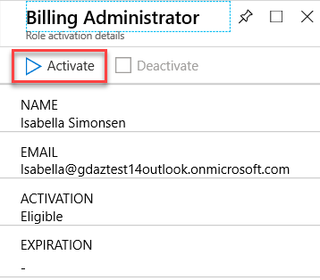

1.  활성화 이유를 입력하고 **활성화** 를 클릭합니다.

     

기본적으로는 설정에 명시적으로 구성된 경우가 아니면 역할을 승인할 필요가 없습니다. 

 승인할 필요가 없는 역할은 활성화되어 활성 역할 목록에 추가됩니다. 역할을 즉시 사용하려면 다음 섹션의 단계를 수행하세요.

 역할을 활성화하려면 승인이 필요한 경우에는 브라우저의 오른쪽 위에 요청이 승인 보류 중임을 알리는 알림이 나타납니다.


### 태스크 2: 활성화 후 즉시 역할 사용


PIM에서 역할을 활성화하면 원하는 관리 포털에 액세스하거나 특정 관리 워크로드 내에서 기능을 수행할 수 있게 될 때까지 최대 10분이 걸릴 수 있습니다. 권한을 강제로 업데이트하려면 다음 단계의 설명에 따라 **애플리케이션 액세스** 페이지를 사용합니다.


1.  **로그아웃** 을 클릭합니다.

     

1.  Isabella로 다시 로그인합니다.


### 태스크 3: 요청 상태 확인


활성화 보류 중인 요청의 상태를 확인할 수 있습니다.


1.  **Isabella** 로 로그인한 상태로 Azure Portal에서 **모든 서비스** 를 클릭하고 **Azure AD Privileged Identity Management** 를 검색하여 선택합니다.

     

1.  **Azure AD 역할** 을 클릭합니다.

1.  **내 요청** 을 클릭하여 요청 목록을 확인합니다.

     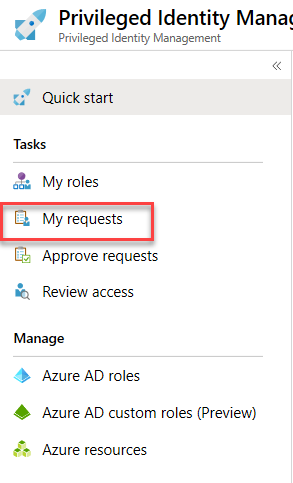

### 태스크 4: 역할 비활성화


활성화된 역할은 시간 제한(할당 가능한 기간)이 지나면 자동으로 비활성화됩니다.

관리자 태스크가 일찍 완료되면 Azure AD Privileged Identity Management에서 역할을 수동으로 비활성화할 수도 있습니다.


1.  **Isabella** 로 로그인한 상태로 Azure AD Privileged Identity Management를 엽니다.

1.  **Azure AD 역할** 을 클릭합니다.

1.  **내 역할** 을 클릭합니다.

     

1.  **활성 역할** 을 클릭하여 활성 역할 목록을 확인합니다.

     

1.  사용을 완료한 역할을 찾아 **비활성화** 를 클릭합니다.

     

1.  **비활성화** 를 다시 클릭합니다.

     

1.  **예** 를 클릭하여 확인합니다.


### 태스크 5: 보류 중인 요청 취소


승인이 필요한 역할을 활성화하지 않아도 되는 경우 언제든지 보류 중인 요청을 취소할 수 있습니다.


1.  **Azure AD Privileged Identity Management를 엽니다**.

1.  **Azure AD 역할** 을 클릭합니다.

1.  **내 요청** 을 클릭합니다.

1.  취소할 역할의 **취소** 단추를 클릭합니다.

**참고**: 이 태스크에서는 요청이 승인되었으므로 취소 단추가 회색으로 표시됩니다.

취소를 클릭하면 요청이 취소됩니다. 역할을 다시 활성화하려면 새 활성화 요청을 제출해야 합니다.


## 연습 4 - 디렉터리 역할(일반)

### 태스크 1: PIM에서 Azure AD 디렉터리 역할의 액세스 검토 시작


사용자의 권한 있는 액세스가 더 이상 필요하지 않으면 역할 할당은 "부실" 상태가 됩니다. 이러한 부실 역할 할당 관련 위험을 줄이려면 권한 있는 역할 관리자나 전역 관리자가 액세스 검토를 정기적으로 작성하여 사용자에게 제공된 역할을 검토할 것을 관리자에게 요청해야 합니다. 이 태스크에서는 Azure AD PIM(Privileged Identity Management)에서 액세스 검토를 시작하는 단계를 설명합니다.


1.  전역 관리자 계정으로 로그인되어 있는 브라우저로 돌아옵니다.

1.  PIM 애플리케이션 기본 페이지에서 **관리** 섹션 아래의 **Azure AD 역할** 을 클릭하고 **액세스 검토** > **새로 만들기** 를 클릭합니다.

     

1.  다음 세부 정보를 입력하고 **시작** 을 클릭합니다.

      - 검토 이름:  **전역 관리자 검토**
      - 빈도: **한 번**
      - 시작 날짜:  **오늘 날짜** 
      - 종료 날짜:  **다음 달 말일**
      - 검토 역할 구성원 자격:  **전역 관리자**
      - 검토자:  **사용자의 계정 선택**
 
 
     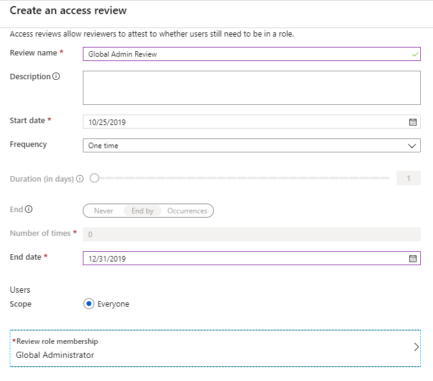
 
1.  검토가 완성되고 활성 상태로 표시되면  **전역 관리자 검토** 를 클릭합니다.

1.  결과를 선택하고 결과가 **검토되지 않음** 으로 표시되는지 확인합니다.

     

### 태스크 2: 액세스 승인 또는 거부


액세스를 승인하거나 거부할 때는 검토자에게 이 역할을 계속 사용하는지 여부만 전달합니다. 역할을 계속 사용하려면 승인을 선택하고, 액세스 권한이 더 이상 필요하지 않으면 거부를 선택합니다. 상태가 즉시 변경되지는 않으며 검토자가 결과를 적용해야 변경됩니다. 액세스 검토를 확인하여 완료하려면 다음 단계를 수행합니다.


1.  PIM 애플리케이션 **액세스 검토** 를 선택합니다. 

2.  **전역 관리자 검토** 를 선택합니다.

     

3.  검토를 직접 만든 경우가 아니면 검토에 표시되는 사용자는 자신뿐입니다. 자신의 이름 옆에 있는 확인란을 선택합니다.

     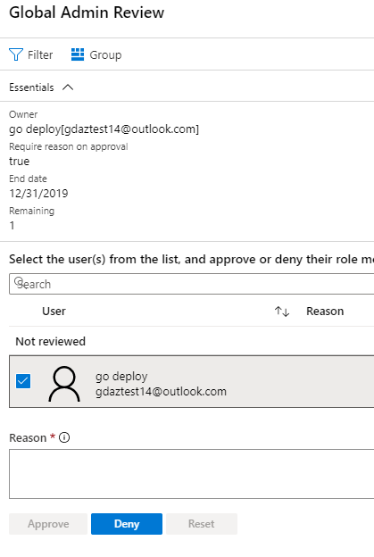

5.  **Azure AD 역할 검토** 블레이드를 닫습니다.

### 태스크 3: PIM에서 Azure AD 디렉터리 역할의 액세스 검토 완료


액세스 검토가 시작되면 권한 있는 역할 관리자는 권한 있는 액세스를 검토할 수 있습니다. Azure AD PIM(Privileged Identity Management)에서는 사용자에게 액세스를 검토하라는 이메일을 자동 전송합니다. 사용자가 이메일을 받지 못한 경우 액세스 검토 수행 방법 지침을 전송할 수 있습니다.

액세스 검토 기간이 끝나거나 모든 사용자가 자체 검토를 완료하고 나면 이 태스크의 단계를 수행하여 검토를 관리하고 결과를 확인합니다.


1.  Azure Portal로 이동하여 **Azure AD Privileged Identity Management** 를 선택합니다.

1.  **Azure AD 역할** 을 선택합니다.

2.  **액세스 검토** 를 선택합니다.


3.  전역 관리자 검토를 선택합니다.


1.  블레이드의 내용을 검토합니다.

     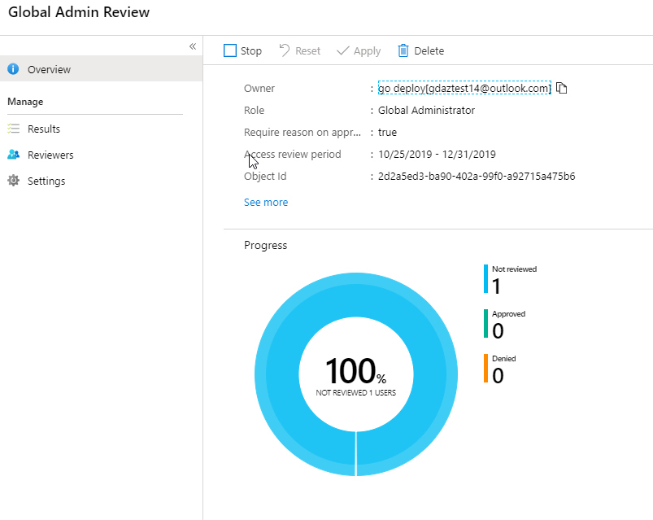


### 태스크 4: PIM에서 Azure AD 디렉터리 역할용 보안 경고 구성


실제 환경 및 보안 목표에 맞도록 PIM의 일부 보안 경고를 사용자 지정할 수 있습니다. 보안 경고 설정을 열려면 다음 단계를 수행합니다.


1.  **Azure AD Privileged Identity Management** 를 엽니다.

1.  **Azure AD 역할** 을 클릭합니다.

1.  **설정**, **경고** 를 차례로 클릭합니다.


1.  경고 이름을 클릭하여 해당 경고의 설정을 구성합니다.


## 연습 5 - PIM 리소스 워크플로

### 태스크 1:  승인이 필요하도록 전역 관리자 역할 구성

1.  **Azure AD Privileged Identity Management** 를 엽니다.

1.  **Azure AD 역할** 을 클릭합니다.

1.  **설정** 을 클릭합니다. 

1.  **역할** 을 클릭하고 **전역 관리자** 를 선택합니다.

1.  아래쪽으로 스크롤하여 **승인 필요** 를 **사용** 으로 설정하고 **저장** 을 클릭합니다.

     

### 태스크 2: Isabella에 대해 전역 관리자 권한 활성화

1.  **Azure AD Privileged Identity Management** 를 엽니다.

1.  **Azure AD 역할** 을 클릭합니다.

1.  **빠른 시작** 을 클릭하고 **자격 할당** 을 선택합니다.

     

1.  **전역 관리자** 를 선택합니다.


1.  **+ 구성원 추가** 를 선택하고 **Isabellla** 를 선택합니다.


1.  InPrivate 검색 세션을 열고 portal.azure.com에 Isabella로 로그인합니다.

1.  **Azure AD Privileged Identity Management** 를 엽니다.

1.  **내 역할** 을 선택합니다.

     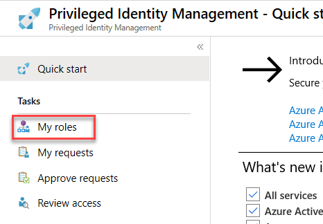

1.  전역 관리자 역할을 **활성화** 합니다.

     

1.  마법사를 사용해 Isabella의 ID를 확인합니다.

     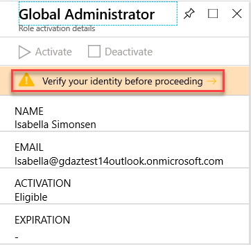

1.  **Azure AD Privileged Identity Management** 의 **내 역할** 로 돌아옵니다.

1.  전역 관리자 역할을 **활성화** 합니다.

1.  **활성화** 를 클릭합니다.

     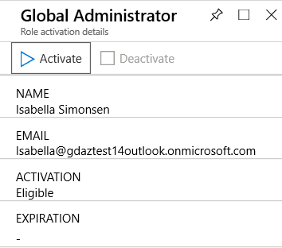

1.  근거로 **관리 태스크를 수행해야 함** 을 입력하고 **활성화** 를 클릭합니다.

     


### 태스크 3: PIM에서 Azure 리소스 역할에 대한 요청 승인 또는 거부


Azure AD PIM(Privilege Identity Management)을 사용하면 활성화 시에 승인이 필요하도록 역할을 구성할 수 있으며 사용자나 그룹 하나 이상을 위임된 승인자로 선택할 수 있습니다. Azure 역할에 대한 요청을 승인하거나 거부하려면 이 문서의 단계를 수행합니다.


###### 보류 중인 요청 확인


승인 보류 중인 Azure 리소스 역할 요청이 있으면 위임된 승인자에게 이메일 알림이 수신됩니다. PIM에서 이러한 보류 중인 요청을 확인할 수 있습니다.


1.  전역 관리 계정으로 로그인한 브라우저로 돌아옵니다.

1.  **Azure AD Privileged Identity Management** 를 엽니다.

1.  **승인 요청** 을 클릭합니다.

     

1.  Isabella의 요청을 클릭하고 **승인** 을 클릭합니다.

     

1.  이유로 **이 태스크용으로 부여함""을 입력하고 **승인** 을 클릭합니다.

      

1.  요청이 승인되고 알림이 표시됩니다.

     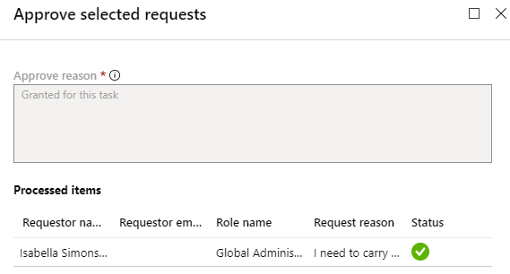

1.  Isabella가 로그인한 InPrivate 검색 세션으로 다시 전환한 후 내 역할을 클릭하고 상태가 승인됨으로 표시되는지 확인합니다.

     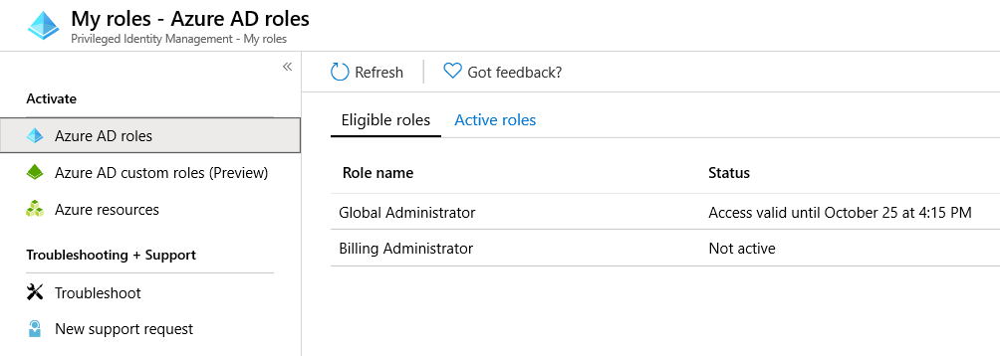

## 연습 6 - PIM에서 Azure AD 역할의 감사 기록 확인


Azure AD PIM(Active Directory Privileged Identity Management) 감사 기록을 사용하여 모든 권한 있는 역할에 대해 지난 30일 동안 수행된 역할 할당 및 활성화를 모두 확인할 수 있습니다. 관리자, 최종 사용자 및 동기화 활동을 포함한 디렉터리 내 활동의 전체 감사 기록을 확인하려는 경우 아래 단계를 수행합니다.


### 태스크 1: 감사 기록 확인


Azure AD 역할의 감사 기록을 확인하려면 다음 단계를 수행합니다.


1.  **Azure AD Privileged Identity Management** 를 엽니다.

1.  **Azure AD 역할** 을 클릭합니다.

1.  **디렉터리 역할 감사 기록** 을 클릭합니다.

    감사 기록에 따라 총 활성화 수, 일별 최대 활성화 횟수, 일별 평균 활성화 횟수와 함께 세로 막대형 차트가 표시됩니다.

    페이지 아래쪽에는 사용 가능한 감사 기록의 각 작업 관련 정보가 포함된 표가 표시됩니다. 각 열의 의미는 다음과 같습니다.

    | 열 | 설명 |
    | --- | --- |
    | 시간 | 작업이 수행된 시간입니다. |
    | 요청자 | 역할 활성화 또는 변경을 요청한 사용자입니다. 값이 **Azure 시스템** 이면 Azure 감사 기록에서 자세한 내용을 확인하세요. |
    | 작업 | 요청자가 수행한 작업입니다. Assign, Unassign, Activate, Deactivate, AddedOutsidePIM이 포함될 수 있습니다. |
    | 구성원 | 활성화 중이거나 역할에 할당된 사용자입니다. |
    | 역할 | 사용자가 할당하거나 활성화한 역할입니다. |
    | 이유 | 활성화 중 이유 필드에 입력한 텍스트입니다. |
    | 만료 | 활성화된 역할이 만료되는 시기입니다. 적격 역할 할당에만 적용됩니다. |

1.  감사 기록을 정렬하려면 **시각**, **작업** 및 **역할** 단추를 클릭합니다.

### 태스크 2: 감사 기록 필터링

1.  감사 기록 페이지 위쪽에서 **필터** 단추를 클릭합니다.

    **차트 매개 변수 업데이트** 창이 나타납니다.

1.  **시간 범위** 에서 시간 범위를 선택합니다.

1.  **역할** 에서 확인할 역할의 확인란을 선택합니다.

1.  **완료** 를 클릭하여 필터링된 감사 기록을 확인합니다.


**결과**: 이 랩이 완료되었습니다.


