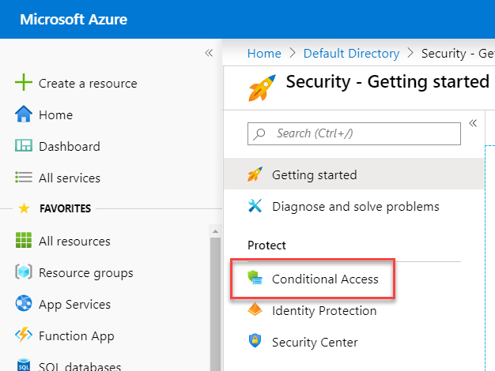
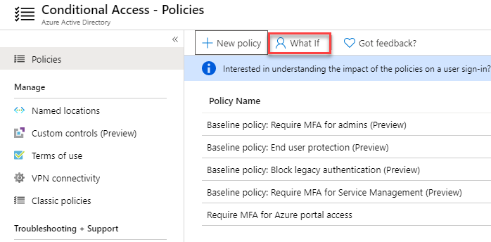
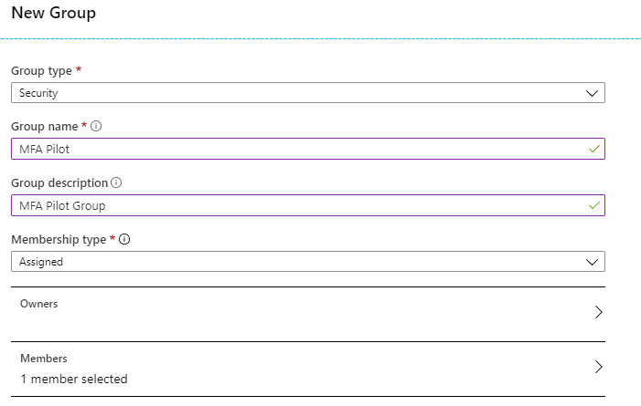

---
lab:
    title: '랩 2: 보안 액세스를 위해 Multi-Factor Authentication 사용'
    module: '모듈 1: ID 및 액세스 관리'
---

# 랩 2: 보안 액세스를 위해 Multi-Factor Authentication 사용

이 모듈에서는 MFA(Multi-Factor Authentication)를 통해 로그인 프로세스를 보호하는 방법을 알아봅니다. 그리고 MFA의 작동 방식 및 온-프레미스 시나리오와 클라우드 시나리오 간의 구현 차이점도 알아봅니다. 또한 조건부 액세스 정책을 사용하여 환경 내 앱과 리소스를 더욱 세부적으로 제어하는 방법도 알아봅니다.

- Multi-Factor Authentication 소개
- MFA 구현

# 랩 2: 보안 액세스를 위해 Multi-Factor Authentication 사용

## 연습 1: MFA 인증 파일럿(Azure Active Directory 조건부 액세스를 사용하여 특정 앱에 MFA를 사용해야 하도록 설정)

### 태스크 1: 조건부 액세스 정책 만들기 

이 섹션에서는 필요한 조건부 액세스 정책을 만드는 방법을 설명합니다. 이 시나리오에서 사용되는 항목은 다음과 같습니다.

- Azure Portal(MFA를 사용해야 하는 클라우드 앱의 자리 표시자) 
- 조건부 액세스 정책을 테스트할 샘플 사용자  

정책에서 다음 항목을 설정합니다.

|설정 |값|
|---     | --- |
|사용자 및 그룹 | Isabella Simonsen |
|클라우드 앱 | Microsoft Azure Management |
|액세스 권한 부여 | 다단계 인증 필요 |

 
1.  Azure Portal에 로그인합니다.

2.  Azure Portal의 허브 메뉴에서 관리 섹션의 **보안** 을 클릭합니다.

3. **보안 - 시작 블레이드** **조건부 액세스** 를 클릭합니다.

     
 
5.  **조건부 액세스** 페이지 위쪽의 도구 모음에서 **새 정책** 을 클릭합니다.

    **참고**: 이 옵션이 회색으로 표시되면 브라우저 세션을 새로 고치세요.

6.  **새로 만들기** 페이지의 **이름** 텍스트 상자에 **Azure Portal 액세스에 MFA 필요** 를 입력합니다.

7.  **할당** 섹션에서 **사용자 및 그룹** 을 클릭합니다.

8.  **사용자 및 그룹** 페이지에서 다음 단계를 수행합니다.

    a. **사용자 및 그룹 선택** 을 클릭하고 **사용자 및 그룹** 을 선택합니다.

    b. **선택** 을 클릭합니다.

    c. **선택** 페이지에서 **Isabella Simonsen** 을 선택하고 **선택** 을 클릭합니다.

    d. **사용자 및 그룹** 페이지에서 **완료** 를 클릭합니다.

9.  **클라우드 앱 또는 작업** 을 클릭합니다.

10. **클라우드 앱** 페이지에서 다음 단계를 수행합니다.

    a. **앱 선택** 을 클릭합니다.

    b. **선택** 을 클릭합니다.

    c. **선택** 페이지에서 **Microsoft Azure Management** 를 선택하고 **선택** 을 클릭합니다.

    d. **클라우드 앱** 페이지에서 **완료** 를 클릭합니다.

11.  **액세스 제어** 섹션에서 **부여** 를 클릭합니다.

12.  **부여** 페이지에서 다음 단계를 수행합니다.
     1. **액세스 허용** 을 선택합니다.
     2.  **다단계 인증 필요** 를 선택합니다.
     3.  **선택** 을 클릭합니다.

13.  **정책 사용** 섹션에서 **설정** 을 클릭합니다.

14.  **만들기** 를 클릭합니다.

### 태스크 2: 시뮬레이션된 로그인 평가

조건부 액세스 정책을 구성했으므로 정책이 정상적으로 작동하는지 확인해야 합니다. 첫 단계에서는 조건부 액세스 가상 정책 도구를 사용하여 테스트 사용자의 로그인을 시뮬레이션합니다. 시뮬레이션은 정책에 대한 이 로그인의 영향을 예측하고 시뮬레이션 보고서를 생성합니다.  

가상 정책 평가 도구를 초기화하려면 다음 항목을 설정합니다.

- 사용자: **Isabella Simonsen** 
- 클라우드 앱: **Microsoft Azure Management**

 **가상** 을 클릭하면 다음 항목이 표시되는 시뮬레이션 보고서가 작성됩니다.

- **Azure Portal 액세스에 MFA 필요**(**적용되는 정책** 아래) 
- **컨트롤 권한 부여**: **다단계 인증 필요**

1.  조건부 액세스-정책 페이지 위쪽의 메뉴에서 **가상** 을 클릭합니다.  
 
     

2.  **사용자** 를 클릭하고 **Isabella Simonsen** 을 선택한 다음 **선택** 을 클릭합니다.

3.  클라우드 앱을 선택하려면 다음 단계를 수행합니다.

    a. **클라우드 앱 또는 작업** 을 클릭합니다.

    b. **클라우드 앱 페이지** 에서 **앱 선택** 을 클릭합니다.

    c. **선택** 을 클릭합니다.

    d. **선택** 페이지에서 **Microsoft Azure Management** 를 선택하고 **선택** 을 클릭합니다.

    e. 클라우드 앱 페이지에서 **완료** 를 클릭합니다.

4.  **가상** 을 클릭합니다.

5.  결과로 "Azure Portal 액세스에 MFA 필요"가 표시되는지 확인합니다.

     

### 태스크 3: 조건부 액세스 정책 테스트

이전 섹션에서는 시뮬레이션된 로그인을 평가하는 방법을 알아보았습니다. 하지만 시뮬레이션뿐 아니라 조건부 액세스 정책도 테스트하여 정상 작동하는지 확인해야 합니다. 

정책을 테스트하려면 **Isabella Simonsen** 테스트 계정을 사용하여 Azure Portal **`https://portal.azure.com`** 에 로그인해 봅니다. 추가 보안 확인이 가능하도록 계정을 설정하라는 대화 상자가 나타납니다.

## 연습 2: MFA 조건부 액세스(Azure Multi-Factor Authentication 파일럿 출시 완료)

이 랩에서는 Azure Portal에 로그인할 때 Azure MFA(Multi-Factor Authentication)를 사용하도록 설정하는 조건부 액세스 정책 구성 과정을 안내합니다. 이 정책은 특정 파일럿 사용자 그룹에 배포되며, 해당 그룹을 대상으로 정책 테스트가 진행됩니다. 조건부 액세스를 사용하여 Azure MFA를 배포하면 기존에 적용했던 방법에 비해 조직과 관리자가 배포 과정을 매우 유동적으로 제어할 수 있습니다.

- Azure Multi-Factor Authentication을 사용하도록 설정
- Azure Multi-Factor Authentication 테스트

### 태스크 1: Azure Multi-Factor Authentication을 사용하도록 설정

1.  전역 관리자 계정으로 로그인한 Azure Portal로 돌아옵니다.

1.  허브 메뉴에서 **Azure Active Directory** 를 클릭합니다.

1.  **그룹**, **+ 새 그룹** 을 차례로 클릭합니다.

     

1.  다음 정보를 입력하고 **만들기** 를 클릭합니다.

      * 그룹 유형: **보안**
      * 그룹 이름: **MFA 파일럿**
      * 그룹 설명: **MFA 파일럿 그룹**
      * 구성원 자격 유형: **할당됨**
      * 구성원: **Isabella** 선택
  
  
      
  
2.  **Azure Active Directory** 로 이동하여 보안을 클릭하고 **보안** 블레이드에서 **조건부 액세스** 를 선택합니다.

 

3.  **+ 새 정책** 을 선택합니다.

 

4.  정책 이름을 **MFA 파일럿** 으로 지정합니다.
5.  **사용자 및 그룹** 에서 **사용자 및 그룹 선택** 확인란을 선택합니다.
    * 파일럿 그룹 **MFA 파일럿**을  선택합니다.
    * **선택** 을 클릭합니다.
    * **완료** 를 클릭합니다.
     
6.  **클라우드 앱 또는 작업** 에서 **앱 선택** 라디오 단추를 선택합니다.
    * Azure Portal용 클라우드 앱은 **Microsoft Azure Management** 입니다.
    * **선택** 을 클릭합니다.
    * **완료** 를 클릭합니다.
     
7.  **조건** 섹션은 건너뜁니다.
8.  **허용** 에서 **액세스 허용** 라디오 단추가 선택되어 있는지 확인합니다.
    * **다단계 인증 필요** 확인란을 선택합니다.
    * **선택** 을 클릭합니다.
     
9.  **세션** 섹션은 건너뜁니다.
10. **정책 사용** 토글을 **켜기** 로 설정합니다.
11. **만들기** 를 클릭합니다.

### 태스크 2: Azure Multi-Factor Authentication 테스트

조건부 액세스 정책이 작동함을 확인하기 위해 MFA가 필요하지 않은 리소스에 테스트 로그인한 다음 MFA가 필요한 Azure Portal에 로그인합니다.

1.  InPrivate 또는 시크릿 모드에서 새 브라우저 창을 열고 **`https://account.activedirectory.windowsazure.com`** 으로 이동합니다.
    * 이 문서의 필수 구성 요소 섹션에서 만든 테스트 사용자로 로그인합니다. MFA를 완료하라는 메시지가 표시되어서는 안 됩니다.
    * 브라우저 창을 닫습니다.

2.  InPrivate 또는 시크릿 모드에서 새 브라우저 창을 열고 **`https://portal.azure.com`** 으로 이동합니다.

       * 이 문서의 필수 구성 요소 섹션에서 만든 테스트 사용자로 로그인합니다. 이번에는 Azure Multi-Factor Authentication에 등록하고 MFA를 사용해야 합니다.
       * 브라우저 창을 닫습니다.

| 경고: 계속하기 전에 이 랩에서 사용한 모든 리소스를 제거해야 합니다.  **Azure Portal** 에서 리소스를 제거하려면 **리소스 그룹** 을 클릭합니다.  랩에서 만든 리소스 그룹을 모두 선택합니다.  리소스 그룹 블레이드에서 **리소스 그룹 삭제** 를 클릭하고 리소스 그룹 이름을 입력한 다음 **삭제** 를 클릭합니다.  추가로 만든 리소스 그룹이 있으면 이 프로세스를 반복합니다. **리소스 그룹을 삭제하지 않으면 다른 랩에서 문제가 발생할 수 있습니다.** |
| --- |

**결과**: 이 랩이 완료되었습니다.
