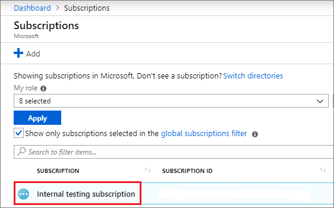
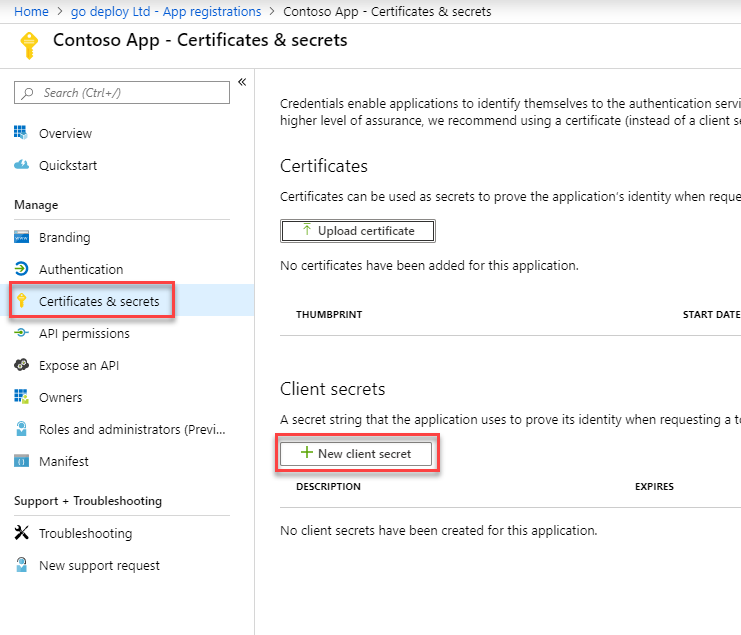

---
lab:
    title: '랩 4 - 애플리케이션 서비스 주체'
    module: '모듈 1: ID 및 액세스 관리'
---

# 랩 4 - 애플리케이션 서비스 주체

**시나리오**

이 랩에서는 역할 기반 액세스 제어와 함께 사용할 수 있는 새 Azure AD(Azure Active Directory) 애플리케이션 및 서비스 주체를 만드는 방법을 설명합니다. 리소스에 액세스하거나 리소스를 수정해야 하는 코드가 있으면 앱의 ID를 만들 수 있습니다. 이 ID가 서비스 주체입니다. ID를 만든 후 서비스 주체에게 필요한 권한을 할당할 수 있습니다. 이 문서에서는 Portal을 사용하여 서비스 주체를 만드는 방법을 설명합니다. 구체적으로는 한 조직 내에서만 실행할 단일 테넌트 애플리케이션을 만드는 방법을 중점적으로 설명합니다. 단일 테넌트 애플리케이션은 대개 조직 내에서 실행하는 사업 부문 애플리케이션으로 사용합니다.

## 연습 1: Portal을 사용하여 리소스에 액세스할 수 있는 서비스 주체 만들기

구독, 리소스 그룹 또는 리소스 수준에서 범위를 설정할 수 있습니다. 권한은 하위 범위 수준에 상속됩니다. 예를 들어 리소스 그룹의 독자 역할에 추가하는 애플리케이션은 리소스 그룹 및 해당 그룹에 포함된 모든 리소스를 읽을 수 있습니다.

### 태스크 1: 역할에 애플리케이션 할당

1.  애플리케이션을 할당할 범위 수준으로 이동합니다. 예를 들어 구독 범위에서 역할을 할당하려면 **모든 서비스** 및 **구독** 을 선택합니다.

       

1.  사용자의 구독을 선택합니다.

       

1.  **액세스 제어(IAM)** 를 선택합니다.
1.  **추가**, **역할 할당 추가** 를 차례로 선택합니다.
1.  애플리케이션에 할당할 참가자 역할을 선택합니다. 애플리케이션이 **다시 부팅**, **시작**, **중지** 등의 작업을 실행할 수 있도록 하려면 **참가자** 역할을 선택합니다. 기본적으로 Azure AD 애플리케이션은 사용 가능한 옵션에 표시되지 않습니다. 애플리케이션을 찾으려면 **Contoso 앱** 이라는 이름을 검색하여 선택합니다.

     

1.  **저장** 을 선택하여 역할 할당을 마칩니다. 해당 범위의 역할에 할당된 사용자 목록에 애플리케이션이 표시됩니다.

서비스 주체가 설정되었으므로 스크립트나 앱을 실행하는 데 사용할 수 있습니다. 다음 섹션에서는 프로그래밍 방식으로 로그인할 때 필요한 값을 가져오는 방법을 설명합니다.

### 태스크 2: 로그인용 가져오기

프로그래밍 방식으로 로그인할 때는 인증 요청과 함께 테넌트 ID를 전달해야 합니다. 애플리케이션의 ID와 인증 키도 필요합니다. 이러한 값을 가져오려면 다음 단계를 수행합니다.

1.  **Azure Active Directory** 를 선택합니다.
1.  Azure AD의 **앱 등록** 에서 **Contosl 앱** 애플리케이션을 선택합니다.
1.  디렉터리(테넌트) ID를 복사하여 애플리케이션 코드에 저장합니다.

       

1.  **애플리케이션 ID** 를 복사하여 애플리케이션 코드에 저장합니다.

       

### 태스크 3: 새 애플리케이션 암호 만들기

인증서 또는 애플리케이션 암호 중 하나를 선택할 수 있습니다.  이 태스크에서는 애플리케이션 암호를 만듭니다.

1.  **인증서 및 암호** 를 선택합니다.
1.  **클라이언트 암호 -> 새 클라이언트 암호** 를 선택합니다.
 
     

1.  암호의 설명과 사용 기간을 입력합니다. 입력을 마친 후 **추가** 를 선택합니다.

클라이언트 암호를 저장하고 나면 클라이언트 암호 값이 표시됩니다. 나중에는 키를 검색할 수 없으므로 이 값을 복사해 두세요. 애플리케이션으로 로그인하려면 애플리케이션 ID와 키 값을 함께 입력해야 합니다. 애플리케이션이 검색할 수 있는 위치에 키 값을 저장하세요.

  
### 태스크 4: Azure AD 권한 확인

1.  **Azure Active Directory** 를 선택합니다.

1.  **사용자 설정** 을 선택합니다.
1.  **앱 등록** 설정을 확인합니다. 이 값은 관리자만 설정할 수 있습니다. **예** 로 설정하면 Azure AD 테넌트의 모든 사용자가 앱을 등록할 수 있습니다.

 앱 등록 설정이 **아니요** 로 설정되어 있으면 관리자 역할의 사용자만 이러한 유형의 애플리케이션을 등록할 수 있습니다.

### 태스크 5: Azure 구독 권한 확인

Azure 구독에서 AD 앱을 역할에 할당하려면 계정에 `Microsoft.Authorization/*/Write` 권한이 있어야 합니다. 이 작업을 수행할 권한은 소유자 역할 또는 사용자 액세스 관리자를 통해 부여됩니다.

구독 권한을 확인하려면 다음 단계를 수행합니다.

1.  오른쪽 위에서 계정을 선택하고 ... -> 내 권한을 선택합니다.

       

1.  드롭다운 목록에서 서비스 주체를 만들 구독을 선택한 다음 **이 구독에 대한 전체 액세스 세부 정보를 보려면 여기를 클릭하세요.** 를 선택합니다.

       
   
1.  **역할 할당** 을 선택하여 할당된 역할을 표시하고 역할에 AD 앱을 할당하는 데 적합한 권한이 있는지를 확인합니다. 이러한 권한이 없으면 구독 관리자에게 자신을 사용자 액세스 관리자 역할에 추가해 줄 것을 요청할 수 있습니다. 다음 이미지에서는 사용자가 소유자 역할에 할당되어 있으므로 적절한 권한이 있습니다.

       
   

**결과**: 이 랩이 완료되었습니다.

