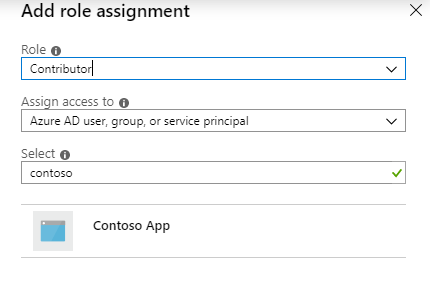
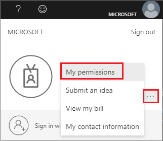
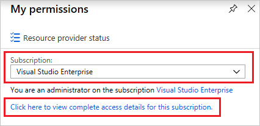
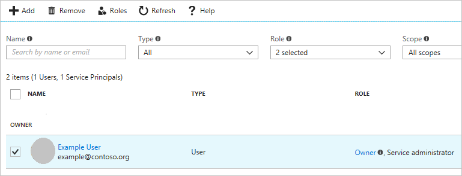

---
lab:
    title: 'LAB 05_Application Service Principal'
    module: '모듈 01 - 계정과 접근 관리'
---

# 랩: Application Service Principal

**Scenario**

This lab shows you how to create a new Azure Active Directory (Azure AD) application and service principal that can be used with role-based access control. When you have code that needs to access or modify resources, you can create an identity for the app. This identity is known as a service principal. You can then assign the required permissions to the service principal. This lab shows you how to use the portal to create the service principal. It focuses on a single-tenant application where the application is intended to run within only one organization. You typically use single-tenant applications for line-of-business applications that run within your organization.

### Exercise 1: Use the portal to create a service principal that can access resources

You can set the scope at the level of the subscription, resource group, or resource. Permissions are inherited to lower levels of scope. For example, adding an application to the Reader role for a resource group means it can read the resource group and any resources it contains.

#### Task 1: Assign the application to a role

1.  Navigate to the level of scope you wish to assign the application to. For example, to assign a role at the subscription scope, select **All services** and **Subscriptions**.

       

1.  Select your subscription.

       

1.  Select **Access control (IAM)**.
1.  Select **Add** and select **Add role assignment**.
1.  Select the Contributer role you wish to assign to the application. To allow the application to execute actions like **reboot**, **start** and **stop** instances, select the **Contributor** role. By default, Azure AD applications aren't displayed in the available options. To find your application, search for the name **Contoso App** and select it.

     

1.  Select **Save** to finish assigning the role. You see your application in the list of users assigned to a role for that scope.

Your service principal is set up. You can start using it to run your scripts or apps. The next section shows how to get values that are needed when signing in programmatically.

#### Task 2: Get values for signing in

When programmatically signing in, you need to pass the tenant ID with your authentication request. You also need the ID for your application and an authentication key. To get those values, use the following steps:

1.  Select **Azure Active Directory**.
1.  From **App registrations** in Azure AD, select the **Contoso App** application.
1.  Copy the **Directory (tenant) ID** and store it in your application code.

       

1.  Copy the **Application (client) ID** and store it in your application code.

       

#### Task 3: Create a new application secret

You can choose a certificate or an application secret.  In this task you will create an application secret.

1.  Select **Certificates & secrets**.
1.  Select **Client secrets -> New client secret**.
 
     

1.  Provide a description of the secret, and a duration. When done, select **Add**.

After saving the client secret, the value of the client secret is displayed. Copy this value because you aren't able to retrieve the key later. You provide the key value with the application ID to sign in as the application. Store the key value where your application can retrieve it.

  
#### Task 4: Check Azure AD permissions

1.  Select **Azure Active Directory**.

1.  Select **User settings**.
1.  Check the **App registrations** setting. This value can only be set by an administrator. If set to **Yes**, any user in the Azure AD tenant can register an app.

 If the app registrations setting is set to **No**, only users with an administrator role may register these types of applications.

#### Task 5: Check Azure subscription permissions

In your Azure subscription, your account must have `Microsoft.Authorization/*/Write` access to assign an AD app to a role. This action is granted through the Owner role or User Access Administrator.

To check your subscription permissions:

1.  Select your account in the upper right corner, and select **... -> My permissions**.

       

1.  From the drop-down list, select the subscription you want to create the service principal in. Then, select **Click here to view complete access details for this subscription**.

       
   
1.  Select **Role assignments** to view your assigned roles and determine if you have adequate permissions to assign an AD app to a role. If not, you would ask your subscription administrator to add you to User Access Administrator role. In the following image, the user is assigned to the Owner role, which means that user has adequate permissions.

       
   

**Results**: You have now completed this lab.

