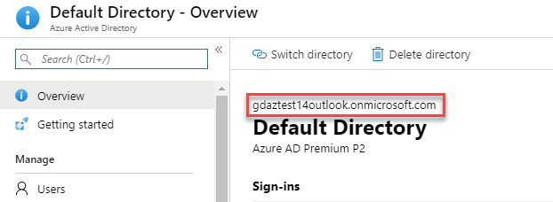
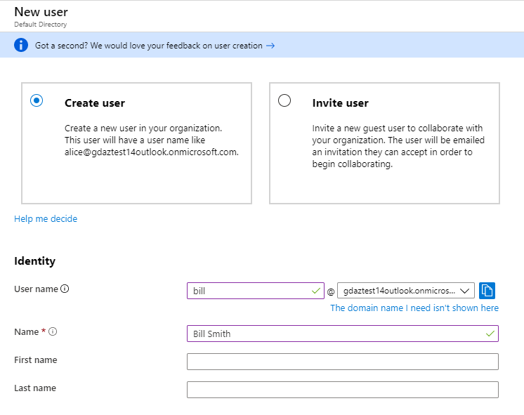
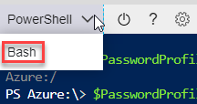
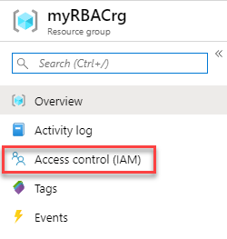
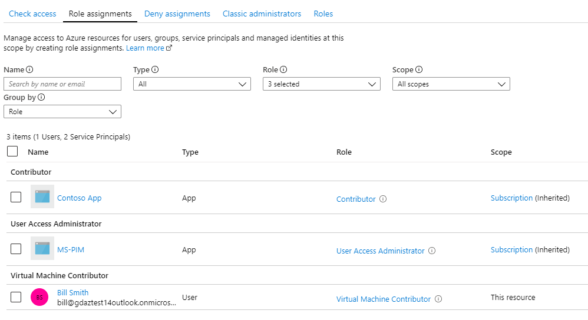

---
lab:
    title: '랩 5: Azure의 ID 보호 소개'
    module: '모듈 1: ID 및 액세스 관리'
---

# 모듈 1: ID 및 액세스 관리 


**시나리오**

이 모듈에서는 최소 권한 원칙에 따라 조직의 관리 액세스를 구성하고 관리하는 데 필요한 전제 조건인 역할 기반 액세스 제어에 대해 알아봅니다. 또한 Azure Active Directory 개념을 검토하고, 권한 있는 액세스 위반 시 IT 조직에 발생하는 보안 위험 및 위협 범위를 파악합니다. 이 랩에 포함된 단원은 다음과 같습니다.

- 역할 기반 액세스 제어
- Azure Active Directory(복습)
- 환경에서 권한 있는 액세스 보호

# 랩 5: Azure의 ID 보호 소개

## 연습 1: 역할 기반 액세스 제어

### 태스크 1: 사용자 만들기

1.  Azure Portal(**`https://portal.azure.com/`**)에 로그인합니다.

1.  **Azure Active Directory**를 선택하고 개요 블레이드에서 테넌트 도메인을 적어 둡니다.

     

1.  **사용자**, **새 사용자**를 차례로 선택합니다.


3.  **사용자** 페이지에서 블레이드에 다음 정보를 입력합니다.

      - **사용자 이름**: bill
      - **이름**: Bill Smith


     

4.  **암호** 상자에서 제공되는 자동 생성 암호를 표시합니다. 초기 로그인 프로세스를 위해 이 암호를 사용자에게 제공해야 합니다.
  
  

5.  **만들기**를 선택합니다.

    사용자가 생성되어 Azure AD 테넌트에 추가됩니다.

8.  Azure Portal 위쪽의 PowerShell 아이콘을 클릭하고 메시지가 표시되면 PowerShell을 선택하여 **Azure Cloud Shell**을 시작합니다.

  
9.  **다음 명령을 입력**하여 PS Cloud Shell에서 사용자를 생성합니다. 이때 **yourdomain**은 앞에서 적어 둔 사용자의 도메인으로 바꿉니다.

     ```powershell
      $PasswordProfile = New-Object -TypeName Microsoft.Open.AzureAD.Model.PasswordProfile
      ```
       ```powershell
      $PasswordProfile.Password = "Pa55w.rd"
      ```
       ```powershell
      New-AzureADUser -DisplayName "Mark" -PasswordProfile $PasswordProfile     -UserPrincipalName "Mark@yourdomain.onmicrosoft.com" -AccountEnabled $true -MailNickName "Mark"

     ```
 
     

10.  다음 명령을 실행하여 Azure AD의 사용자 목록을 가져옵니다. 

      ```powershell
      Get-AzureADUSer 
      ```
 
11.  드롭다운 메뉴를 사용하여 Azure Cloud Shell을 Bash 사용 Azure CLI 모드로 변경합니다.

     

12.  Azure CLI에서 **다음 명령을 입력**하여 Azure CLI에서 사용자를 생성합니다. 이때 **yourdomain**은 앞에서 적어 둔 도메인으로 바꿉니다.
 
       ```cli
      az ad user create --display-name Tracy --password Pa55w.rd --user-principal-name Tracy@yourdomain.onmicrosoft.com
       ```


이제 Azure AD의 사용자가 3명이 되었습니다.


### 태스크 2: Portal, PowerShell 및 CLI에서 그룹 만들기

1.  Azure Portal에서 **Azure AD** 블레이드의 **Azure Active Directory**를 클릭하고 **그룹**을 클릭한 다음 **새 그룹**을 선택합니다.
 
16.  다음 세부 정보를 입력합니다.
  
       - **그룹 유형**: 보안
       - **그룹 이름**: 선임 관리자 그룹 
    
17.  **구성원**을 클릭하고 **Bill**을 선택합니다.

18.  **만들기**를 클릭합니다.

1.  Azure Portal 위쪽의 PowerShell 아이콘을 클릭하여 **Cloud Shell Bash**를 시작합니다.

19.  **Cloud Shell**에서 다음 명령을 입력합니다.

       ```cli
      az ad group create --display-name ServiceDesk --mail-nickname ServiceDesk
       ```

20.  Cloud Shell을 **PowerShell**로 변경하고 다음 명령을 입력합니다.

       ```powershell
      New-AzureADGroup -DisplayName "Junior Admins" -MailEnabled $false -SecurityEnabled $true -MailNickName JuniorAdmins
       ```
 
1.  **Cloud Shell**을 엽니다.

21.  **Active Directory** 블레이드에서 **그룹**을 클릭하고 그룹이 **4**임을 확인합니다.

     


## 연습 2: 연습 - RBAC

### 태스크 1: 리소스 그룹 만들기

1.  탐색 목록에서 **리소스 그룹**을 선택합니다.

1.  **추가**를 선택하여 **리소스 그룹** 블레이드를 엽니다.

1.  **리소스 그룹 이름**으로 **myRBACrg**를 입력합니다.

1.  사용자의 구독을 선택하고 위치로 **미국 동부**를 선택합니다.

1.  **만들기**를 선택하여 리소스 그룹을 만듭니다.

1.  **새로 고침**을 선택하여 리소스 그룹 목록을 새로 고칩니다.

   리소스 그룹 목록에 새 리소스 그룹이 나타납니다.

### 태스크 2: 액세스 권한 부여


RBAC에서는 액세스 권한을 부여하려면 역할 할당을 만듭니다.


1.  **리소스 그룹** 목록에서 새 **myRBACrg** 리소스 그룹을 선택합니다.

1.  **액세스 제어(IAM)**를 선택하여 현재 역할 할당 목록을 확인합니다.

       

1.  **추가**를 선택하여 **역할 할당 추가** 창을 엽니다.

    역할을 할당할 권한이 없으면 **추가** 옵션이 표시되지 않습니다.

1.  **역할** 드롭다운 목록에서 **가상 머신 참가자**를 선택합니다.

1.  **선택** 목록에서 **Bill Smith**를 선택합니다.

1.  **저장**을 선택하여 역할 할당을 만듭니다.

   잠시 후 사용자에게 rrbac-quickstart-resource-group 리소스 그룹 범위에서 가상 머신 참가자 역할이 할당됩니다.

  
### 태스크 3: 액세스 권한 제거


RBAC에서는 액세스 권한을 제거하려면 역할 할당을 제거합니다.


1.  역할 할당 탭을 클릭합니다.

1.  역할 할당 목록에서 가상 머신 참가자 역할이 할당된 사용자 옆의 확인란을 선택합니다.
  
      

1.  **제거**를 선택합니다.

1.  역할 할당 제거 메시지가 나타나면 **예**를 선택합니다.  
   
  
## 연습 3:  PowerShell을 사용한 RBAC(역할 기반 액세스 제어)


이 연습에서는 PowerShell을 사용하여 다음 작업을 수행합니다.

-   Get-AzureRMRoleAssignment 명령을 사용하여 역할 할당 목록 표시
-   Remove-AzureRmResourceGroup 명령을 사용하여 액세스 권한 제거


### 태스크 1: 액세스 권한 부여
  

사용자에게 액세스 권한을 부여하려면 New-AzureRmRoleAssignment 명령을 사용하여 역할을 할당합니다. 서비스 주체, 역할 정의 및 범위를 지정해야 합니다.  


1.  **Cloud Shell PowerShell**을 시작합니다.
  
1.  **`Get-AzureRmSubscription`** 명령을 사용하여 구독 ID를 가져옵니다.
  
       ```powershell
      Get-AzureRmSubscription
       ```

  
1.  변수에 구독 범위를 저장합니다. 여기서 000000은 구독 ID로 바꿉니다.
  
       ```powershell
      $subScope = "/subscriptions/00000000-0000-0000-0000-000000000000" 
       ```  
  

  
1.  다음 명령을 사용하여 구독 범위에서 사용자에게 독자 역할을 할당합니다. 이때 도메인은 앞에서 적어 둔 테넌트 도메인으로 바꿉니다.
  
       ```powershell
      New-AzureRmRoleAssignment -SignInName bill@yourdomain.onmicrosoft.com -RoleDefinitionName "Reader" -Scope $subScope  
       ```
  
      
  
1.  다음 명령을 사용하여 리소스 그룹 범위에서 사용자에게 참가자 역할을 할당합니다.
  
       ```powershell
      New-AzureRmRoleAssignment -SignInName bill@yourdomain.onmicrosoft.com -RoleDefinitionName "Contributor" -ResourceGroupName "myRBACrg"
       ```

  
### 태스크 2: 액세스 권한 목록 표시  
  
1.  구독에 대한 액세스 권한을 확인하려면 Get-AzureRmRoleAssignment 명령을 사용해 역할 할당 목록을 표시합니다.
  
       ```powershell
      Get-AzureRmRoleAssignment -SignInName bill@yourdomain.onmicrosoft.com -Scope $subScope
       ```

       

    출력에는 구독 범위에서 RBAC 자습서 사용자에게 독자 역할이 할당되었음이 표시됩니다.

2.  리소스 그룹에 대한 액세스 권한을 확인하려면 Get-AzureRmRoleAssignment 명령을 사용해 역할 할당 목록을 표시합니다.
  
     ```powershell
    Get-AzureRmRoleAssignment -SignInName bill@yourdomain.onmicrosoft.com     -ResourceGroupName "myRBACrg"
     ```


 출력에는 RBAC 자습서 사용자에게 참가자 및 독자 역할이 할당되었음이 표시됩니다. 참가자 역할은 rbac-tutorial-resource-group 범위에서 할당되며, 독자 역할은 구독 범위에서 상속됩니다.

### 태스크 3: 액세스 권한 제거
  

사용자/그룹/애플리케이션에 대한 액세스 권한을 제거하려면 Remove-AzureRmRoleAssignment를 사용해 역할 할당을 제거합니다.


1.  리소스 그룹 범위에서 사용자의 참가자 역할 할당을 제거하려면 다음 명령을 사용합니다.
  
     ```powershell
    Remove-AzureRmRoleAssignment -SignInName bill@yourdomain.onmicrosoft.com -RoleDefinitionName "Contributor" -ResourceGroupName "myRBACrg"
     ```
  
  
1.  구독 범위에서 사용자의 독자 역할 할당을 제거하려면 다음 명령을 사용합니다.

     ```powershell
    Remove-AzureRmRoleAssignment -SignInName bill@yourdomain.onmicrosoft.com -RoleDefinitionName "Reader" -Scope $subScope
     ```
  
  
1.  다음 명령을 실행하여 리소스 그룹을 제거합니다. 제거를 확인하라는 메시지가 표시되면 Y를 누르고 Enter 키를 누릅니다.
  
     ```powershell
    Remove-AzureRmResourceGroup -Name "myRBACrg"
     ```

1.  **Cloud Shell**을 닫습니다.  


**결과**: 이 랩이 완료되었습니다.
