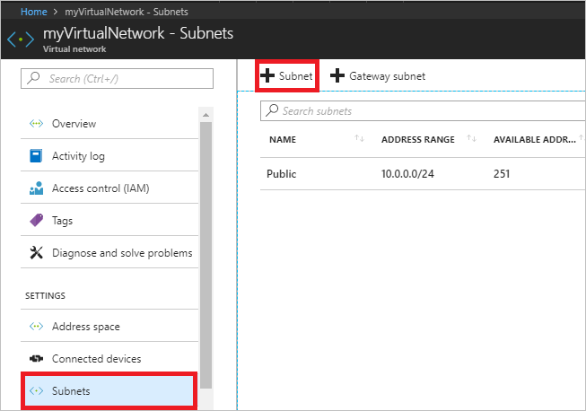
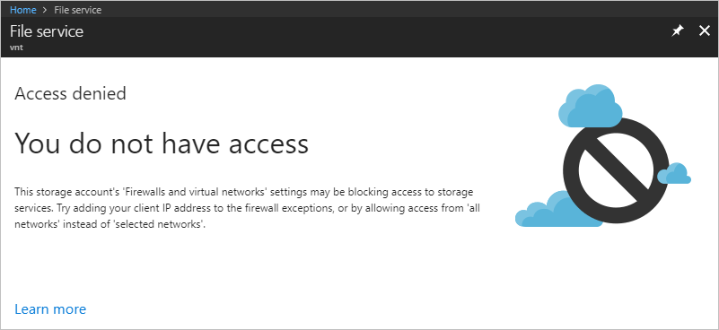

---
lab:
    title: 'LAB 07_Service Endpoints'
    module: '모듈 02 - 플랫폼 보호'
---

# 랩: Service Endpoints

가상 네트워크의 Service Endpoint를 사용하면 일부 Azure 서비스 리소스에 대한 네트워크 액세스를 가상 네트워크의 서브넷으로 제한할 수 있습니다. PaaS 리소스에 대한 인터넷 액세스를 제거 할 수도 있습니다. Service Endpoint은 가상 네트워크에서 지원되는 Azure 서비스로 PaaS 리소스에 직접 연결을 제공하므로 가상 네트워크의 개인 IP 주소 공간을 사용하여 Azure 서비스에 액세스 할 수 있습니다. Service Endpoint을 통해 Azure 리소스와 통신하는 트래픽은 항상 Microsoft Azure 백본 네트워크에 유지됩니다. 이 학습서에서는 다음 방법을 학습합니다.

- 가상 네트워크에 서브넷 만들기
- 서브넷에 service endpoint 추가
- Azure 리소스를 만들고 생성된 서브넷만 통신이 가능하도록 네트워크 액세스 허용
- 서브넷에 가상 머신 배포
- 서브넷에서 Azure 리소스와 통신 확인
- 인터넷에서 Azure 리소스에 액세스가 불가한지 확인

### 연습 1: Azure Portal을 사용하여 가상 네트워크의 Service Endpoint로 PaaS 리소스에 대한 네트워크 액세스 제한

#### 작업 1: 가상 네트워크 만들기

1. <a href="https://portal.azure.com" target="_blank"><span style="color: #0066cc;" color="#0066cc">Azure Portal</span></a>에 로그인 합니다.

1. **+ 리소스 만들기**를 클릭한 다음 **virtual network**를 입력하고 **virtual network**를 클릭합니다.

1. **가상 네트워크** 블레이드가 뜨면 **만들기** 버튼을 클릭합니다.

1. **가상 네트워크 만들기** 블레이드가 뜨면 다음을 참고하여 정보를 입력합니다.

    | 설정 | 값 |
    | --- | --- |
    | 이름 | **az5000207vnet** |
    | 주소 공간 | **10.0.0.0/16** |
    | 구독 | 이 랩에서 사용할 구독 |
    | 리소스 그룹 | **az5000207**로 새로 만들기 |
    | 위치 | **(아시아 태평양)한국 중부** |
    | 서브넷 - 이름 | **Public** |
    | 서브넷 - 주소 범위 | **10.0.0.0/24** |

1. 나머진 기본값으로 두고 **만들기** 버튼을 클릭합니다.

#### 작업 2: Service endpoint 활성

Service endpoint는 서비스, 서브넷별로 활성화됩니다. 서브넷을 생성하고 서브넷에 서비스 엔드 포인트를 활성화합니다.

1. 생성한 **az5000207vnet**을 탐색합니다.

1. **설정** 섹션에 있는 **서브넷**으로 이동합니다.

1. 상단에 있는 **+ 서브넷**을 클릭합니다.

    

3. 오른쪽에 **서브넷 추가** 컨텍스트 창이 뜨면 다음과 같이 입력한 후 **확인** 버튼을 클릭하여 서브넷을 생성합니다.

    | 설정 | 값 |
    | --- | --- |
    | 이름 | **Private** |
    | 주소 범위(CIDR 블록) | **10.0.1.0/24** |
    | 서비스 엔드포인트 | 드롭 다운 메뉴를 열어 **Microsoft.Storage** 만 체크박스에 체크 |

#### 작업 3: 서브넷에 대한 네트워크 액세스 제한

기본적으로 서브넷의 모든 VM은 모든 리소스와 통신 할 수 있습니다. 네트워크 보안 그룹을 생성하고 서브넷과 연결하여 서브넷의 모든 리소스와의 통신을 제한 할 수 있습니다.

1. **+ 리소스 만들기**를 클릭한 다음 **network security group**를 입력하고 **Network Security Group**을 클릭합니다.

1. **Network Security Group** 블레이드가 뜨면 **만들기** 버튼을 클릭합니다.

1. **네트워크 보안 그룹 만들기** 블레이드가 뜨면 다음을 참고하여 정보를 입력합니다.

    | 설정 | 값 |
    | --- | --- |
    | 구독 | 이 랩에서 사용할 구독 |
    | 리소스 그룹 | **az5000207** |
    | 이름 | **az5000207-Private-NSG** |
    | 지역 | **(아시아 태평양)한국 중부** |

1. **검토 + 만들기** 버튼을 클릭하교 유효성 검사가 끝나면 **만들기** 버튼을 클릭하여 네트워크 보안 그룹을 생성합니다.

1. 배포가 완료되면 생성된 **az5000207-Private-NSG**을 탐색합니다.

1. **설정** 섹션에서 **아웃바운드 보안 규칙**을 클릭합니다.

1. **+ 추가**를 클릭합니다.

1. 스토리지 계정과 통신이 가능하도록 네트워크 보안 그룹 정책을 만듭니다. 오른쪽에 **아웃바운드 보안 규칙 추가** 컨텍스트가 뜨면 다음을 참고하여 정보를 입력한 후 **추가** 버튼을 클릭합니다.

    | 설정 | 값 |
    | --- | --- |
    | 소스 | **VirtualNetwork** |
    | 원본 포트 범위 | * |
    | 대상 주소 | **Service Tag**|
    | 대상 서비스 태그 | **Storage**|
    | 대상 포트 범위 | * |
    | 프로토콜 | **Any** |
    | 작업 | **허용** |
    | 우선 순위 | **100** |
    | 이름 | **Allow-Storage-All** |

1. 인터넷 통신을 거부하는 아웃바운드 보안 규칙을 추가합니다. 이 규칙은 아웃바운드 인터넷 통신을 허용하는 기본 네트워크 보안 정책보다 우선시 됩니다. 오른쪽에 **아웃바운드 보안 규칙 추가** 컨텍스트가 뜨면 다음을 참고하여 정보를 입력한 후 **추가** 버튼을 클릭합니다.

    | 설정 | 값 |
    | --- | --- |
    | 소스 | **VirtualNetwork** |
    | 원본 포트 범위 | * |
    | 대상 주소 | **Service Tag**|
    | 대상 서비스 태그 | **Internet**|
    | 대상 포트 범위 | * |
    | 프로토콜 | **Any** |
    | 작업 | **거부** |
    | 우선 순위 | **110** |
    | 이름 | **Allow-Internet-All** |

1. **설정** 섹션에서 **인바운드 보안 규칙**을 클릭합니다.

1. **+ 추가**를 클릭합니다.

1. 원격 데스크톱 포트를 추가합니다. 네트워크 보안 그룹의 경우 Stateful한 통신을 지원하기에 아웃바운드 보안 정책과 무관하게 통신할 수 있습니다. 오른쪽에 **인바운드 보안 규칙 추가** 컨텍스트가 뜨면 다음을 참고하여 정보를 입력한 후 **추가** 버튼을 클릭합니다.

    | 설정 | 값 |
    | --- | --- |
    | 소스 | **Any** |
    | 원본 포트 범위 | * |
    | 대상 주소 | **VirtualNetwork**|
    | 대상 포트 범위 | **3389** |
    | 프로토콜 | **Any** |
    | 작업 | **허용** |
    | 우선 순위 | **120** |
    | 이름 | **Allow-RDP-All** |

1. **설정** 섹션에서 **서브넷**을 클릭합니다.

1. **+연결**을 클릭합니다.

1. **서브넷 연결** 컨텍스트가 뜨면 **가상 네트워크**를 클릭하고 이전에 생성한 **az5000207vnet**를 선택합니다.

15. 하단에 **서브넷**에서 생성한 **Private**를 선택하고 **확인** 버튼을 클릭하여 서브넷에 네트워크 보안 그룹을 연결합니다.

#### 작업 4: 리소스에 대한 네트워크 액세스 제한

Service Endpoint를 통해 생성 된 리소스로 네트워크 액세스를 제한하는 데 필요한 단계는 서비스마다 다릅니다. 각 서비스에 대한 특정 단계는 개별 서비스 설명서를 참조하십시오. 이 자습서의 나머지 부분에는 예를 들어 Azure 스토리지 계정에 대한 네트워크 액세스를 제한하는 단계가 포함되어 있습니다.

1. **+ 리소스 만들기**를 클릭한 다음 **storage account**를 입력하고 **Storage account - blob, file, table, queue**를 클릭합니다.

1. **Storage 계정 - Blob, File, Table, Queue** 블레이드가 뜨면 **만들기** 버튼을 클릭합니다.

1. **스토리지 계정 만들기** 블레이드가 뜨면 다음을 참고하여 정보를 입력합니다.

    | 설정 | 값 |
    | --- | --- |
    | 구독 | 이 랩에서 사용할 구독 |
    | 리소스 그룹 | **az5000207** |
    | 스토리지 계정 이름 | **az5000207stxxx** (xxx는 유니크 해야 함) |
    | 위치 | **(아시아 태평양)한국 중부** |
    | 성능 | **표준** |
    | 계정 종류 | **StorageV2(범용 V2)** |
    | 복제 | **LRS(로컬 중복 스토리지)** |

1. **검토 + 만들기** 버튼을 클릭하교 유효성 검사가 끝나면 **만들기** 버튼을 클릭하여 네트워크 보안 그룹을 생성합니다.

#### 작업 5: 스토리지 계정에서 파일 공유 생성

1. 생성된 az5000207stxxx를 탐색합니다.

1. **개요** 블레이드 오른쪽에서 **파일 공유**를 클릭합니다.

    

1. **+ 파일 공유**를 클릭합니다.

1. **새 파일 공유** 컨텍스트에서 **이름**에 **myshare**를 입력한 후 **만들기** 버튼을 클릭합니다.

#### 작업 6: 스토리지 계정에 서브넷 연결하기

기본적으로 스토리지 계정은 인터넷을 포함한 모든 네트워크의 클라이언트에서 네트워크 연결을 허용합니다. *az5000207vnet* 가상 네트워크의 *Private* 서브넷을 제외하고 인터넷 및 모든 가상 네트워크의 다른 모든 서브넷에서 네트워크 액세스를 거부하십시오.

1. 생성된 az5000207stxxx를 탐색합니다.

1. **설정** 섹션에서 **방화벽 및 가상 네트워크**를 클릭합니다.

1. **선택한 네트워크**를 클릭합니다.

1. **+ 기존 가상 네트워크 추가**를 클릭합니다.

1. 오른쪽에 **네트워크 추가** 컨텍스트에 다음을 참고하여 정보를 입력한 후 **추가** 버튼을 클릭합니다.

    | 설정 | 값 |
    | --- | --- |
    | 구독 | 이 랩에서 사용할 구독 |
    | 가상 네트워크 | 생성된 **az5000207vnet** 선택 |
    | 서브넷 | **Private**만 선택 |

1. 상단에 **저장**을 클릭합니다.

1. **설정**에 **액세스 키**를 클릭합니다.

8. 아상 머신에서 SMB를 통해 스토리지 계정의 파일 공유를 연결할 때 사용하므로 별도로 메모합니다.

#### 작업 7: 가상 머신 만들기

스토리지 계정에 대한 네트워크 액세스를 테스트하기 위해 각 서브넷에 VM을 배포합니다.

1. **+ 리소스 만들기**를 클릭한 다음 **windows server**를 입력하고 **Windows Server**를 클릭합니다.

1. **Windows Server** 블레이드가 뜨면 소프트웨어 플랜 선택 드롭다운 메뉴를 클릭하여 **Windows Server 2019 Datacenter**를 선택한 후 **만들기** 버튼을 클릭합니다.

1. **가상 머신 만들기** 블레이드가 뜨면 다음을 참고하여 정보를 입력합니다.

    | 설정 | 값 |
    | --- | --- |
    | 구독 | 이 랩에서 사용할 구독 |
    | 리소스 그룹 | **az5000207** |
    | 가상 머신 이름 | **az5000207vm01** |
    | 지역 | **(아시아 태평양)한국 중부** |
    | 이미지 | **Windows Server 2019 Datacenter** |
    | 크기 | **Standard DS2 v2** |
    | 사용자 이름 | **student** |
    | 암호 | **Pa55w.rd1234** |
    | 공용 인바운드포트 | **없음** |

1. **다음: 디스크** 버튼을 클릭합니다.

1. **다음: 네트워킹** 버튼을 클릭합니다.

1. 네트워킹 탭에서 다음을 참고하여 정보를 입력합니다.

    | 설정 | 값 |
    | --- | --- |
    | 가상 네트워크 | **az5000207vnet** |
    | 서브넷 | **Public(10.0.0.0/24)** |
    | 공용 IP | **(새로 만드는 중) az5000207vm01-ip**. |
    | 공용 인바운드 포트 | **선택한 포트 허용** |
    | 인바운드 포트 선택 | **RDP** |

1. **검토 + 만들기** 버튼을 클릭한 후 유효성 검사가 완료되면 **만들기** 버튼을 클릭하여 가상 머신을 배포한다.

    > **참고**: 배포가 완료되길 기다리지 않고 다음을 진행해도 됩니다.

1. 다음 정보를 참고하여 배포된 VM과 동일한 설정으로 두번째 VM을 배포합니다.

    - **기본 사항**

    | 설정 | 값 |
    | --- | --- |
    | 구독 | 이 랩에서 사용할 구독 |
    | 리소스 그룹 | **az5000207** |
    | 가상 머신 이름 | **az5000207vm02** |
    | 지역 | **(아시아 태평양)한국 중부** |
    | 이미지 | **Windows Server 2019 Datacenter** |
    | 크기 | **Standard DS2 v2** |
    | 사용자 이름 | **student** |
    | 암호 | **Pa55w.rd1234** |
    | 공용 인바운드포트 | **없음** |

    - **네트워킹**

    | 설정 | 값 |
    | --- | --- |
    | 가상 네트워크 | **az5000207vnet** |
    | 서브넷 | **Private(10.0.1.0/24)** |
    | 공용 IP | **(새로 만드는 중) az5000207vm02-ip**. |
    | 공용 인바운드 포트 | **선택한 포트 허용** |
    | 인바운드 포트 선택 | **RDP** |

#### 작업 8: 스토리지 계정에 연결 확인

1. 생성된 **az5000207vm02**를 탐색고 **연결**을 클릭하여 RDP로 Windows Server 2019 Datacenter에 연결합니다.

    

1. **az5000207vm02**에 이전에 생성한 스토리지 계정의 파일 공유를 Z:로 연결합니다. PowerShell ISE을 실행하여 `<storage-account-key>`와 `<storage-account-name>`을 수정하여 스크립트를 실행합니다.

    ```powershell
    $staccountname = "<storage-account-name>"
    $staccountkey = "<storage-account-key>"

    $connectTestResult = Test-NetConnection -ComputerName "$staccountname.file.core.windows.net" -Port 445
    if ($connectTestResult.TcpTestSucceeded) {
        # 다시 부팅할 때 드라이브가 유지되도록 암호를 저장합니다.
        cmd.exe /C "cmdkey /add:`"$staccountname.file.core.windows.net`" /user:`"Azure\$staccountname`" /pass:$staccountkey"
        # 드라이브 탑재
        New-PSDrive -Name Z -PSProvider FileSystem -Root "\\$staccountname.file.core.windows.net\myshare"-Persist
    } else {
        Write-Error -Message "Unable to reach the Azure storage account via port 445. Check to make sure your organization or ISP is not blocking port 445, or use Azure P2S VPN, Azure S2S VPN, or Express Route to tunnel SMB traffic over a different port."
    }
    ```

1. 파일 탐색기를 열어 Z:가 정상적으로 연결 되어있는지 확인합니다.

1. PowerShell 창에서 다음 명령어를 실행하여 인터넷 서비스가 동작하는지 확인합니다.

    ```PowerShell
    ping bing.com
    ```

1. **az5000207vm02**의 연결을 종료합니다.

#### 작업 9: 인터넷에서 Azure 리소스에 액세스가 불가한지 확인

1. 생성된 **az5000207vm01**를 탐색고 **연결**을 클릭하여 RDP로 Windows Server 2019 Datacenter에 연결합니다.

1. `작업 8`에서 수행한 대로 파일 공유를 Z:로 연결해 보고 인터넷이 되는지 확인해 봅니다.

    > **결과**: 파일 공유는 연결이 실패하고, 인터넷 연결은 정상적으로 통신이 되어야 합니다.

1. **az5000207vm01**의 연결을 종료합니다.

1. Azure Portal에서 앞서 생성한 스토리지 계정(*az5000207stxxx*)을 탐색합니다.

7. **개요** 블레이드에서 **파일 공유**를 클릭합니다.

8. 다음 스크린 샷과 같이 접근이 통제되는 것을 확인합니다.

     

     Access is denied, because your computer is not in the *Private* subnet of the *MyVirtualNetwork* virtual network.

### 연습 2: 랩 리소스 삭제

#### 작업 1: Cloud Shell 열기

1. Azure 포털 상단에서 **Cloud Shell** 아이콘을 클릭하여 Cloud Shell 창을 엽니다.

1. Cloud Shell 인터페이스에서 **Bash**를 선택합니다.

1. **Cloud Shell** 명령 프롬프트에서 다음 명령을 입력하고 **Enter**를 눌러 이 랩에서 생성한 모든 리소스 그룹을 나열합니다.

    ```sh
    az group list --query "[?starts_with(name,'az500')].name" --output tsv
    ```

1. 출력된 결과가 이 랩에서 생성한 리소스 그룹만 포함되어 있는지 확인합니다. 이 그룹은 다음 작업에서 삭제됩니다.

#### 작업 2: 리소스 그룹 삭제하기

1. **Cloud Shell** 명령 프롬프트에서 다음 명령을 입력하고 **Enter**를 눌러 이 랩에서 생성한 모든 리소스 그룹을 삭제합니다.

    ```sh
    az group list --query "[?starts_with(name,'az500')].name" --output tsv | xargs -L1 bash -c 'az group delete --name $0 --no-wait --yes'
    ```

1. **Cloud Shell** 명령 프롬프트를 닫습니다.

> **결과**: 이 연습을 완료한 후 이 랩에서 사용된 리소스 그룹을 제거했습니다.
