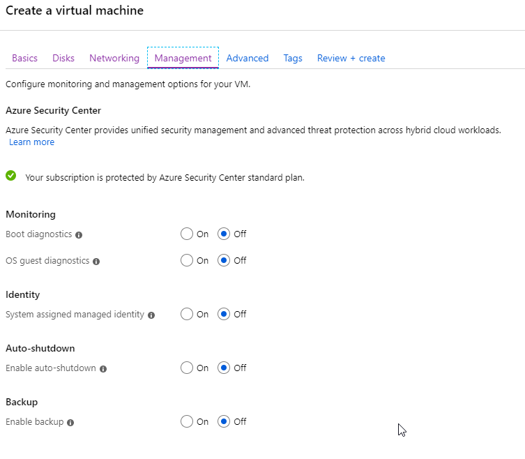

---
lab:
    title: '가상 네트워크 피어링'
    module: '모듈 02 - 플랫폼 보호'
---

# 랩: 가상 네트워크 피어링

**Scenario**

You can connect virtual networks to each other with virtual network peering. These virtual networks can be in the same region or different regions (also known as Global VNet peering). Once virtual networks are peered, resources in both virtual networks are able to communicate with each other, with the same latency and bandwidth as if the resources were in the same virtual network. In this tutorial, you learn how to:

- Create two virtual networks
- Connect two virtual networks with a virtual network peering
- Deploy a virtual machine (VM) into each virtual network
- Communicate between VMs


### Exercise 1: Create Virtual Networks and implement Peering.

### Task 1: Create virtual networks

1.  Select **+ Create a resource** on the upper, left corner of the Azure portal.
2.  Select **Networking**, and then select **Virtual network**.
3.  Enter, or select, the following information, accept the defaults for the remaining settings, and then select **Create**:

    |Setting|Value|
    |---|---|
    |Name|myVirtualNetwork1|
    |Address space|10.0.0.0/16|
    |Subscription| Select your subscription.|
    |Resource group| Select **Create new** and enter *myResourceGroup*.|
    |Location| Select **East US**.|
    |Subnet Name|Subnet1|
    |Subnet Address range|10.0.0.0/24|


4.  Complete steps 1-3 again, with the following changes:

    |Setting|Value|
    |---|---|
    |Name|myVirtualNetwork2|
    |Address space|10.1.0.0/16|
    |Resource group| Select **Use existing** and then select **myResourceGroup**.|
    |Subnet Address range|10.1.0.0/24|

### Task 2: Peer virtual networks

1.  In the Search box at the top of the Azure portal, begin typing *MyVirtualNetwork1*. When **myVirtualNetwork1** appears in the search results, select it.
2.  Select **Peerings**, under **SETTINGS**, and then select **+ Add**.

3.  Enter, or select, the following information, accept the defaults for the remaining settings, and then select **OK**.

    |Setting|Value|
    |---|---|
    |Name|myVirtualNetwork1-myVirtualNetwork2|
    |Subscription| Select your subscription.|
    |Virtual network|myVirtualNetwork2 - To select the *myVirtualNetwork2* virtual network, select **Virtual network**, then select **myVirtualNetwork2**. You can select a virtual network in the same region or in a different region.|
    |Name|myVirtualNetwork2-myVirtualNetwork1|


    The **PEERING STATUS** is *Initiated*, as shown in the following screenshot:


    If you don't see the status, refresh your browser.

    The **PEERING STATUS** is *Connected*. Azure also changed the peering status for the *myVirtualNetwork2-myVirtualNetwork1* peering from *Initiated* to *Connected.* Virtual network peering is not fully established until the peering status for both virtual networks is *Connected.* 
    
    

### Task 3: Create virtual machines

1.  Select **+ Create a resource** on the upper, left corner of the Azure portal.
2.  Select **Compute**, and then select **Windows Server 2016 Datacenter**. You can select a different operating system, but the remaining steps assume you selected **Windows Server 2016 Datacenter**. 
3.  Enter, or select, the following information for **Basics**, accept the defaults for the remaining settings, and then select **Create**:

    |Setting|Value|
    |---|---|
    |Resource group| Select **myResourceGroup**.|
    |Name|myVM1|
    |Region| East US|
    |User name| localadmin |
    |Password| Pa55w.rd1234 |
       
     
   

5.  Select the Networking Tab:

    |Setting|Value|
    |---|---|
    |Virtual network| myVirtualNetwork1 - If it's not already selected, select **Virtual network** and then select **myVirtualNetwork1** under **Choose virtual network**.|
    |Subnet| Subnet1 - If it's not already selected, select **Subnet** and then select **Subnet1** under **Choose subnet**.|
    |Public inbound ports| Select **Allow selected ports**|
    |Select inbound ports| **RDP** |


1.  Select the Management Tab and turn all the radio buttons to **Off**.

     

6.  Select **Review + create** and click **Create**.


1.  Complete the above steps again, with the following changes (The VMs take a few minutes to create. Do not continue with the remaining  steps until both VMs are created.):

 |Setting|Value|
 |---|---|
 |Name | myVM2|
 |Virtual network | myVirtualNetwork2|


### Task 4: Communicate between VMs

1.  In the *Search* box at the top of the portal, begin typing *myVM1*. When **myVM1** appears in the search results, select it.
2.  Create a remote desktop connection to the *myVm1* VM by selecting **Connect**.

3.  To connect to the VM, open the downloaded RDP file. If prompted, select **Connect**.
4.  Enter the user name and password you specified when creating the VM (you may need to select **More choices**, then **Use a different account**, to specify the credentials you entered when you created the VM), then select **OK**.
5.  You may receive a certificate warning during the sign-in process. Select **Yes** to proceed with the connection.
6.  In a later step, ping is used to communicate with the *myVm2* VM from the *myVm1* VM. Ping uses the Internet Control Message Protocol (ICMP), which is denied through the Windows Firewall, by default. On the *myVm1* VM, enable ICMP through the Windows firewall, so that you can ping this VM from *myVm2* in a later step, using PowerShell:

    ```powershell
    New-NetFirewallRule -DisplayName "Allow ICMPv4-In" -Protocol ICMPv4
    ```
    
    Though ping is used to communicate between VMs in this tutorial, allowing ICMP through the Windows Firewall for production deployments is not recommended.

7.  To connect to the *myVm2* VM, enter the following command from a command prompt on the *myVm1* VM:

    ```cli
    mstsc /v:10.1.0.4
    ```
    
8.  Since you enabled ping on *myVm1*, you can now ping it by IP address:

    ```cli
    ping 10.0.0.4
    ```
    
9.  Disconnect your RDP sessions to both *myVM1* and *myVM2*.


10. Leave all resources running.  You will use them in a later lab.


**Results**: You have now completed this lab.

