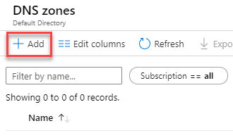
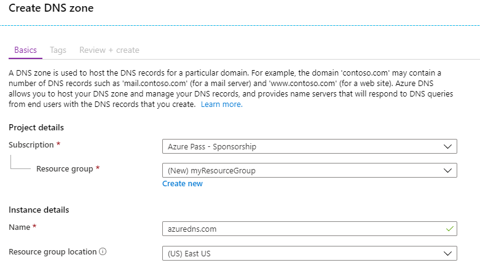
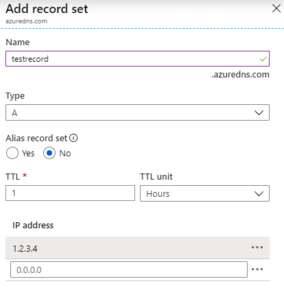
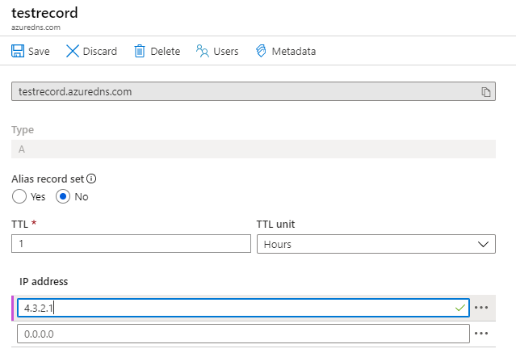
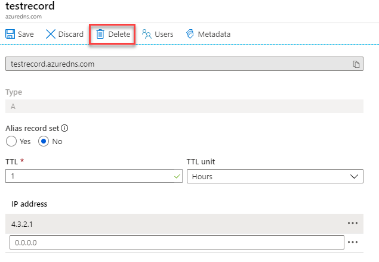

---
lab:
    title: '랩 9: Azure DNS'
    module: '모듈 2 - 플랫폼 보호 구현'
---

# 랩 9: Azure DNS

**시나리오**

이 모듈에서는 DNS 관련 기본 사항, 구체적으로는 Azure DNS를 구현하는 방법을 알아봅니다. DNS 기본 사항 단원에서는 DNS 도메인, 영역, 레코드 종류, 확인 방법 등을 검토합니다. 그리고 Azure DNS 단원에서는 위임, 메트릭, 경고, DNS 호스팅 체계 등을 살펴봅니다. 

**목표**

이 모듈에 포함된 단원은 다음과 같습니다.

 * Azure DNS 기본 사항
 * Azure DNS 구현

## 연습 1: DNS 영역

### 태스크 1: DNS 영역 만들기

1.  Azure Portal에 로그인합니다.
2.  허브 메뉴에서 **모든 서비스**를 클릭하고 **DNS 영역**을 검색하여 선택합니다.

     

1. **+ 추가**를 클릭합니다.

     

4.  **DNS 영역 만들기** 블레이드에서 다음 값을 입력하고 **검토 + 만들기**, **만들기**를 차례로 클릭합니다.

     | **설정** | **값** | **세부 정보** |
     |------|---|---|
     |**구독**|**사용자의 구독**|DNS 영역을 만들 구독을 선택합니다.|
     |**리소스 그룹**|다음 그룹을 새로 만듭니다. **_myResourceGroup_**|리소스 그룹을 만듭니다. 리소스 그룹 이름은 선택한 구독 내에서 고유해야 합니다. 
     |**이름**|**_see details**_|DNS 영역의 이름입니다. 고유한 이름을 지정해야 합니다. |
     |**위치**|미국 동부||

     

## 연습 2: Azure Portal을 사용하여 DNS 레코드와 레코드 집합 관리

이 연습에서는 Azure Portal을 사용하여 DNS 영역의 레코드 집합과 레코드를 관리하는 방법을 설명합니다.

### 태스크 1: 레코드 집합에 새 레코드 추가

1.  Azure Portal에서 **모든 리소스**로 이동하여 이전 태스크에서 만든 DNS 영역을 선택합니다.

**참고:** 각 DNS 영역에는 자체 리소스가 있으며, 이름 서버 및 레코드 집합 수 등의 정보를 이 보기에서 확인할 수 있습니다. 

 
3.  **+ 레코드 집합**을 클릭합니다.
 
     

4.  이름으로 **testrecord**를 입력하고 IP 주소로 **1.2.3.4**를 입력한 후에 **확인**을 클릭합니다.

     

### 태스크 2: 레코드 업데이트

1.  이전 태스크에서 만든 testrecord를 DNS 영역의 개요 블레이드에서 선택합니다.

      
 
2.  IP 주소에 테스트 주소 **4.3.2.1**을 추가하고 **저장**을 클릭합니다.

     
 
### 태스크 3: 레코드 집합에서 레코드 제거

Azure Portal을 사용하여 레코드 집합에서 레코드를 제거할 수 있습니다. 레코드 집합에서 마지막 레코드를 제거해도 레코드 집합은 삭제되지 않습니다.

1.  이전 태스크에서 만든 testrecord를 DNS 영역의 개요 창에서 선택합니다.

     

2.  **삭제**를 선택하고 메시지가 표시되면 **예**를 클릭합니다.

      
 

**NS 및 SOA 레코드 사용**

자동으로 생성되는 NS 및 SOA 레코드는 기타 레코드 종류와는 다른 방식으로 관리됩니다.

**SOA 레코드 수정**

영역 apex(이름 = "\@")에서 자동 생성되는 SOA 레코드 집합에서는 레코드를 추가하거나 제거할 수 없습니다. 그러나 "Host"를 제외한 SOA 레코드 내의 모든 매개 변수와 레코드 집합 TTL은 수정할 수 있습니다.

**영역 apex에서 NS 레코드 수정**

영역 apex에 설정되는 NS 레코드 집합은 각 DNS 영역과 함께 자동 생성되며 영역에 할당된 Azure DNS 이름 서버의 이름을 포함합니다.

DNS 공급자가 하나 이상 포함된 공동 호스팅 도메인을 지원하기 위해 이 NS 레코드 집합에 이름 서버를 더 추가할 수 있습니다. 이 레코드 집합의 TTL 및 메타데이터를 수정할 수도 있습니다. 그러나 미리 입력된 Azure DNS 이름 서버를 제거하거나 수정할 수는 없습니다.

이 규칙은 영역 apex에 설정된 NS 레코드 집합에만 적용됩니다. 자식 영역을 위임하는 데 사용되는 영역의 다른 NS 레코드 집합은 제한 없이 수정할 수 있습니다.

**SOA 또는 NS 레코드 집합 삭제**

영역을 만들 때 자동으로 생성되는 영역 apex(이름 = "\@")의 SOA 및 NS 레코드 집합은 삭제할 수 없습니다. 이러한 레코드 집합은 영역을 삭제하면 자동으로 삭제됩니다.

그러면 DNS 영역 삭제를 확인하라는 메시지가 표시됩니다. DNS 영역을 삭제하면 해당 영역에 포함된 레코드도 모두 삭제됩니다.

| 경고: 계속하기 전에 이 랩에서 사용한 모든 리소스를 제거해야 합니다.  **Azure Portal**에서 리소스를 제거하려면 **리소스 그룹**을 클릭합니다.  랩에서 만든 리소스 그룹을 모두 선택합니다.  리소스 그룹 블레이드에서 **리소스 그룹 삭제**를 클릭하고 리소스 그룹 이름을 입력한 다음 **삭제**를 클릭합니다.  추가로 만든 리소스 그룹이 있으면 이 프로세스를 반복합니다. **리소스 그룹을 삭제하지 않으면 다른 랩에서 문제가 발생할 수 있습니다.** |
| --- |
