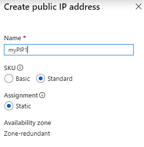
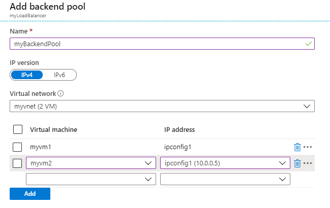
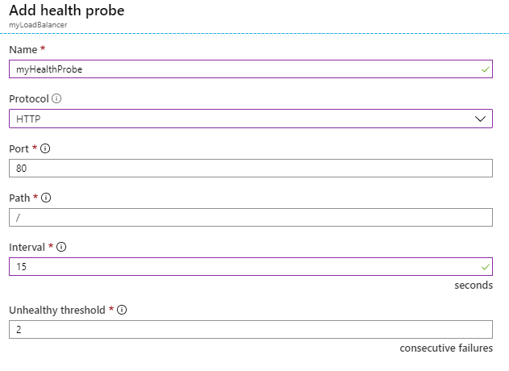
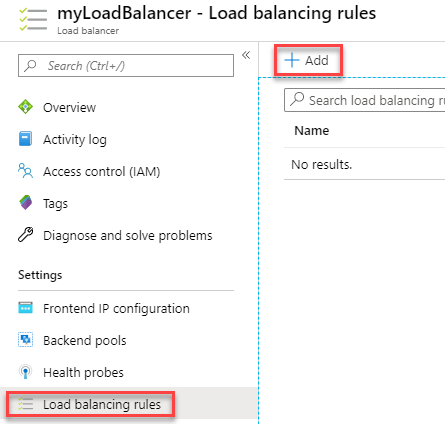
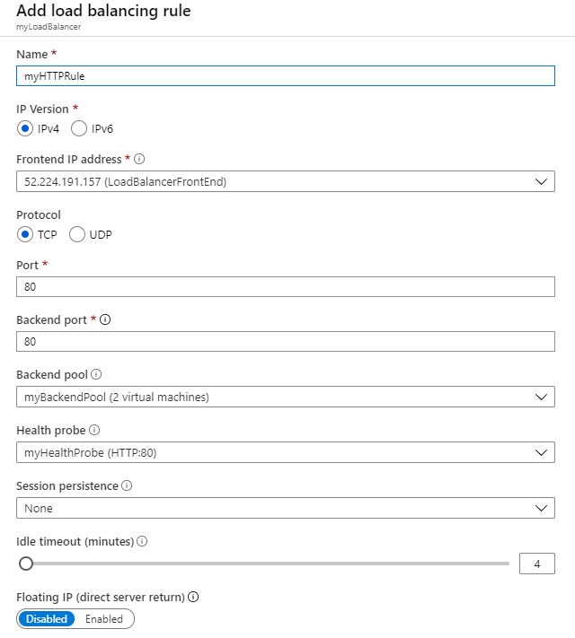
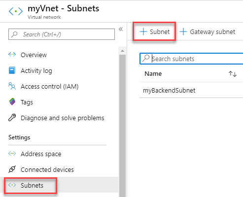
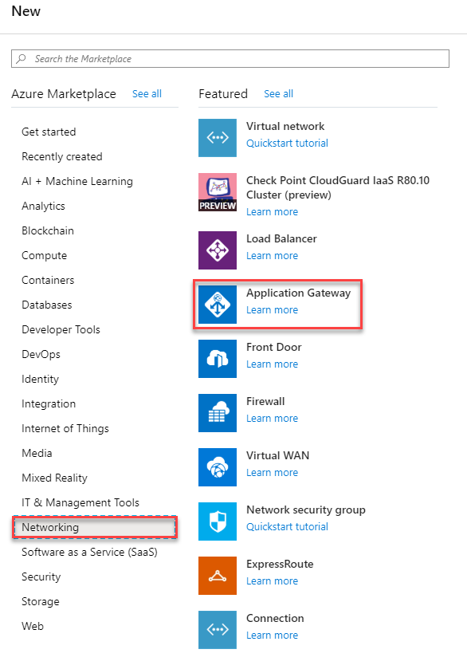
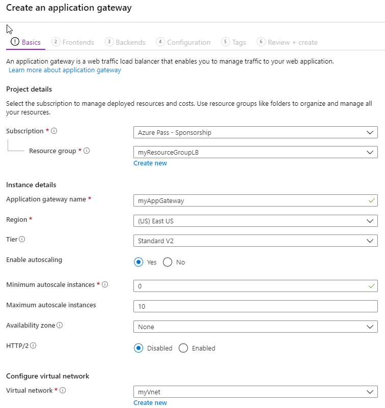
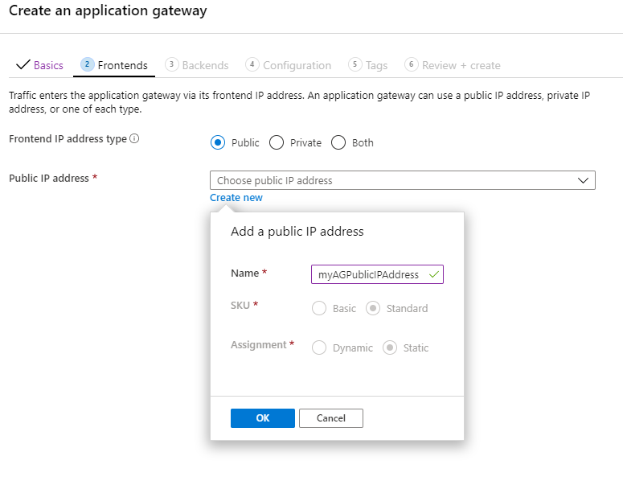
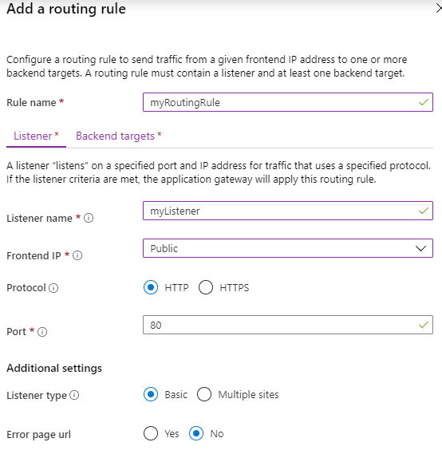

---
lab:
    title: 'Load Balancer'
    module: '모듈 02 - 플랫폼 보호'
---

# 랩: Load Balancer

**Scenario**

In this module, you will learn about three ways to distribute network traffic: Azure Load Balancer, Azure Traffic Manager, and Azure Application Gateway. The Azure Load Balancer delivers high availability and network performance to your applications. The Azure Traffic Manager allows you to control the distribution of user traffic to your service endpoints. The Azure Application Gateway is a web traffic load balancer that enables you to manage traffic to your web applications. 

**Lessons include:**

- Azure Load Balancer
- Azure Traffic Manager 
- Azure Application Gateway


#### Exercise 1: Distributing Network Traffic using a Standard Load Balancer


In this section, you create a public load balancer that helps load balance virtual machines. Standard Load Balancer only supports a Standard Public IP address. When you create a Standard Load Balancer, and you must also create a new Standard Public IP address that is configured as the frontend (named as *LoadBalancerFrontend* by default) for the Standard Load Balancer. 


#### Task 1: Create a public load balancer

1.  On the top left-hand side of the screen, click **Create a resource** > **Networking** > **Load Balancer**.  

2.  In the **Create load balancer** page, enter or select the following information, accept the defaults for the remaining settings, and then select **Review + create**:

    | Setting                 | Value                                              |
    | ---                     | ---                                                |
    | Subscription               | Select your subscription.    |
    |Resource group | Select **Create new**, and then type myResourceGroupLB    |
    | Name                   | *myLoadBalancer*                                   |
    | Region           | Select **East US**.                          |
    | Type          | Public                                        |
    | SKU           | Standard                          |
    | Public IP address | Select **Create new** and type *myPublicIP* in the name box.  |
    | Availability zone               | **Zone-redundant**    |
    
      

1.  On the Validation screen click **Create**.

#### Task 2: Create a virtual network

1.  On the top left-hand side of the screen click **+ Create a resource** > **Networking** > **Virtual network** and enter these values for the virtual network:
    - **myVnet** - for the name of the virtual network.
    - **10.0.0.0/16** - for the Address space
    - **myResourceGroupLB** - for the name of the existing resource group
    - **myBackendSubnet** - for the subnet name.
    - **10.0.0.0/24** - for the Subnet Address range
    </br>

2.  Click **Create** to create the virtual network.

     

#### Task 3: Create virtual machines

1.  On the top left-hand side of the screen, click **Create a resource** > **Compute** > **Virtual Machine** and enter these values for the virtual machine:
          
    - **myResourceGroupLB** - for **Resource group**, select *myResourceGroupLB* from the drop down menu.
    - **myVM1** - for the name of the virtual machine.  
    - **Image** - Windows Server 2019 Datacenter.
    - **localadmin** - for the **Username**
    - **Pa55w.rd1234** - for the **Password**
    - **HTTP (80) & RDP (3389)** - for the inbound port rules.
    </br>

     

1.  Click the Networking Tab and under Public IP click **Create new**.  Name the IP Address **myPIP1** and click the **Standard SKU** then click **OK**.

    **Note**: If you do not select the Standard SKU here you will have problems later in the lab.


     

2.  Select the **Management** Tab and ensure all radio buttons are **No** or **Off**.

1.  Click **Review + create** then click **Create**.

7.  Repeat the steps above to create a second VM, called ***myVM2*** using _**myPIP2**_ for the new Public IP address. 
 
#### Task 4: Install IIS

1.  Click **All resources** in the left-hand menu, and then from the resources list click **myVM1** that is located in the *myResourceGroupLB* resource group.

2.  On the **Overview** page, click **Connect** to RDP into the VM.
3.  Log into the VM with username *localadmin*.
4.  Open PowerShell and run the following command to install IIS.

     ```powershell
    Install-WindowsFeature Web-Server
     ```

7.  Repeat steps 1 to 4 for the virtual machine *myVM2*.

#### Task 5: Create load balancer resources


In this section, you  configure load balancer settings for a backend address pool and a health probe, and specify a load balancer rule.

To distribute traffic to the VMs, a backend address pool contains the IP addresses of the virtual (NICs) connected to the load balancer. Create the backend address pool *myBackendPool* to inlcude *VM1* and *VM2*.


1.  Click **All resources** in the left-hand menu, and then click **myLoadBalancer** from the resources list.

2.  Under **Settings**, click **Backend pools**, then click **Add**.

     

3.  On the **Add a backend pool** page, do the following:
   - For name, type *myBackendPool*, as the name for your backend pool.
   - For **Virtual network**, select *myVNet*.
   - Add *myVM1* and *my VM2* under **Virtual Machine** along with their corresponding IP addresses, and then select **Add**.
     </br>
 
     

3.  Check to make sure your load balancer backend pool setting displays both the VMs **VM1** and **VM2**.

     

#### Task 6: Create a health probe


To allow the load balancer to monitor the status of your app, you use a health probe. The health probe dynamically adds or removes VMs from the load balancer rotation based on their response to health checks. Create a health probe *myHealthProbe* to monitor the health of the VMs.


1.  On the Load Balancer blade, under **Settings**, click **Health probes**, then click **Add**.

     

3.  Use these values to create the health probe:
    - *myHealthProbe* - for the name of the health probe.
    - **HTTP** - for the protocol type.
    - *80* - for the port number.
    - */* - for the URI path. 
    - *15* - for number of **Interval** in seconds between probe attempts.
    - *2* - for number of **Unhealthy threshold** or consecutive probe failures that must occur before a VM is considered unhealthy.
    </br>
 
     


4.  Click **OK**.


#### Task 7: Create a load balancer rule


A load balancer rule is used to define how traffic is distributed to the VMs. You define the frontend IP configuration for the incoming traffic and the backend IP pool to receive the traffic, along with the required source and destination port. Create a load balancer rule *myLoadBalancerRuleWeb* for listening to port 80 in the frontend *FrontendLoadBalancer* and sending load-balanced network traffic to the backend address pool *myBackEndPool* also using port 80. 


1.  On the Load Balancer blade, under **Settings**, click **Load balancing rules**, then click **Add**.

     


3.  Use these values to configure the load balancing rule:
    - *myHTTPRule* - for the name of the load balancing rule.
    - **TCP** - for the protocol type.
    - *80* - for the port number.
    - *80* - for the backend port.
    - *myBackendPool* - for the name of the backend pool.
    - *myHealthProbe* - for the name of the health probe.
    </br>
    
      
    
4.  Click **OK**.
    
#### Task 8: Test the load balancer

1.  Find the public IP address for the Load Balancer on the **Overview** screen.

     
  
2.  Copy the public IP address, and then paste it into the address bar of your browser. The default page of IIS Web server is displayed on the browser.

     

1.  Notice the IIS default page loads.

1.  In the Azure Portal click on **Virtual Machines** in the hub menu.  Select myVM1 and in the **Overview** blade click **Stop** and confirm **Yes**.

     
 
1.  Wait until the myVM1 Virtual Machine has stopped then go back to the browser tab with the load lanancer public IP and click refresh to confirm myVM2 is continuing to service the requests and the load balancer is functioning as expected.

#### Exercise 2:  Load Balancer ARM Deployments

#### Task 1: Deploy an ARM template 


This template allows you to create 2 Virtual Machines under a Load balancer and configure a load balancing rule on Port 80. This template also deploys a Storage Account, Virtual Network, Public IP address, Availability Set and Network Interfaces. In this template, we use the resource loops capability to create the network interfaces and virtual machines


1.  In a new tab in your browser, navigate to the following URL **`https://aka.gd/2E2MAjh`**

1.  Click **Deploy to Azure**

     

1.  On the template blade that opens, enter the following details:

      - Resource group:  **myResourceGroupLB**
      - Admin Username:  **localadmin**
      - Admin Password:  **Pa55w.rd1234**

1.  Click **I agree....** and click **Purchase**.
# Exercise 3: Deploying Application Gateways

#### Task 1: Create an application gateway


A virtual network is needed for communication between the resources that you create. Two subnets are created in this example: one for the application gateway, and the other for the backend servers. You can create a virtual network at the same time that you create the application gateway.


1.  First you need to create a subnet for the Application Gateway to reside in.  Click **Virtual networks** on hub menu and select **myVNet**.

     
 
1.  Click **Subnets** and click **+ Subnet**.

     
 
1.  Enter **myAppGWSubnet** as the name and click **OK**.

     

1.  Click **Create a resource** found on the upper left-hand corner of the Azure portal.

2.  Click **Networking** and then click **Application Gateway** in the Featured list.

     

1.  Enter these values for the application gateway basics blade then click **Next**:

    - *myAppGateway* - for the name of the application gateway.
    - *myResourceGroupLB* - select the already existing Resource Group.
    - *myVnet* - select the already existing Virtual network.
      </br>
    
      

7.  Under **Frontend configuration** blade, ensure **IP address type** is set to **public**, and under **Public IP address**, click **Create new**. Type ***myAGPublicIPAddress*** for the public IP address name and then click **OK**.

     
 
1. Click **Next**.

1. Select **+Add a backend pool**.

1. Enter the name **appGatewayBackendPool**.  Under backend targets select **Virtual Machine** and add myVM1 and myVM2 virtual machines and their associated network interfaces then click **Add**.

     

1. Click **Next**.

1. On the **Configuration** tab, you'll connect the frontend and backend pool you created using a routing rule.

1. Select **Add a rule** in the **Routing rules** column.

2. In the **Add a routing rule** window that opens, enter *myRoutingRule* for the **Rule name**.

3. A routing rule requires a listener. On the **Listener** tab within the **Add a routing rule** window, enter the following values for the listener:

    - **Listener name**: Enter *myListener* for the name of the listener.
    - **Frontend IP**: Select **Public** to choose the public IP you created for the frontend.
  
      Accept the default values for the other settings on the **Listener** tab, then select the **Backend targets** tab to configure the rest of the routing rule.

       

4. On the **Backend targets** tab, select **appGatewayBackendPool** for the **Backend target**.

5. For the **HTTP setting**, select **Create new** to create a new HTTP setting. The HTTP setting will determine the behavior of the routing rule. In the **Add an HTTP setting** window that opens, enter *myHTTPSetting* for the **HTTP setting name**. Accept the default values for the other settings in the **Add an HTTP setting** window, then select **Add** to return to the **Add a routing rule** window. 


    

6. On the **Add a routing rule** window, select **Add** to save the routing rule and return to the **Configuration** tab.

      

7. Select **Add**

7. Select **Next: Tags** and then **Next: Review + create**.


#### Task 2: Test the application gateway

1.  Find the public IP address for the application gateway on the Overview screen. Click **All resources** and then click **myAGPublicIPAddress**.

     
 
2.  Copy the public IP address, and then paste it into the address bar of your browser.

     


| WARNING: Prior to continuing you should remove all resources used for this lab.  To do this in the **Azure Portal** click **Resource groups**.  Select any resources groups you have created.  On the resource group blade click **Delete Resource group**, enter the Resource Group Name and click **Delete**.  Repeat the process for any additional Resource Groups you may have created. **Failure to do this may cause issues with other labs.** |
| --- |
**Results**: You have now completed this lab.
