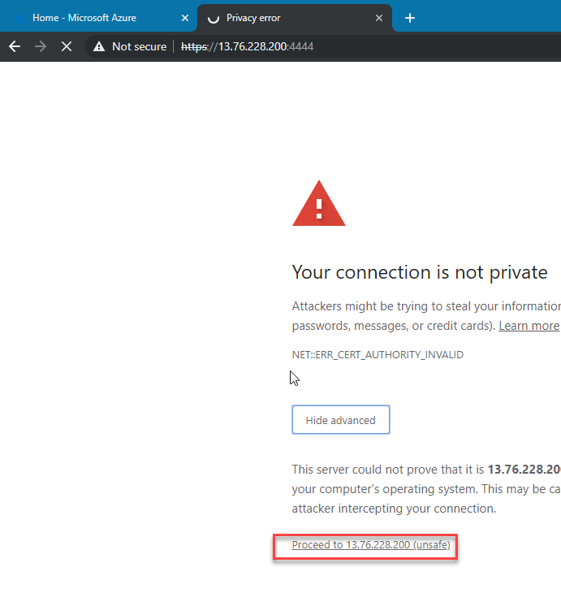
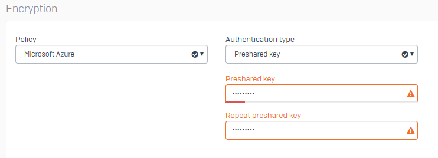
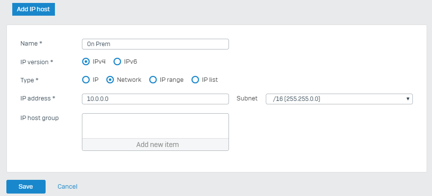

---
lab:
    title: '온-프레미스와 Azure 연결 - VPN 게이트웨이와 터널링'
    module: '모듈 02 - 플랫폼 보호'
---

# 랩: 온-프레미스와 Azure 연결 - VPN 게이트웨이와 터널링

## Exercise 1: Deploy Virtual Appliances and Gateways for intersite connectivity.

### Task 1: Deploy a Virtual Appliance.


In this task you will create a Sophos XG Virtual Appliance which will emulate an on-premises device.  The layout of this is depicted in the digaram below

   

1.  Open PowerShell and run the following command.

     ```powershell
    start "https://portal.azure.com/#create/Microsoft.Template/uri/https%3A%2F%2Fraw.githubusercontent.com%2FGoDeploy%2FAZ300%2Fmaster%2Fxg-azure-master%2FmainTemplate.json"
     ```
 
2.  Login to the portal if required.

3.  On the Custom deployment enter or select the following details:

 | Setting | Value |
 |---|---|
 | Resource Group | _Create New_ **OnPremRG** |
 | Location | **Southeast Asia** |
 | Admin Password | **Pa55w.rd1234** |
 | Public IP DNS | _Enter a unique name_ |
 | Storage Name | _Enter a unique name_ |
 
4.  Scroll to the bottom of the blade and click the check box next to  I agree to the terms and conditions..... and click **Purchase**. 
 
### Task 2: Create a Resource Group and VNet.


In this task you will create a Virtual Machine and a Virtual Network inside a new Resource group which will be use to connect to your emulated On-Prem environment.


1.  Login to your Azure Portal **`https://portal.azure.com`**

1.  Click **Create a resource** > **Networking** > **Virtual Network**

1.  Change the values in the **Create virtual network** blade change the values tobe the same as the output below:

      - **Name** S2S_RG-vnet
      - **Address space** 172.17.0.0/16
      - **Resource group** Create New: S2S_RG
      - **Location**: East US
      - **Subnet address range** 172.17.0.0/24

1.  Click **Create**.
**Note:**  You can continue to the next task without having to wait for the deployment to complete.


### Task 2: Create a Gateway Subnet and a Virtual network Gateway.


In this tak you will Create a Gateway Subnet and a Virtual network Gateway which will enable you to create a connection between On-Prem and your Azure VNet.


1.  In the Azure Portal click **Resource Groups** on the Hub Menu.
 
1.  Click the **S2S_RG** resource group that has been created for you.

1.  In the S2S_RG Resource Group blade click the **S2S_RG-vnet**.

1.  On the  **S2S_RG-vnet** menu click **Subnets**.

1.  Click **+ Gateway subnet**.  

    **Note:** You need to create a Gateway subnet in order for the Gateway machines to reside in.  All the routing is done by the Azure Software Defined Networking.


1.  Leave the default options on the **Add subnet** blade and click **OK**.

1.  Click **+ Create a resource**.

1.  Search for Virtual Network Gateway and select **Virtual network gateway**.

1.  Click **Create**.

1.  On the **Create virtual network gateway** blade enter the following information:

      - **Name**: S2S-GW
      - **Name**: (US) East US
      - **Gateway type**: VPN
      - **VPN Type**: Route-based
      - **SKU**: Basic
      - **Virtual network**: Select the S2S_RG-vnet (this was created earlier when you deployed the VM)
      - **Public IP address**: (Create New) Name: S2S-GW-PIP


     

1.  Click **Review + create** then on the summary screen click **Create**

**Note:**  The gateway may take upto 45 minutes to deploy, although. in most cases it is much quicker.  Monitor this by clicking on the Bell Icon. You can continue to the next task whilst the Gateway is deploying.


### Task 3: Configure the Sophos virtual appliance.

1.  On the Azure Portal Hub menu click **Resource Groups**.

1.  Select the **OnPremRG** Resource Group.

1.  Select the **PublicIP** Resource.

     

1.  Make a note of the assigned Public IP address.

     

1.  Open a new browser session and navigate to **`https://x.x.x.x:4444`** (where x.x.x.x is the public IP address you noted above).

1.  Depending on your browser there may be different options to proceed with the connection.

     

1.  Log into the Firewall with the following credentials:

      - Admin
      - Pa55w.rd1234
 
1.  Accept the licence agreement.

1.  On the Register your firewall page click **I don't have a a serial number (start a trial)** and select **I do not want to register now** then click **Continue**.

     

1.  On the Warning pop up click **Continue**.

1.  Return back to the Azure Portal.  Open the **S2S_RG** Resource Group and select the **S2S-GW-PIP** Public IP and make a note of it.

    **Note**: This is your Public IP you will connect your Sophos virtual appliance to via IPSec VPN.


     
 
1.  Return back to the Sophos Portal.

1.  Go to **VPN > IPsec Connections**, select **Add **and configure the following settings:

    **General Settings Section:**

      - **Name**: On_Prem_to_Azure
      - **IP Version**: IPv4.
      - **Activate on Save:** Selected.
      - **Create firewall rule:** Selected.
      - **Description**: Site to Site connection from On Prem to Azure VNet.
      - **Connection Type**: Site-to-Site.
      - **Gateway Type**: Respond Only.

     

    **Encryption Section**:

      - **Policy**: Microsoft Azure.
      - **Authentication Type**: Preshared Key.
      - **Preshared Key**: 123456789
      - **Repeat Preshared Key**: 123456789

     

    **Gateway Settings Section**:

      - **Listening Interface**: Leave the default.
      - **Gateway Address**: Input the public IP of the Azure VPN gateway noted earlier.
      - **Local ID**: IP Address.
      - **Remote ID**: IP Address.
      - **Local ID**: Enter the public IP of the on-premises Sophos XG Firewall.
      - **Remote ID**: Input the public IP of the Azure VPN gateway that you noted earlier.
      - **Local Subnet**: Enter the local subnet of 10.0.0.0 /16 (255.255.0.0)


      

      - **Remote Subnet**: Enter the remote subnet 172.17.0.0 /16 (255.255.0.0)
</br>


1.  **Advanced**: leave the default settings.

1.  Upon clicking **Save**, the IPsec connection is activated.

**Note**: Do not click on the button under the **Connection** column as it will override the configuration settings set on the IPsec connection (**Gateway type: Respond only**). This is to avoid issues since Azure must initiate the tunnel.


### Task 4: Creating Azure connection.


In this task you will create a connection on your Azure Gateway to the On-Prem firewall and establish the connection.


1.  Click on **Resource Groups** on the **Hub Menu**.

2.  Select the **S2S_RG** Resource Group. 
 
1.  Select your **S2S-GW** Gateway. 

1.  Click **Connections** from the S2S-GW menu.

1.  Click **Add**.

1.  Enter the following information in the **Add connection** blade.

      - **Name:** GWConnection
      - **Connection type:** Site-to-site (IPSec)
      - **Virtual Network Gateway:** S2S-GW

1.  Click the **Local network gateway**

1.  Click **Create new**.

1.  Enter the following information in the **Create local network gateway** blade:

      - **Name:** OnPremGW
      - **IP address:** _Enter your IP address of your Sophos on prem firewall you recorded earlier_
      - **Address space:** 10.0.0.0/16  _(Note:  This is the IP range of your On-Prem servers)_

 
1.  Click **OK**.

2.  In the **Shared key (PSK)** box enter `123456789` then click **OK**.

    **Note:**  This key is just for this lab.  In the real world you would use something with greater complexity.


1.  Refresh the page and the connection should be established.

    **Note:**  It may take 30 seconds to establish the connection.

 
     


| WARNING: Prior to continuing you should remove all resources used for this lab.  To do this in the **Azure Portal** click **Resource groups**.  Select any resources groups you have created.  On the resource group blade click **Delete Resource group**, enter the Resource Group Name and click **Delete**.  Repeat the process for any additional Resource Groups you may have created. **Failure to do this may cause issues with other labs.** |
| --- |  


**Results**: You have now completed this lab.
