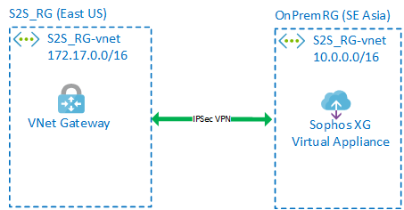
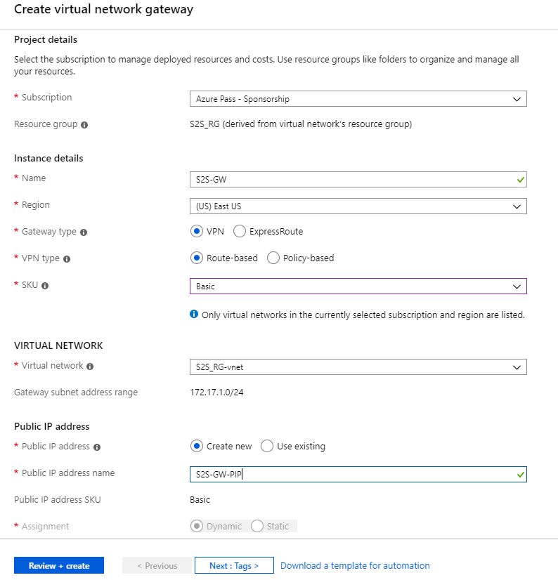
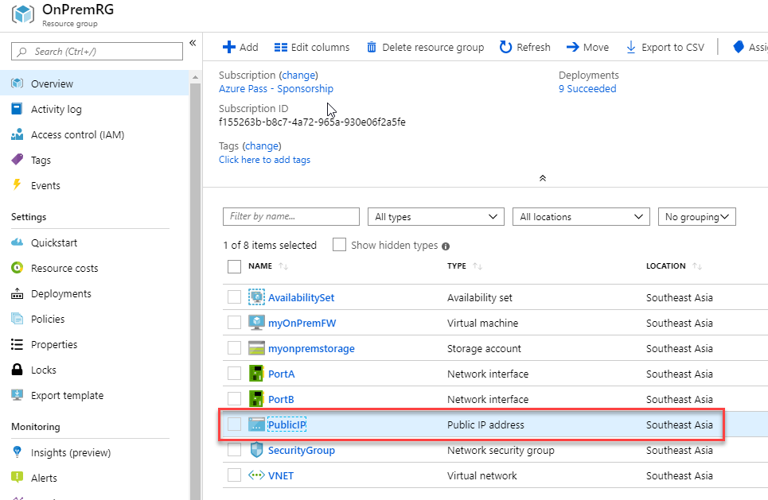
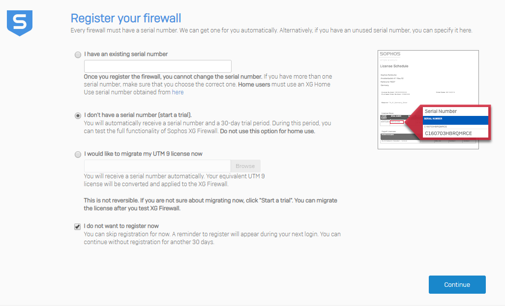
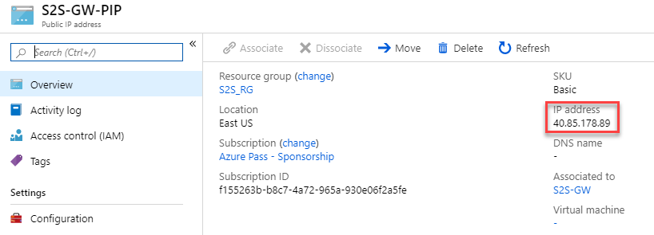
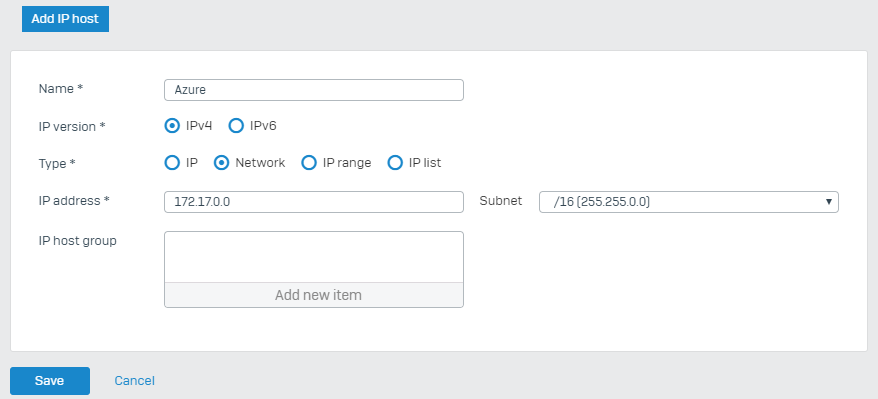

---
lab:
    title: '랩 11: 온-프레미스 및 Azure 간 연결 - VPN 게이트웨이 및 터널링'
    module: '모듈 2 - 플랫폼 보호 구현'
---

# 모듈 2: 랩 11: 온-프레미스 및 Azure 간 연결 - VPN 게이트웨이 및 터널링

## 연습 1: 사이트 간 연결용 가상 어플라이언스 및 게이트웨이 배포

### 태스크 1: 가상 어플라이언스 배포


이 태스크에서는 온-프레미스 디바이스를 에뮬레이트하는 Sophos XG 가상 어플라이언스를 만듭니다.  아래 다이어그램에 이 어플라이언스의 레이아웃이 나와 있습니다.

   

1.  PowerShell을 열고 다음 명령을 입력합니다.

     ```powershell
    start "https://portal.azure.com/#create/Microsoft.Template/uri/https%3A%2F%2Fraw.githubusercontent.com%2FMicrosoftLearning%2FAZ-500-Azure-Security%2Fmaster%2FAllfiles%2FLabs%2FMod2_Lab11%2Ftemplate.json"
     ```
 
2.  필요한 경우 Portal에 로그인합니다.

3.  사용자 지정 배포에서 다음 세부 정보를 입력하거나 선택합니다.

 | 설정 | 값 |
 |---|---|
 | 리소스 그룹 | _새로 만들기_: **OnPremRG** |
 | 위치 | **동남 아시아** |
 | 관리자 암호 | **Pa55w.rd1234** |
 | 공용 IP DNS | _고유한 이름 입력_ |
 | 스토리지 이름 | _고유한 이름 입력_ |
 
4.  블레이드 아래쪽으로 스크롤한 다음 사용 약관에 동의합니다. 옆의 확인란을 클릭하고 **구매**를 클릭합니다. 
 
### 태스크 2: 리소스 그룹 및 VNet 만들기


이 태스크에서는 새 가상 리소스 그룹 내에 가상 머신과 가상 네트워크를 만듭니다. 이 가상 머신과 가상 네트워크를 사용하여 에뮬레이트된 온-프레미스 환경에 연결합니다.


1.  Azure Portal(**`https://portal.azure.com`**)에 로그인합니다.

1.  **리소스 만들기** > **네트워킹** > **가상 네트워크**를 클릭합니다.

1.  **가상 네트워크 만들기** 블레이드에서 아래 출력과 같이 값을 변경합니다.

      - **이름** S2S_RG-vnet
      - **주소 공간** 172.17.0.0/16
      - **리소스 그룹** 새로 만들기: S2S_RG
      - **위치**: 미국 동부
      - **서브넷 주소 범위** 172.17.0.0/24

1.  **만들기**를 클릭합니다.
**참고:**  배포가 완료될 때까지 기다릴 필요 없이 다음 태스크를 계속 진행할 수 있습니다.


### 태스크 2: 게이트웨이 서브넷과 가상 네트워크 게이트웨이 만들기


이 태스크에서는 게이트웨이 서브넷과 가상 네트워크 게이트웨이를 만듭니다. 그러면 온-프레미스와 Azure VNet 간에 연결을 생성할 수 있습니다.


1.  Azure Portal에서 허브 메뉴의 **리소스 그룹**을 클릭합니다.
 
1.  미리 작성되어 있는 **S2S_RG** 리소스 그룹을 클릭합니다.

1.  S2S_RG 리소스 그룹 블레이드에서 **S2S_RG-vnet**을 클릭합니다.

1.  **S2S_RG-vnet** 블레이드에서 **서브넷**을 클릭합니다.

1.  **+ 게이트웨이 서브넷**을 클릭합니다.  

    **참고:** 게이트웨이 컴퓨터를 포함할 게이트웨이 서브넷을 만들어야 합니다. Azure Software Defined Networking에서 모든 라우팅을 수행합니다.


1.  **서브넷 추가** 블레이드에서 기본 옵션을 그대로 유지하고 **확인**을 클릭합니다.

1.  **+ 리소스 만들기**를 클릭합니다.

1.  가상 네트워크 게이트웨이를 검색한 다음 **가상 네트워크 게이트웨이**를 선택합니다.

1.  **만들기**를 클릭합니다.

1.  **가상 네트워크 게이트웨이 만들기** 블레이드에서 다음 정보를 입력합니다.

      - **이름**: S2S-GW
      - **이름**: (미국) 미국 동부
      - **게이트웨이 유형**: VPN
      - **VPN 유형**: 경로 기반
      - **SKU**: 기본
      - **가상 네트워크**: VM을 배포할 때 작성된 S2S_RG-vnet 선택
      - **공용 IP 주소**: (새로 만들기) 이름: S2S-GW-PIP


     

1.  **검토 + 만들기**를 클릭하고 요약 화면에서 **만들기**를 클릭합니다.

**참고:**  게이트웨이를 배포하려면 최대 45분이 걸릴 수 있지만 대부분의 경우에는 훨씬 빠른 시간 내에 배포됩니다.  종 모양 아이콘을 클릭하여 배포를 모니터링합니다. 게이트웨이가 배포되는 동안 다음 태스크를 계속 진행할 수 있습니다.


### 태스크 3: Sophos 가상 어플라이언스 구성

1.  Azure Portal에서 허브 메뉴의 **리소스 그룹**을 클릭합니다.

1.  **OnPremRG** 리소스 그룹을 선택합니다.

1.  **PublicIP** 리소스를 선택합니다.

     

1.  할당된 공용 IP 주소를 적어 둡니다.

     

1.  새 브라우저 세션을 열고 **`https://x.x.x.x:4444`**로 이동합니다. 여기서 xxxx는 위에서 적어 둔 공용 IP 주소입니다.

1.  브라우저에 따라 연결을 진행하는 데 사용 가능한 다른 옵션이 있을 수도 있습니다.

     

1.  다음 자격 증명을 사용하여 방화벽에 로그인합니다.

      - Admin
      - Pa55w.rd1234
 
1.  사용권 계약에 동의합니다.

1.  방화벽 등록 페이지에서 **일련 번호 없음(평가판 시작).**을 클릭하고 **지금 등록하지 않음**을 선택한 후에 **계속**을 클릭합니다.

     

1.  경고 팝업에서 **계속**을 클릭합니다.

1.  Azure Portal로 돌아옵니다.  **S2S_RG** 리소스 그룹을 열고 **S2S-GW-PIP** 공용 IP를 선택한 후에 적어 둡니다.

    **참고**: IPSec VPN을 통해 이 공용 IP에 Sophos 가상 어플라이언스를 연결합니다.


     
 
1.  Sophos Portal로 돌아옵니다.

1.  **VPN > IPsec 연결**로 이동하여 **추가**를 선택하고 다음 설정을 구성합니다.

    **일반 설정 섹션:**

      - **이름**: On_Prem_to_Azure
      - **IP 버전**: IPv4.
      - **저장 시 활성화:** 선택
      - **방화벽 규칙 만들기:** 선택
      - **설명**: On Prem에서 Azure VNet으로의 사이트 간 연결입니다.
      - **연결 형식**: 사이트 간
      - **게이트웨이 유형**: 응답만

     

    **암호화 섹션**:

      - **정책**: Microsoft Azure
      - **인증 유형**: 미리 공유한 키
      - **미리 공유한 키**: 123456789
      - **미리 공유한 키 다시 입력**: 123456789

     

    **게이트웨이 설정 섹션**:

      - **수신 대기 인터페이스**: 기본값 유지
      - **게이트웨이 주소**: 앞에서 적어 둔 Azure VPN 게이트웨이의 공용 IP 입력
      - **로컬 ID**: IP 주소
      - **원격 ID**: IP 주소
      - **로컬 ID**: 온-프레미스 Sophos XG Firewall의 공용 IP 입력
      - **원격 ID**: 앞에서 적어 둔 Azure VPN 게이트웨이의 공용 IP 입력
      - **로컬 서브넷**: 로컬 서브넷 10.0.0.0/16(255.255.0.0) 입력


      

      - **원격 서브넷**: 원격 서브넷 172.17.0.0/16(255.255.0.0) 입력
</br>

        

1.  **고급**: 기본 설정 유지

1.  **저장**을 클릭하면 IPsec 연결이 활성화됩니다.

**참고**: **연결** 열 아래의 단추는 클릭하지 마세요. 이 단추를 클릭하면 IPsec 연결에 설정된 구성 설정(**게이트웨이 유형: 응답만**)이 재정의됩니다. 설정이 재정의되는 이유는 Azure에서 터널을 시작해야 하므로 문제를 방지하기 위해서입니다.


### 태스크 4: Azure 연결 만들기


이 태스크에서는 Azure Gateway에서 온-프레미스 방화벽으로의 연결을 생성 및 설정합니다.


1.  **허브 메뉴**의 **리소스 그룹**을 클릭합니다.

2.  **S2S_RG** 리소스 그룹을 선택합니다. 
 
1.  **S2S-GW** 게이트웨이를 선택합니다. 

1.  S2S-GW 메뉴에서 **연결**을 클릭합니다.

1.  **추가**를 클릭합니다.

1.  **연결 추가** 블레이드에서 다음 정보를 입력합니다.

      - **이름:** GWConnection
      - **연결 형식:** 사이트 간(IPSec)
      - **가상 네트워크 게이트웨이:** S2S-GW

1.  **로컬 네트워크 게이트웨이**를 클릭합니다.

1.  **새로 만들기**를 클릭합니다.

1.  **로컬 네트워크 게이트웨이 만들기** 블레이드에서 다음 정보를 입력합니다.

      - **이름:** OnPremGW
      - **IP 주소:** _앞에서 적어 둔 Sophos 온-프레미스 방화벽의 IP 주소 입력_
      - **주소 공간:** 10.0.0.0/16_(참고:  이 주소 공간은 온-프레미스 서버의 IP 범위입니다.)_

 
1.  **확인**을 클릭합니다.

2.  **공유 키(PSK)** 상자에`123456789`를 입력하고 **확인**을 클릭합니다.

    **참고:**  이 키는 이 랩에서만 사용할 수 있습니다.  실제 환경에서는 더 복잡한 키를 사용해야 합니다.


1.  페이지를 새로 고치면 연결이 설정됩니다.

    **참고:**  연결을 설정하려면 30초 정도 걸릴 수 있습니다.

 
     


| 경고: 계속하기 전에 이 랩에서 사용한 모든 리소스를 제거해야 합니다.  **Azure Portal**에서 리소스를 제거하려면 **리소스 그룹**을 클릭합니다.  랩에서 만든 리소스 그룹을 모두 선택합니다.  리소스 그룹 블레이드에서 **리소스 그룹 삭제**를 클릭하고 리소스 그룹 이름을 입력한 다음 **삭제**를 클릭합니다.  추가로 만든 리소스 그룹이 있으면 이 프로세스를 반복합니다. **리소스 그룹을 삭제하지 않으면 다른 랩에서 문제가 발생할 수 있습니다.** |
| --- |  


**결과**: 이 랩이 완료되었습니다.
