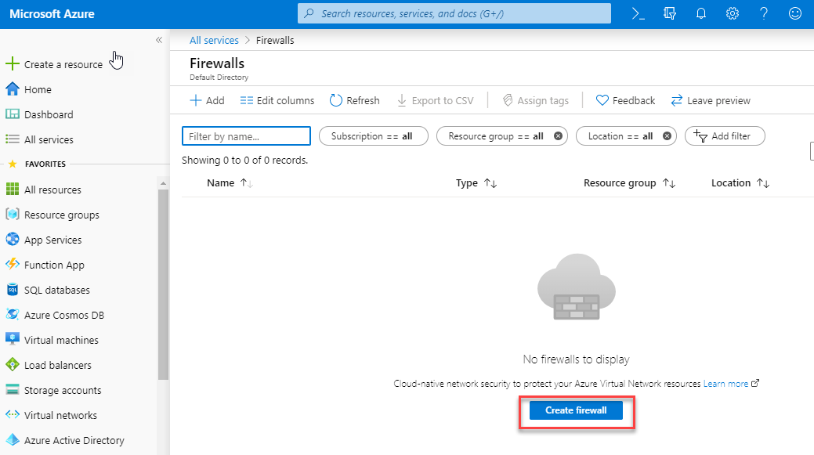

---
lab:
    title: '랩 12 - Azure Firewall'
    module: '모듈 2 - 플랫폼 보호 구현'
---

# 모듈 2: 랩 12 - Azure Firewall


**시나리오**

아웃바운드 네트워크 액세스 제어 작업은 전반적인 네트워크 보안 계획의 중요한 부분입니다. 예를 들어 웹 사이트 액세스를 제한하거나 액세스 가능한 아웃바운드 IP 주소와 포트를 제한할 수 있습니다.

Azure 서브넷에서 아웃바운드 네트워크 액세스를 제어할 수 있는 한 가지 방법은 Azure Firewall을 사용하는 것입니다. Azure Firewall을 사용하면 다음을 구성할 수 있습니다.

* 서브넷에서 액세스할 수 있는 FQDN(정규화된 도메인 이름)을 정의하는 애플리케이션 규칙
* 원본 주소, 프로토콜, 대상 포트 및 대상 주소를 정의하는 네트워크 규칙

서브넷 기본 게이트웨이인 방화벽으로 네트워크 트래픽을 라우팅할 때는 구성된 방화벽 규칙이 네트워크 트래픽에 적용됩니다.

## 연습 1: Azure Firewall 배포

### 태스크 1: 랩 설정

1.  PowerShell을 열고 다음 PowerShell 명령을 실행하여 이 랩 전체에서 사용되는 리소스를 배포하는 데 사용할 ARM 템플릿을 엽니다.  _메시지가 표시되면 Chrome을 브라우저로 선택합니다._

     ```powershell
    start "https://portal.azure.com/#create/Microsoft.Template/uri/ https%3A%2F%2Fraw.githubusercontent. com%2FGoDeploy%2FAZ500%2Fmaster%2FAZ500%20Mod2%20Lab%207%2Ftemplate.json"
     ```
 
2.  리소스 그룹 아래의 **새로 만들기**를 클릭하고 리소스 그룹 이름으로 **Test-FW-RG**를 입력합니다.  

3.  위치로는 **미국 동부**를 선택합니다.  

4.  기타 모든 필드의 값은 미리 입력된 기본값으로 유지합니다.

5.  동의... 확인란을 선택하고 **구매**를 클릭한 후에 배포가 완료될 때까지 기다립니다.

    이 랩 설정 템플릿은 다음과 같은 랩용 리소스를 설정합니다.

 |이름     |유형     | 위치|
 |---------|---------|---------|
azureFirewalls-ip|	공용 IP 주소|	미국 동부	
Firewall-route |	경로 테이블|	미국 동부	
Srv-Jump|	가상 머신|	미국 동부	
Srv-Jump_OsDisk|	디스크|	미국 동부	
srv-jump121	|네트워크 인터페이스|	미국 동부	
Srv-Jump-nsg|	네트워크 보안 그룹|	미국 동부	
Srv-Jump-PIP|	공용 IP 주소|	미국 동부	
Srv-Work|	가상 머신|	미국 동부	
Srv-Work_OsDisk_1 |	디스크|	미국 동부	
srv-work267|	네트워크 인터페이스|	미국 동부	
Srv-Work-nsg|	네트워크 보안 그룹|	미국 동부	
Test-FW-VN|	가상 네트워크|	미국 동부


### 태스크 2: 방화벽 배포


이 태스크에서는 VNet에 Azure Firwall을 배포합니다.


1.  Azure Portal에서 **모든 서비스**를 클릭하고 **Azure Firewall**을 검색하여 선택합니다.

     

3.  **Firewall**블레이드에서 **방화벽 만들기**를 클릭합니다. 

     

4.  **방화벽 만들기** 블레이드에서 다음 표의 정보를 사용하여 방화벽을 구성합니다.

   |설정  |값  |
   |---------|---------|
   |구독     |_사용자의 구독_|
   |리소스 그룹     |**기존 항목 사용**: Test-FW-RG |
   |이름     |Test-FW01|
   |위치     |미국 동부|
   |가상 네트워크 선택     |**기존 항목 사용**: Test-FW-VN|
   |공용 IP 주소     |**새로 만들기**. **TEST-FW-PIP** 공용 IP 주소는 표준 SKU 유형이어야 합니다.|
   
   

5.  **검토 + 만들기**를 클릭합니다.
6.  요약을 검토한 다음 **만들기**를 클릭하여 방화벽을 만듭니다.

     

    방화벽을 배포하려면 몇 분 정도 걸립니다.

7.  배포가 완료되면 **Test-FW-RG** 리소스 그룹으로 이동하여 **Test-FW01** 방화벽을 클릭합니다.

8.  **개인 IP** 주소를 적어 둡니다. 나중에 기본 경로를 만들 때 이 주소를 사용합니다.

     

### 태스크 3: 기본 경로 만들기


**Workload-SN** 서브넷에서 아웃바운드 기본 경로가 방화벽을 통과하도록 구성합니다.


1.  Azure Portal 홈 페이지에서 **모든 서비스**를 클릭합니다.
2.  **네트워킹**에서 **경로 테이블**을 클릭합니다.
3.  **추가**를 클릭합니다.
4.  **이름**으로 **Firewall-route**를 입력합니다.
5.  **구독**으로는 사용자의 구독을 선택합니다.
6.  **리소스 그룹**에서는 **기존 항목 사용**을 선택하고 **Test-FW-RG**를 선택합니다.
7.  **위치**로는 **미국 동부**를 선택합니다.
8.  **만들기**를 클릭합니다.
9.  **새로 고침**을 클릭한 다음 **Firewall-route** 경로 테이블을 클릭합니다.
10.  **서브넷** > **연결**을 클릭합니다.
11.  **가상 네트워크** > **Test-FW-VN**을 클릭합니다.
12.  **서브넷**으로 **Workload-SN**을 클릭합니다. 이 경로용으로 **Workload-SN** 서브넷만 선택해야 합니다. 다른 서브넷도 선택하면 방화벽이 제대로 작동하지 않습니다.

13.  **확인**을 클릭합니다.
14.  **경로** > **추가**를 클릭합니다.
15.  **경로 이름**으로 **FW-DG**를 입력합니다.
16.  **주소 접두사**로는 **0.0.0.0/0**을 입력합니다.
17.  **다음 홉 유형**으로는 **가상 어플라이언스**를 선택합니다.

        Azure Firewall은 실제로는 관리되는 서비스이지만 이 상황에서는 가상 어플라이언스를 사용할 수 있습니다.

18.  **다음 홉 주소**로는 앞에서 적어 두었던 방화벽의 프라이빗 IP 주소를 입력합니다.
19.  **확인**을 클릭합니다.

### 태스크 4: 애플리케이션 규칙 구성


이 태스크에서는 `msn.com`으로의 아웃바운드 액세스를 허용하는 애플리케이션 규칙을 만듭니다.


1.  **Test-FW-RG** 리소스 그룹을 열고 **Test-FW01** 방화벽을 클릭합니다.

2.  **Test-FW01** 페이지의 **설정** 섹션에서 **규칙**을 클릭합니다.
3.  **애플리케이션 규칙 컬렉션** 탭을 클릭합니다.
4.  **애플리케이션 규칙 컬렉션 추가**를 클릭합니다.
5.  **이름**으로 **App-Coll01**을 입력합니다.
6.  **우선 순위**로 **200**을 입력합니다.
7.  **작업**으로 **허용**을 선택합니다.
8.  **규칙**, **대상 FQDN** 아래에서 **이름**으로 **AllowGH**를 입력합니다.
9.  **원본 주소**로는 **10.0.2.0/24**를 입력합니다.
10.  **프로토콜:포트**로는 **http, https**를 입력합니다.
11.  **대상 FQDN**으로는 **msn.com**을 입력합니다.
12.  **추가**를 클릭합니다.

 Azure Firewall에는 기본적으로 허용되는 인프라 FQDN용 기본 제공 규칙 컬렉션이 포함되어 있습니다. 이러한 FQDN은 플랫폼에 따라 다르며 다른 용도로는 사용할 수 없습니다. 

### 태스크 5: 네트워크 규칙 구성


이 태스크에서는 포트 53(DNS)에서 두 IP 주소로의 아웃바운드 액세스를 허용하는 네트워크 규칙을 만듭니다.


1.  **네트워크 규칙 컬렉션** 탭을 클릭합니다.
2.  **네트워크 규칙 컬렉션 추가**를 클릭합니다.
3.  **이름**으로 **Net-Coll01**을 입력합니다.
4.  **우선 순위**로 **200**을 입력합니다.
5.  **작업**으로 **허용**을 선택합니다.

6.  **IP 주소** 섹션의 **규칙**에서 **이름**으로 **AllowDNS**를 입력합니다.
7.  **프로토콜**로 **UDP**를 선택합니다.
8.  **원본 주소**로는 **10.0.2.0/24**를 입력합니다.
9.  대상 주소로는 **209.244.0.3,209.244.0.4**를 입력합니다.
10.  **대상 포트**로는 **53**을 입력합니다.
11.  **추가**를 클릭합니다.

### 태스크 6: **Srv-Work** 네트워크 인터페이스의 기본 및 보조 DNS 주소 변경


이 자습서에서는 테스트용으로 기본 및 보조 DNS 주소를 구성합니다. Azure Firewall에서 이러한 주소를 반드시 구성해야 하는 것은 아닙니다.


1.  Azure Portal에서 **Test-FW-RG** 리소스 그룹을 엽니다.

2.  **Srv-Work** 가상 머신의 네트워크 인터페이스를 클릭합니다.

3.  **설정**에서 **DNS 서버**를 클릭합니다.

4.  **DNS 서버**에서 **사용자 지정**을 클릭합니다.

5.  **DNS 서버 추가** 텍스트 상자에는 **209.244.0.3**을 입력하고 다음 텍스트 상자에는 **209.244.0.4**을 입력합니다.

6.  **저장**을 클릭합니다. 

7.  **Srv-Work** 가상 머신을 다시 시작합니다.

### 태스크 7: 방화벽 테스트


이 태스크에서는 방화벽을 테스트하여 정상적으로 작동하는지 확인합니다.


1.  Azure Portal에서 **Srv-Work** 가상 머신의 네트워크 설정을 검토하고 개인 IP 주소를 적어 둡니다.

2.  RDP를 사용하여 **Srv-Jump** 가상 머신에 연결한 다음 해당 가상 머신에서 **Srv-Work** 개인 IP 주소로의 원격 데스크톱 연결을 엽니다.

	-	**사용자 이름**: localadmin
    -	**암호**: Pa55w.rd1234
</br>
3.  Internet Explorer를 열고 **`https://msn.com`**으로 이동합니다.

4.  보안 경고에서 **확인** > **닫기**를 클릭합니다.

   MSN 홈 페이지가 표시됩니다.

5.  **`https://www.msn.com`**으로 이동합니다.

       - 페이지 액세스가 방화벽에 의해 차단됩니다.
       - 방화벽 규칙이 작동함을 확인했습니다.
          - 허용되는 FQDN 하나로는 이동할 수 있지만 다른 FQDN으로는 이동할 수 없습니다.
          - 구성된 외부 DNS 서버를 사용하여 DNS 이름을 확인할 수 있습니다.


1. 다음 랩에서 사용할 수 있도록 모든 리소스를 그대로 두세요.


**결과**: 이 랩이 완료되었습니다.


