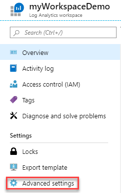
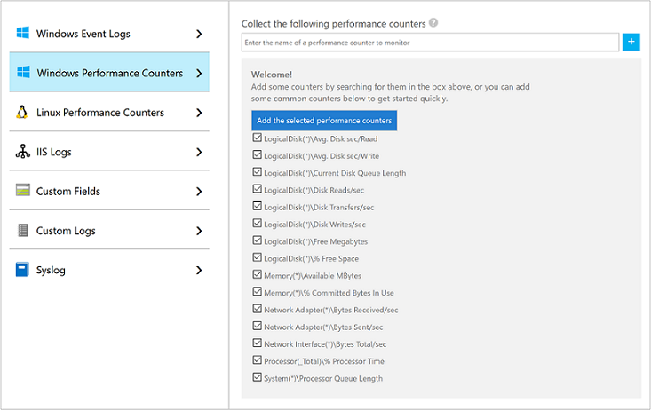
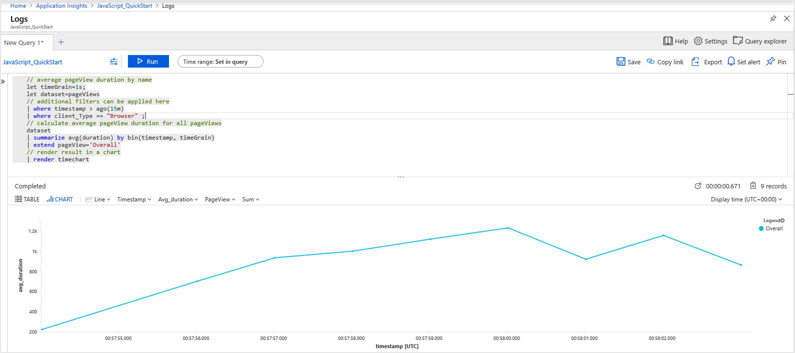
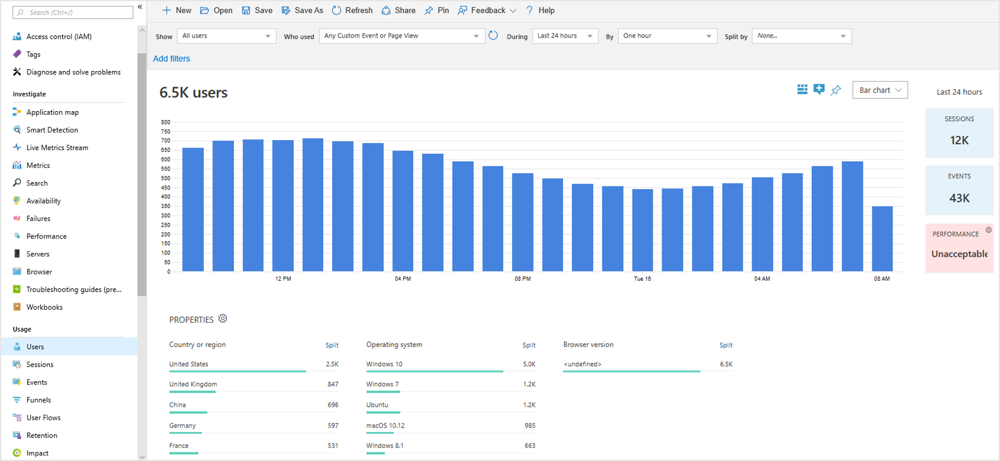
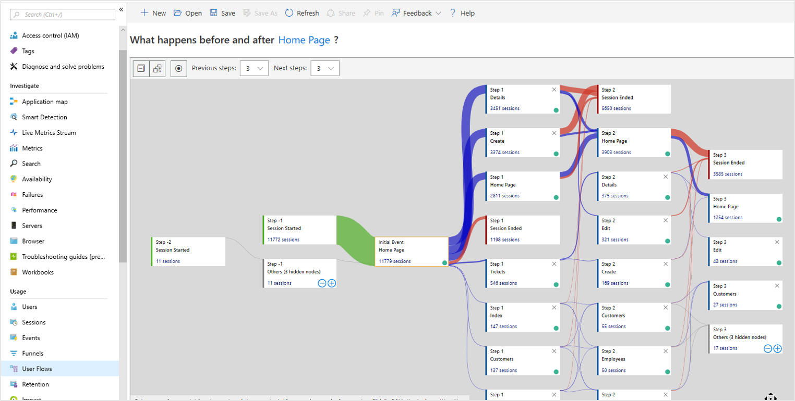

---
lab:
    title: 'LAB 01_Azure Monitor'
    module: '모듈 04 - 보안 운영 관리'
---

# 랩: Azure Monitor

Azure Monitor는 클라우드 및 온-프레미스 환경에서 원격 측정을 수집, 분석 및 수행하기 위한 포괄적인 솔루션을 제공하여 응용 프로그램 및 서비스의 가용성과 성능을 최대화 합니다. 또한 응용 프로그램의 성능을 이해하고 응용 프로그램에 영향을 미치는 문제와 응용프로그램의 리소스를 미리 식별합니다.

이 실습에서는 다음과 같이 Azure Monitor를 구성합니다.

    - Azure 가상 머신에서 데이터 수집
    - Application Insights를 사용하여 웹 사이트 모니터링
 
### 연습 1: Azure Monitor를 사용하여 Azure 가상 머신 데이터 수집

Azure Monitor는 자세한 분석 및 상관 관계 분석을 위해 Azure 가상 머신에서 Log Analytics 작업 영역으로 직접 데이터를 수집 할 수 있습니다. Windows 및 Linux용 Log Analytics VM 확장을 설치하면 Azure Monitor가 Azure VM에서 데이터를 수집할 수 있습니다. 이 연습에서는 몇 가지 간단한 단계로 VM 확장을 사용하여 Azure Linux 또는 Windows VM에서 데이터를 구성하고 수집하는 방법을 보여줍니다.

#### 작업 1: Azure VM 배포

1. <a href="https://portal.azure.com" target="_blank"><span style="color: #0066cc;" color="#0066cc">Azure Portal</span></a>에 로그인 하고 다음을 참고하여 Windows Server 2016 Datacenter를 배포합니다.

    - **기본 사항**

    | 설정 | 값 |
    | --- | --- |
    | 구독 | 이 랩에서 사용할 구독 |
    | 리소스 그룹 | **az5000401** |
    | 가상 머신 이름 | **az5000401vm01** |
    | 지역 | **(아시아 태평양)한국 중부** |
    | 이미지 | **Windows Server 2016 Datacenter** |
    | 크기 | **Standard DS1 v2** |
    | 사용자 이름 | **student** |
    | 암호 | **Pa55w.rd1234** |
    | 공용 인바운드포트 | **HTTP, RDP** |

    > **참고**: 다음을 이용하여 Cloud Shell의 PowerShell 모드에서 간단하게 배포할 수 있습니다.

       ```powershell
       New-AzResourceGroup -Name "az5000401" -Location "koreacentral"
       ```

       ```powershell
       New-AzVm -ResourceGroupName "az5000401" -Name "az5000401vm01" -Location "koreacentral" -VirtualNetworkName "az5000401-vnet" -SubnetName "Default" -SecurityGroupName "az5000401vm01-sg" -PublicIpAddressName "az5000401vm01-ip" -OpenPorts 80,3389
       ```

       - 인증을 입력하라는 명령 프롬프트가 출력되면 사용자 이름을 **student**, 암호를 **Pa55w.rd1234**로 입력합니다.

#### 작업 2: 작업 영역 만들기

1. Azure Portal에서 **모든 서비스**를 클릭한 후 **Log Analytics 작업 영역**을 탐색하여 클릭합니다.

    

1. **+추가**를 클릭하고 다음을 참고하여 정보를 입력합니다. **확인** 버튼을 클릭하여 작업 영역을 생성합니다.

    | 설정 | 값 | 
    | --- | --- |
    | Log Analytics 작업 영역 | **az5000401log** |
    | 구독 | 이 랩에서 사용할 구독 |
    | 리소스 그룹 | **az5000401** |
    | 위치 | **한국 중부** |
    | 가격 책정 계층 | **종량제** |

    

1. **알람 센터**에서 작업 영역의 배포를 모니터링 할 수 있습니다.

#### 작업 3: Log Analytics VM 확장 활성화

Azure에 이미 배포된 Windows 및 Linux 가상 컴퓨터의 경우 Log Analytics VM Extension과 함께 Log Analytics 에이전트를 설치할 수 있습니다. 확장을 사용하면 설치 프로세스가 간소화되고 지정한 Log Analytics 작업 영역으로 데이터를 보내도록 에이전트가 자동으로 구성됩니다. 최신 버전이 릴리스되면 에이전트도 자동으로 업그레이드되어 최신 기능과 수정 사항을 갖습니다. 진행하기 전에 VM이 실행 중인지 확인하십시오. 그렇지 않으면 프로세스가 성공적으로 완료되지 않습니다.

1. 생성된 **az5000401log**를 탐색합니다.

1. **작업 영역 데이터 원본** 섹션에 있는 **가상 머신**을 클릭합니다.

1. **가상 머신** 목록에서 에이전트를 설치하려는 **az5000401vm01** 가상 머신을 클릭합니다. 선택한 가상 머신의 **Log Analytics 연결** 상태가 **연결되지 않음**인지 확인합니다.

1. 가상 머신의 세부 사항에서 **연결**를 클릭합니다. 가상 머신의 확장을 이용하여 **az5000401vm01**에 에이전트가 설치되고 Log Analytics 작업 영역에 구성됩니다. 이 프로세스는 몇 분이 걸리며 그 동안 **Log Analytics 연결** 상태는 **연결 중**으로 표시됩니다.

1. 에이전트를 설치하고 연결하면 **Log Analytics 연결** 상태가 **이 작업 영역**으로 업데이트됩니다.

#### 작업 4: Windows VM의 이벤트 및 성능 수집

Azure Monitor는 장기 분석 및 보고를 위해 지정하는 Windows 이벤트 로그 또는 Linux Syslog 및 성능 카운터에서 이벤트를 수집하고 특정 조건이 감지되면 조치를 취할 수 있습니다. 다음 단계에 따라 Windows 시스템 로그 및 Linux Syslog에서 이벤트 콜렉션을 구성하고 몇 가지 공통 성능 카운터를 시작합니다.

1. **az5000401log** Log Analytics 작업 영역을 탐색합니다. **일반** 섹션에서 **고급 설정**을 클릭합니다.

    

1. **Data**를 클릭하고 **Windows 이벤트 로그**를 클릭합니다.

1. 로그 이름을 입력하여 이벤트 로그를 추가합니다. **System** 입력한 다음 오른쪽에 있는 **+** 버튼을 클릭합니다.

1. 아래 보이는 테이블에서 **오류**와 **경고**의 체크박스에만 체크를 합니다.

1. 상단에 **저장**을 클릭하여 구성을 저장합니다.

1. **Windows 성능 카운터**를 클릭하여 Windows 컴퓨터의 성능 수집을 활성화 합니다.

1. 새로운 Log Analytics 작업 영역에서 Windows 성능 카운터를 처음 구성하면 몇 가지 공통 성능 카운터를 빠르게 만들 수 있는 옵션이 제공됩니다. 각 옆에 확인란이 표시됩니다.

    

    **선택한 성능 카운터 추가** 버튼을 클릭하여 활성화 합니다. 10초 샘플 간격으로 설정이 추가 됩니다.
  
1. 상단에 **저장**을 클릭하여 구성을 저장합니다.

> **참고**: 데이터를 수집하는데 10분 이상 걸릴 수 있습니다.

#### 작업 5: 수집된 데이터 확인

데이터 수집을 활성화 했으므로 간단한 로그 검색 예제를 실행하여 대상 VM의 일부 데이터를 볼 수 있습니다.

1. **az5000401log** Log Analytics 작업 영역을 탐색합니다. **일반** 섹션에서 **로그**를 클릭합니다.

1. 로그 쿼리 페이지에 `Perf`를 입력하고 **실행** 버튼을 클릭하여 쿼리를 실행합니다.

    

    예를 들어 다음 이미지의 쿼리는 10,000 개의 성능 레코드를 반환했습니다. VM이 몇 분 동안만 실행되어 결과가 크게 떨어집니다.

    

1. 상단에 **샘플 쿼리**를 클릭하고 **컴퓨터 성능**탭에 있는 샘플 쿼리를 실행하여 쿼리해 봅니다.

### 연습 2: Azure Monitor Application Insights를 사용하여 웹 사이트 모니터링

Azure Monitor Application Insights를 사용하면 가용성, 성능 및 사용량에 대한 웹 사이트를 쉽게 모니터링 할 수 있습니다. 또한 사용자가 보고 할 때 까지 기다리지 않고도 응용프로그램의 오류를 신속하게 식별하고 진단 할 수 있습니다. Application Insights는 서버 측 모니터링 및 클라이언트/브라우저 측 모니터링 기능을 모두 제공합니다.

이 실습에서는 웹 사이트 방문자의 클라이언트/브라우저 측 경험을 이해할 수있는 오픈 소스 Application Insights JavaScript SDK를 추가하는 과정을 안내합니다.

#### 작업 1: Application Insights 활성화

Application Insights는 온-프레미스 또는 클라우드에서 실행되는 모든 인터넷 연결 응용 프로그램에서 원격 측정 데이터를 수집 할 수 있습니다.

1. Azure Portal에서 **+ 리소스 만들기**를 클릭한 다음 **application insight**를 입력하고 **Application Insights**를 클릭합니다.

1. **Application Insights** 블레이드가 뜨면 **만들기** 버튼을 클릭합니다.

1. **Application Insights** 블레이드가 뜨면 다음을 참고하여 정보를 입력합니다.

    | 설정 | 값 | 
    | --- | --- |
    | 구독 | 이 랩에서 사용할 구독 |
    | 리소스 그룹 | **az5000401** |
    | 이름 | **az5000401insights** |
    | 지역 | **(아시아 태평양)한국 중부** |

1. **검토 + 만들기** 버튼을 클릭한 후 유효성 검사가 완료되면 **만들기** 버튼을 클릭하여 가상 머신을 배포한다.

#### 작업 2: HTML 파일 만들기

1. 실습 컴퓨터에서 `hello_world.html` 라는 파일을 만듭니다. 이 예제에서는 파일이 C: 드라이브의 루트 인 `C:\hello_world.html` 에 배치됩니다.

1. 메모장으로 `hello_world.html` 파일을 열고 다음 내용을 입력합니다.:

    ```html
    <!DOCTYPE html>
    <html>
    <head>
    <title>
    Azure Monitor Application Insights
    </title>
    <script>
        var appInsights=window.appInsights||function(config)
    {
    function r(config){ t[config] = function(){ var i = arguments; t.queue.push(function(){ t[config].apply(t, i)})} }
    var t = { config:config},u=document,e=window,o='script',s=u.createElement(o),i,f;for(s.src=config.url||'https://az416426.vo.msecnd.net/scripts/a/ai.0.js',u.getElementsByTagName(o)[0].parentNode.appendChild(s),t.cookie=u.cookie,t.queue=[],i=['Event','Exception','Metric','PageView','Trace','Ajax'];i.length;)r('track'+i.pop());return r('setAuthenticatedUserContext'),r('clearAuthenticatedUserContext'),config.disableExceptionTracking||(i='onerror',r('_'+i),f=e[i],e[i]=function(config, r, u, e, o) { var s = f && f(config, r, u, e, o); return s !== !0 && t['_' + i](config, r, u, e, o),s}),t
    }({
    instrumentationKey:'xxxxxx-xxxxxxxx-xxxxxxxx-xxxxxxxxx' // REMOVE xxxx-xxx... REPLACE WITH INSTRUMENTATIONKEY '' //
    });
    window.appInsights=appInsights;
    appInsights.trackPageView();
    </script>
    </head>
    <body>
    <h1>Azure Monitor Application Insights Hello World!</h1>
    <p>You can use the Application Insights JavaScript SDK to perform client/browser-side monitoring of your website. To learn about more advanced JavaScript SDK configurations visit the <a href="https://github.com/Microsoft/ApplicationInsights-JS/blob/master/API-reference.md" title="API Reference">API reference</a>.</p>
    </body>
    </html>
    ```

#### 작업 3: App Insights SDK 구성

1. Azure Portal에서 생성된 **az5000401insights**를 탐색합니다.

1. **개요** 블레이드에서 **계측 키**에 표시된 키 값을 복사하여 메모합니다.

    

1. 로컬 컴퓨터에 있는 `hello_world.html` 파일을 열고 `instrumentationKey`를 탐색하여 앞서 복사한 **계측 키**를 입력하고 저장합니다.

1. 로컬 웹 브라우저에서 `hello_world.html`을 엽니다. 단일 페이지 뷰가 생성됩니다. 브라우저를 새로 고쳐 여러번 테스트 페이지 보기를 실행해 봅니다.

#### 작업 4: Azure Portal에서 모니터링 시작

1. Azure Portal에서 **az5000401insights** Application Insights의 **개요** 페이지를 다시 열어봅니다. 현재 실행중인 응용 프로그램에 대한 세부 정보를 볼 수 있습니다. 개요 페이지의 4가지 기본 차트는 서버 측 응용 프로그램 데이터 범위입니다. JavaScript SDK와의 클라이언트/브라우저 측 상호 작용을 계측하고 있으므로 서버 측 SDK가 설치되어 있지 않으면이 특정보기가 적용되지 않습니다.

1. **모니터링** 섹션에 있는 **로그**를 클릭합니다. 여기서는 Application Insights가 수집한 로그를 쿼리해 볼 수 있습니다. 다음 쿼리문을 참고하여 클라이언트 측 브라우저 요청과 관련된 데이터를 확인합니다.

    ```Kusto
    // average pageView duration by name
    let timeGrain=1s;
    let dataset=pageViews
    // additional filters can be applied here
    | where timestamp > ago(15m)
    | where client_Type == "Browser" ;
    // calculate average pageView duration for all pageViews
    dataset
    | summarize avg(duration) by bin(timestamp, timeGrain)
    | extend pageView='Overall'
    // render result in a chart
    | render timechart
    ```

    

1. **조사** 섹션에 있는 **성능**을 클릭합니다. **성능** 화면에서 오른쪽 위에 **브라우저**를 클릭하여 클라이언트 요청에 대한 모니터링 모드로 변경합니다. 여기에는 웹 사이트의 성능과 관련된 측정 항목을 확인할 수 있습니다. 또한 웹 사이트에 실패 및 예외를 분석하기 위한 정보를 제공합니다. **샘플**을 클릭하여 개별 거래 세부 정보를 드릴 다운 할 수 있습니다. 여기에서 엔드-투-엔드 트랜잭션 세부 사항에 액세스 할 수 있습니다.

    

1. 사용자 행동 분석 도구를 탐색하려면 기본 Application Insights 메뉴에서 **사용법** 세션에서 **사용자**를 클릭합니다. 단일 머신에서 테스트하므로 한 명의 사용자에 대한 데이터만 볼 수 있습니다. 라이브 웹 사이트의 경우 사용자 분포는 다음과 같습니다.

    
    
1. 여러 페이지가 있는 보다 복잡한 웹 사이트를 계측 한 경우 유용한 또 다른 도구는 [**사용자 흐름**] (https://docs.microsoft.com/en-us/azure/azure-monitor/app/usage-flows) 입니다. **사용자 흐름**을 사용하면 방문자가 웹 사이트의 다양한 부분의 통신하는 경로를 추적 할 수 있습니다.

    

1.  Leave all resources.  You will use these in a future lab.

**Results**: In this lab, you learned how to monitor resources with Azure Monitor.

### 연습 3: 랩 리소스 삭제

#### 작업 1: Cloud Shell 열기

1. Azure 포털 상단에서 **Cloud Shell** 아이콘을 클릭하여 Cloud Shell 창을 엽니다.

1. Cloud Shell 인터페이스에서 **Bash**를 선택합니다.

1. **Cloud Shell** 명령 프롬프트에서 다음 명령을 입력하고 **Enter**를 눌러 이 랩에서 생성한 모든 리소스 그룹을 나열합니다.

   ```sh
   az group list --query "[?starts_with(name,'az500')].name" --output tsv
   ```

1. 출력된 결과가 이 랩에서 생성한 리소스 그룹만 포함되어 있는지 확인합니다. 이 그룹은 다음 작업에서 삭제됩니다.

#### 작업 2: 리소스 그룹 삭제하기

1. **Cloud Shell** 명령 프롬프트에서 다음 명령을 입력하고 **Enter**를 눌러 이 랩에서 생성한 모든 리소스 그룹을 삭제합니다.

   ```sh
   az group list --query "[?starts_with(name,'az500')].name" --output tsv | xargs -L1 bash -c 'az group delete --name $0 --no-wait --yes'
   ```

1. **Cloud Shell** 명령 프롬프트를 닫습니다.

> **결과**: 이 연습을 완료한 후 이 랩에서 사용된 리소스 그룹을 제거했습니다.
