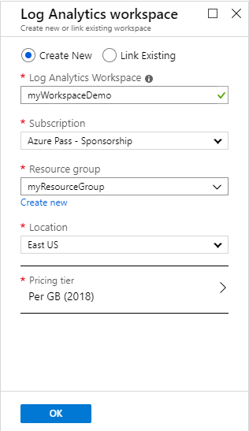
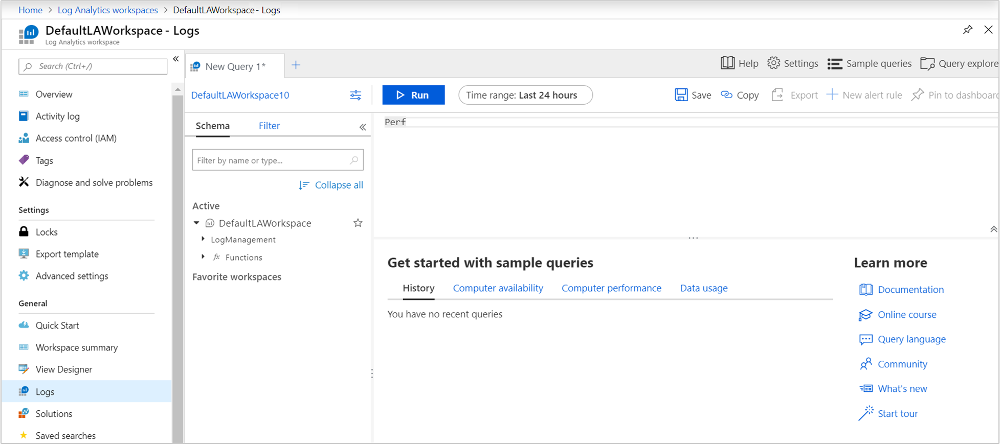
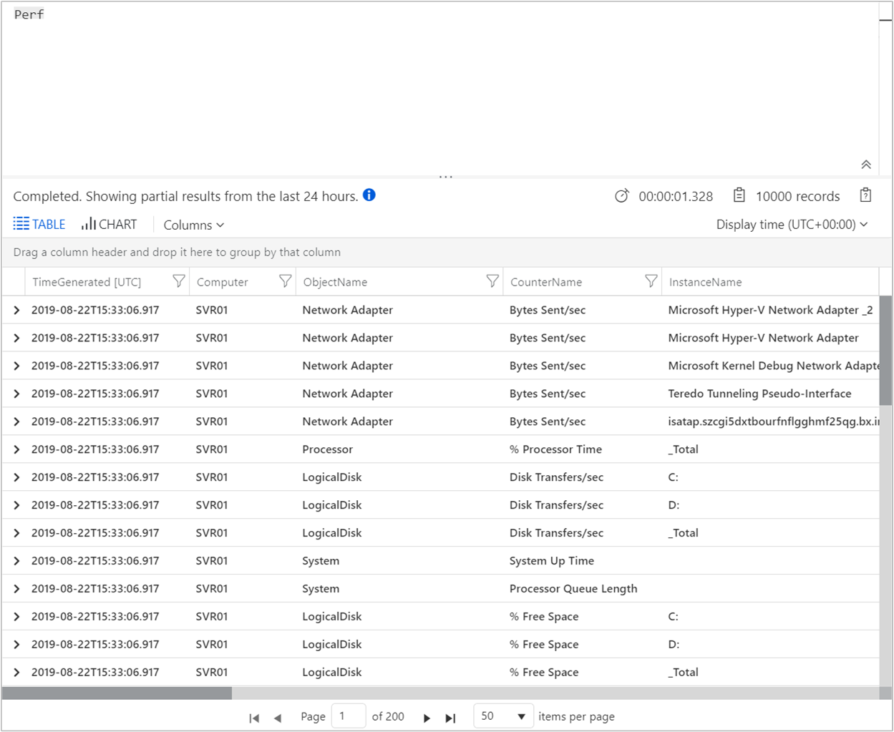
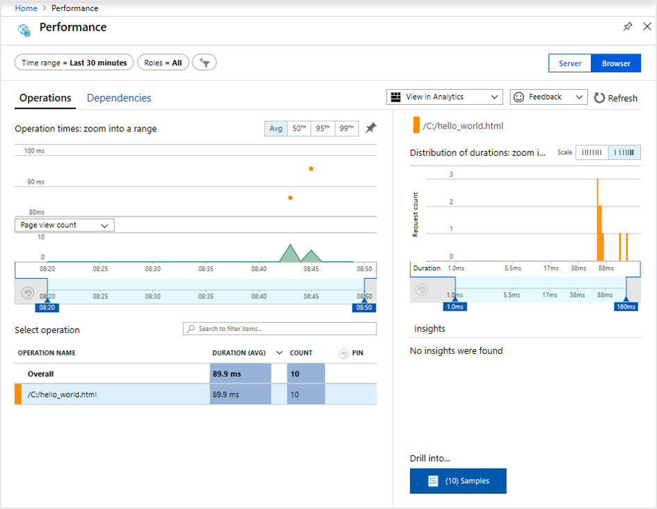

---
lab:
    title: 'LAB 01_Azure Monitor'
    module: '모듈 04 - 보안 운영 관리'
---

# 랩: Azure Monitor


Azure Monitor maximizes the availability and performance of your applications and services by delivering a comprehensive solution for collecting, analyzing, and acting on telemetry from your cloud and on-premises environments. It helps you understand how your applications are performing and proactively identifies issues affecting them and the resources they depend on.

In this lab you will configure Azure Monitor to:

- Collect data from an Azure virtual machine.
- Use Application Insights to monitor your website.


 
### Exercise 1: Collect data from an Azure virtual machine with Azure Monitor


Azure Monitor can collect data directly from your Azure virtual machines into a Log Analytics workspace for detailed analysis and correlation. Installing the Log Analytics VM extension for Windows and Linux allows Azure Monitor to collect data from your Azure VMs. This exercise shows you how to configure and collect data from your Azure Linux or Windows VMs using the VM extension with a few easy steps.  


#### Task 1: Deploy an Azure VM to monitor.

1.  Open the Azure Cloud Shell and run the following two commands to create a Resource Group and Azure VM that you will use to monitor:

     ```powershell
    New-AzResourceGroup -Name myResourceGroup -Location EastUS
     ```

     ```powershell
    New-AzVm -ResourceGroupName "myResourceGroup" -Name "myVM" -Location "East  US" -VirtualNetworkName "myVnet" -SubnetName "mySubnet" -SecurityGroupName   "myNetworkSecurityGroup" -PublicIpAddressName "myPublicIpAddress"     -OpenPorts 80,3389
     ```

1.  When prompted for credentials enter **LocalAdmin** as the User and use the password **Pa55w.rd1234**

#### Task 2: Create a workspace

1.  In the Azure portal, select **All services**. In the list of resources, type **Log Analytics**. As you begin typing, the list filters based on your input. Select **Log Analytics workspaces**.

       

2.  Select **Create**, and then select choices for the following items:

       * Provide a name for the new **Log Analytics workspace**, such as *myWorkspaceDemo*.  
       * Select a **Subscription** to link to by selecting from the drop-down list if the default selected is not appropriate.
       * For **Resource Group**, select **myResourceGroup** which is the Resource Group that contains the VM you created in Task 1.
       * Select the **EastUS** as the location. 
       * Leave the pricing Tier as **Per Gb (2018)**
  
           

3.  After providing the required information on the **Log Analytics workspace** pane, select **OK**.  

1.  While the information is verified and the workspace is created, you can track its progress under **Notifications** from the menu. 

#### Task 2: Enable the Log Analytics VM Extension


For Windows and Linux virtual machines already deployed in Azure, you install the Log Analytics agent with the Log Analytics VM Extension. Using the extension simplifies the installation process and automatically configures the agent to send data to the Log Analytics workspace that you specify. The agent is also upgraded automatically when a newer version is released, ensuring that you have the latest features and fixes. Before proceeding, verify the VM is running otherwise the process will fail to complete successfully. 
 

1.  In the Azure portal, select **All services** found in the upper left-hand corner. In the list of resources, type **Log Analytics**. As you begin typing, the list filters based on your input. Select **Log Analytics workspaces**.

2.  In your list of Log Analytics workspaces, select **myWorkspaceDemo** created earlier.

    **Note**: The name of your workspace may be different to **myWorkspaceDemo**.


3.  On the left-hand menu, under Workspace Data Sources, select **Virtual machines**.  

4.  In the list of **Virtual machines**, select a virtual machine you want to install the agent on. Notice that the **Log Analytics connection status** for the VM indicates that it is **Not connected**.

5.  In the details for your virtual machine, select **Connect**. The agent is automatically installed and configured for your Log Analytics workspace. This process takes a few minutes, during which time the **Status** shows **Connecting**.

6.  After you install and connect the agent, the **Log Analytics connection status** will be updated with **This workspace**.

#### Task 3: Collect event and performance of a Windows VM.


Azure Monitor can collect events from the Windows event logs or Linux Syslog and performance counters that you specify for longer term analysis and reporting, and take action when a particular condition is detected. Follow these steps to configure collection of events from the Windows system log and Linux Syslog, and several common performance counters to start with.  


1.  On the Log Analytics workspaces blade, select **Advanced settings**.

       

2.  Select **Data**, and then select **Windows Event Logs**.

3.  You add an event log by typing in the name of the log.  Type **System** and then select the plus sign **+**.

4.  In the table, check the severities **Error** and **Warning**.

5.  Select **Save** at the top of the page to save the configuration.

6.  Select **Windows Performance Data** to enable collection of performance counters on a Windows computer.

7.  When you first configure Windows Performance counters for a new Log Analytics workspace, you are given the option to quickly create several common counters. They are listed with a checkbox next to each.

       

    Select **Add the selected performance counters**.  They are added and preset with a ten second collection sample interval.
  
8.  Select **Save** at the top of the page to save the configuration.


#### Task 4: View data collected


Now that you have enabled data collection, lets run a simple log search example to see some data from the target VMs.  


1.  In the selected workspace, from the left-hand pane, select **Logs**.

2.  On the Logs query page, type `Perf` in the query editor and select **Run**.

       

    For example, the query in the following image returned 10,000 performance records. Your results will be significantly less due to the VM having only being ran for a few minutes.

       

### Exercise 2: Monitor Websites with Azure Monitor Application Insights


With Azure Monitor Application Insights, you can easily monitor your website for availability, performance, and usage. You can also quickly identify and diagnose errors in your application without waiting for a user to report them. Application Insights provides both server-side monitoring as well as client/browser-side monitoring capabilities.

This exercise guides you through adding the open source Application Insights JavaScript SDK which allows you to understand the client/browser-side experience for visitors to your website.


#### Task 1: Enable Application Insights


Application Insights can gather telemetry data from any internet-connected application, running on-premises or in the cloud. Use the following steps to start viewing this data.


1.  Select **Create a resource** > **Management tools** > **Application Insights**.

    A configuration box appears; use the following table to fill out the input fields.

   | Settings        | Value   | 
   | ------------- |-----|
   | **Name**      | Enter a Globally Unique Value |
   | **Resource Group**     | myResourceGroup |
   | **Location** | East US |

2.  Click **Create**.

#### Task 2: Create an HTML file

1.  On your local computer, create a file called ``hello_world.html``. For this example the file will be placed on the root of the C: drive at ``C:\hello_world.html``.
2.  Copy the script below into ``hello_world.html``:

    ```html
    <!DOCTYPE html>
    <html>
    <head>
    <title>
    Azure Monitor Application Insights
    </title>
    <script>
        var appInsights=window.appInsights||function(config)
    {
    function r(config){ t[config] = function(){ var i = arguments; t.queue.push(function(){ t[config].apply(t, i)})} }
    var t = { config:config},u=document,e=window,o='script',s=u.createElement(o),i,f;for(s.src=config.url||'https://az416426.vo.msecnd.net/scripts/a/ai.0.js',u.getElementsByTagName(o)[0].parentNode.appendChild(s),t.cookie=u.cookie,t.queue=[],i=['Event','Exception','Metric','PageView','Trace','Ajax'];i.length;)r('track'+i.pop());return r('setAuthenticatedUserContext'),r('clearAuthenticatedUserContext'),config.disableExceptionTracking||(i='onerror',r('_'+i),f=e[i],e[i]=function(config, r, u, e, o) { var s = f && f(config, r, u, e, o); return s !== !0 && t['_' + i](config, r, u, e, o),s}),t
    }({
    instrumentationKey:'xxxxxx-xxxxxxxx-xxxxxxxx-xxxxxxxxx' // REMOVE xxxx-xxx... REPLACE WITH INSTRUMENTATIONKEY '' //
    });
    window.appInsights=appInsights;
    appInsights.trackPageView();
    </script>
    </head>
    <body>
    <h1>Azure Monitor Application Insights Hello World!</h1>
    <p>You can use the Application Insights JavaScript SDK to perform client/browser-side monitoring of your website. To learn about more advanced JavaScript SDK configurations visit the <a href="https://github.com/Microsoft/ApplicationInsights-JS/blob/master/API-reference.md" title="API Reference">API reference</a>.</p>
    </body>
    </html>
    ```

#### Task 3: Configure App Insights SDK

1.  Select **Overview** > **Essentials** > Copy your application's **Instrumentation Key**.

       

2. Edit ``hello_world.html`` and add your instrumentation key.

4.  Open ``hello_world.html`` in a local browser session. This will create a single pageview. You can refresh your browser to generate multiple test page views.

#### Task 4: Start monitoring in the Azure portal

1.  You can now reopen the Application Insights **Overview** page in the Azure portal, where you retrieved your instrumentation key, to view details about your currently running application. The four default charts on the overview page are scoped to server-side application data. Since we are instrumenting the client/browser-side interactions with the JavaScript SDK this particular view doesn't apply unless we also have a server-side SDK installed.

2.  Click on **Logs**.  This opens **Logs**, which provides a rich query language for analyzing all data collected by Application Insights. To view data related to the client-side browser requests run the  following query:

    ```json
    // average pageView duration by name
    let timeGrain=1s;
    let dataset=pageViews
    // additional filters can be applied here
    | where timestamp > ago(15m)
    | where client_Type == "Browser" ;
    // calculate average pageView duration for all pageViews
    dataset
    | summarize avg(duration) by bin(timestamp, timeGrain)
    | extend pageView='Overall'
    // render result in a chart
    | render timechart
    ```

       

3.  Go back to the **Overview** page. Click on **Performance** from under the **Investigate** header.  Here you find metrics related to the performance of your website. There is also a corresponding view for analyzing failures and exceptions in your website. You can click **Samples** to drill into individual transaction details. From here, you can access the end-to-end transaction details.

       

4.  To begin exploring the user behavior analytics tools, from the main Application Insights menu select **Users** under the **Usage** header. Since we are testing from a single machine, we will only see data for one user. For a live website, the distribution of users might look as follows:

       
    
5.  If we had instrumented a more complex website with multiple pages, another useful tool is [**User Flows**](https://docs.microsoft.com/en-us/azure/azure-monitor/app/usage-flows). With **User Flows** you can track the pathway visitors takes through the various parts of your website.

      

1.  Leave all resources.  You will use these in a future lab.


**Results**: In this lab, you learned how to monitor resources with Azure Monitor.

