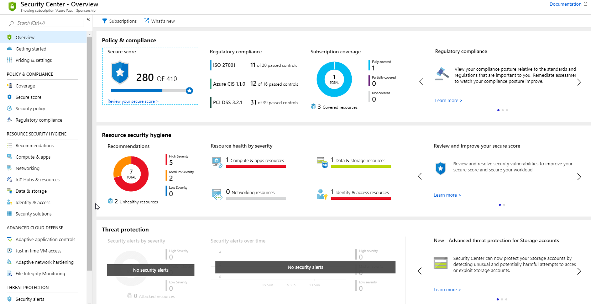
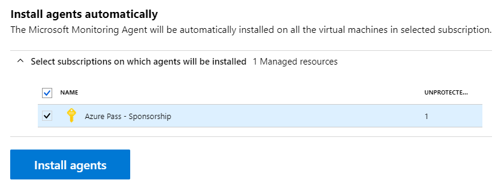
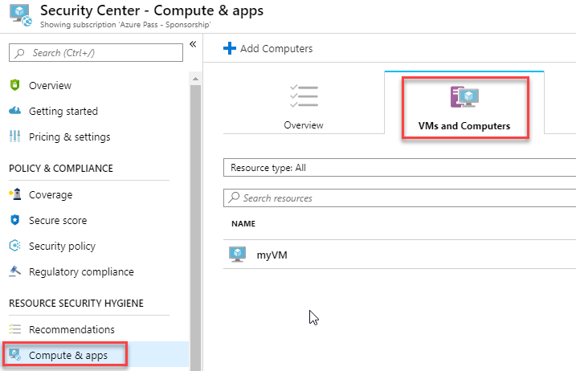
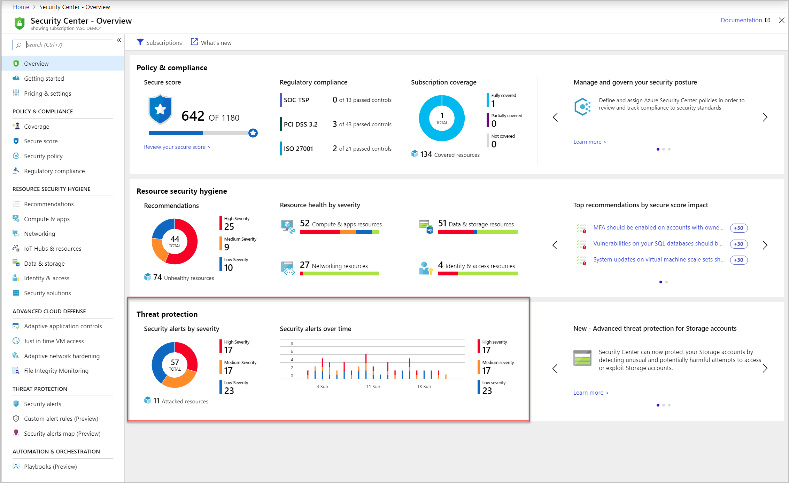
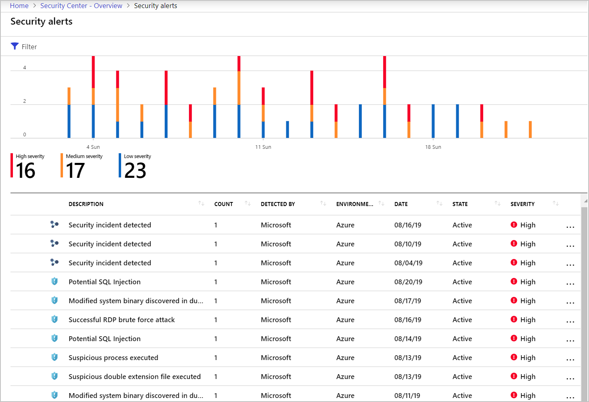
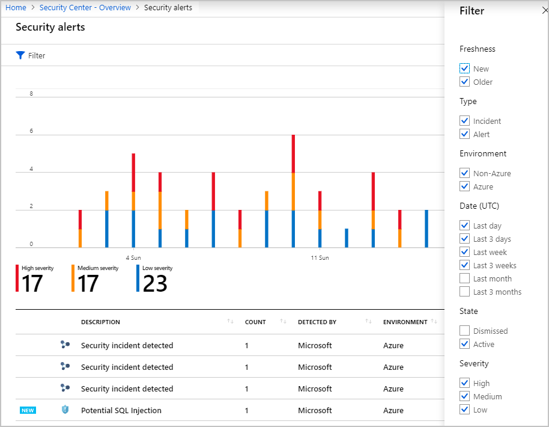
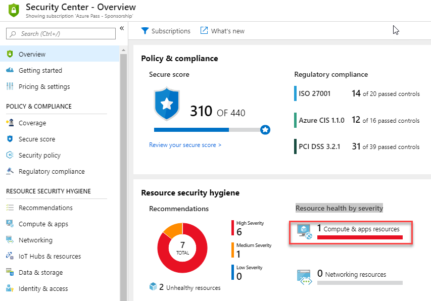

---
lab:
    title: 'LAB 02_보안 센터'
    module: '모듈 04 - 보안 운영 관리'
---

# 랩: 보안 센터

Azure 보안 센터는 데이터 센터의 보안 상태를 강화하고 클라우드의 하이브리드 워크로드 (Azure 여부에 관계없이)와 온-프레미스에 대한 고급 위협 방지 기능을 제공하는 통합 인프라 보안 관리 시스템입니다.

리소스를 안전하게 유지하는 것은 클라우드 공급자와 Azure와 고객이 함께 해야 하는 공동 책임제 입니다. 클라우드로 전환 할 때 워크로드를 안전하게 유지해야 하며 동시에 IaaS(서비스 인프라)로 전환 할 때 PaaS(플랫폼 서비스)와 SaaS(서비스로서의 소프트웨어)보다 많은 고객 책임이 있습니다. Azure 보안 센터는 네트워크 보안을 강화하고 서비스를 보호하며 보안 상태를 유지하는 데 필요한 도구를 제공합니다.

### 연습 1: 보안 센터 표준 활성화

Azure 보안 센터는 하이브리드 클라우드 워크로드 전체에서 통합 보안 관리 및 위협 방지 기능을 제공합니다. 프리 티어는 Azure 리소스에 대해서만 제한된 보안을 제공하지만 표준 티어는 이러한 기능을 온-프레미스 및 기타 클라우드로 확장합니다. 보안 센터 표준은 보안 취약점을 찾아 수정하고, 액세스 및 애플리케이션 제어를 적용하여 악의적 인 활동을 차단하고, 분석 및 인텔리전스를 사용하여 위협을 탐지하고, 공격을받을 때 신속하게 대응합니다. 무료로 보안 센터 표준을 사용해 볼 수 있습니다. 자세한 내용은 요금 페이지를 참조하십시오.

이 연습에서는 보안 강화를 위해 표준 계층으로 업그레이드하고 가상 시스템에 Microsoft Monitoring Agent를 설치하여 보안 취약성 및 위협을 모니터링합니다.

#### 작업 1: Azure VM 배포

1. <a href="https://portal.azure.com" target="_blank"><span style="color: #0066cc;" color="#0066cc">Azure Portal</span></a>에 로그인 하고 다음을 참고하여 Windows Server 2016 Datacenter를 배포합니다.

    - **기본 사항**

    | 설정 | 값 |
    | --- | --- |
    | 구독 | 이 랩에서 사용할 구독 |
    | 리소스 그룹 | **az5000402** |
    | 가상 머신 이름 | **az5000402vm** |
    | 지역 | **(아시아 태평양)한국 중부** |
    | 이미지 | **Windows Server 2016 Datacenter** |
    | 크기 | **Standard DS1 v2** |
    | 사용자 이름 | **student** |
    | 암호 | **Pa55w.rd1234** |
    | 공용 인바운드포트 | **HTTP, RDP** |

    > **참고**: 다음을 이용하여 Cloud Shell의 PowerShell 모드에서 간단하게 배포할 수 있습니다.

       ```powershell
       New-AzResourceGroup -Name "az5000402" -Location "koreacentral"
       ```

       ```powershell
       New-AzVm -ResourceGroupName "az5000402" -Name "az5000402vm" -Location "koreacentral" -VirtualNetworkName "az5000402-vnet" -SubnetName "Default" -SecurityGroupName "az5000402vm-sg" -PublicIpAddressName "az5000402vm-ip" -OpenPorts 80,3389
       ```

       - 인증을 입력하라는 명령 프롬프트가 출력되면 사용자 이름을 **student**, 암호를 **Pa55w.rd1234**로 입력합니다.

#### 작업 2: 데이터 수집 자동화

보안 센터는 Azure VM 및 Azure 가상 머신이 아닌 머신에서 데이터를 수집하여 보안 취약성 및 위협을 모니터링합니다. 데이터는 컴퓨터에서 다양한 보안 관련 구성 및 이벤트 로그를 읽고 분석을 위해 작업 공간으로 데이터를 복사하는 Microsoft Monitoring Agent를 사용하여 수집됩니다. 기본적으로 보안 센터는 새로운 작업 공간을 만듭니다.

자동 프로비저닝이 활성화되면 보안 센터는 지원되는 모든 Azure VM 및 새로 생성 된 모든 VM에 Microsoft Monitoring Agent를 설치합니다. 자동 프로비저닝을 적극 권장합니다.

1. Azure Portal에서 **보안 센터**를 탐색합니다.

1. **일반** 섹션에 있는 **시작**을 클릭하고 보안 센터 표준을 활성화 할 구독을 선택한 후 **업그레이드** 버튼을 클릭합니다.

1. **일반** 섹션에 있는 **가격 책정 및 설정**을 클릭합니다.

1. 설정을 변경 할 구독을 선택합니다.

1. **설정**섹션에서 **데이터 수집**을 클릭한 후 **자동 프로비전** 옵션을 **켜기**로 설정합니다.

1. **저장**이 활성화 되는지 확인합니다.

    > **참고**: 저장을 클릭하지 마세요. 다음 연습에서 활성화 할 것입니다.
 
     

Azure VM에 대한이 새로운 통찰력을 얻기 위해 보안 센터는 시스템 업데이트 상태, OS 보안 구성, 엔드 포인트 보호와 관련된 추가 권장 사항을 제공하고 추가 보안 경고를 생성 할 수 있습니다.

### 연습 2: Windows 컴퓨터에서 Azure 보안 센터 활성화

보안 센터에서 Azure 구독을 활성화한 후 Microsoft Monitoring Agent를 프로비저닝하여 Azure 외부(예:온-프레미스 또는 다른 클라우드)에서 실행되는 리소스에 대해 보안 센터를 활성화 할 수 있습니다.

이 연습에서는 Windows 컴퓨터에 Microsoft Monitoring Agent를 설치하는 방법을 알아봅니다.

#### 작업 1: 새로운 Windows 컴퓨터 만들기

1. Azure Portal에서 **보안 센터**의 **개요**블레이드를 탐색합니다.

       

1. **일반** 섹션에 있는 **시작**을 클릭합니다.

1. 상단에 **에이전트 설치** 탭으로 이동합니다.

       

1. 에이전트 자동 설치 섹션으로 스크롤하여 원하는 구독만 선택한 후 **에이전트 설치**를 클릭합니다.

     

1. 배포를 모니터링하여 에이전트가 설치 완료될 때까지 기다립니다.

     
 
1. **보안 센터** 블레이드로 돌아와서 **리소스 보안 예방 조치** 섹션에 있는 **컴퓨팅 및 앱**을 클릭합니다.

     
 
1. 가상머신이 모니터링 되는 것을 확인합니다.

### 연습 3: Azure 보안 센터에서 경고 관리 및 응답

보안 센터는 Azure 리소스, 네트워크 및 방화벽 및 엔드 포인트 보호 솔루션과 같은 연결된 파트너 솔루션에서 로그 데이터를 자동으로 수집, 분석 및 통합하여 실제 위협을 탐지하고 오 탐지를 줄입니다. 우선 순위가 지정된 보안 경고 목록이 문제를 신속하게 조사하는 데 필요한 정보 및 공격 치료 방법에 대한 권장 사항과 함께 보안 센터에 표시됩니다.

#### 작업 1: 경고 관리

1. Azure Portal에서 **보안 센터**의 **개요** 블레이드를 탐색합니다. 

1. **개요**블레이드에서 **위협 보호** 섹션을 확인합니다. 여기에 위협 보호에 대한 경고가 표시됩니다.

    > **참고**: **보안 경고가 없음**이 표시되면 평가가 실행될 때까지 기다려야 할 수 있습니다.

    

1. 경고에 대한 자세한 내용을 보려면 해당 타일을 클릭합니다. 아래 스크린 샷은 실제로 볼 수 있는 잠재적인 경고를 보여줍니다.

    

1. 표시된 경고를 필터링하려면 **필터**를 클릭하고 열리는 **필터** 블레이드에서 적용 할 필터 옵션을 선택합니다. 선택한 필터에 따라 목록이 업데이트 됩니다. 예를 들어, 시스템에서 잠재적인 위반을 조사하고 있기 때문에 지난 24시간 동안 발생한 보안 경고를 처리할 수 ​​있습니다.

    

#### 작업 2: 권장 구성에 대한 응답

1. Azure Portal에서 **보안 센터**의 **개요** 블레이드를 탐색합니다. 

1. **리소스 보안 예방 조치** 목록의 **심각도별 리소스 상태** 섹션에서 **컴퓨팅 및 앱 리소스**를 클릭합니다.

     

1. 권장 구성에 대한 내용을 확인합니다.

       

### 연습 3: 랩 리소스 삭제

#### 작업 1: 보안 그룹 표준 구독 제거

1. Azure Portal에서 **보안 센터**를 탐색합니다.

1. **일반** 섹션에 있는 **가격 책정 및 설정**을 클릭합니다.

1. 나열된 구독에서 **가격 책정 계층**이 **표준**으로 되어있는 구독을 클릭합니다.

1. **가격 책정 계층** 블레이드가 뜨면 **무료(Azure 리소스 전용)** 타일을 클릭한 후 상단에 **저장**을 클릭하여 보안 그룹 표준 구독을 무료로 변경합니다.

#### 작업 2: Cloud Shell 열기

1. Azure 포털 상단에서 **Cloud Shell** 아이콘을 클릭하여 Cloud Shell 창을 엽니다.

1. Cloud Shell 인터페이스에서 **Bash**를 선택합니다.

1. **Cloud Shell** 명령 프롬프트에서 다음 명령을 입력하고 **Enter**를 눌러 이 랩에서 생성한 모든 리소스 그룹을 나열합니다.

   ```sh
   az group list --query "[?starts_with(name,'az500')].name" --output tsv
   ```

1. 출력된 결과가 이 랩에서 생성한 리소스 그룹만 포함되어 있는지 확인합니다. 이 그룹은 다음 작업에서 삭제됩니다.

#### 작업 3: 리소스 그룹 삭제하기

1. **Cloud Shell** 명령 프롬프트에서 다음 명령을 입력하고 **Enter**를 눌러 이 랩에서 생성한 모든 리소스 그룹을 삭제합니다.

   ```sh
   az group list --query "[?starts_with(name,'az500')].name" --output tsv | xargs -L1 bash -c 'az group delete --name $0 --no-wait --yes'
   ```

1. **Cloud Shell** 명령 프롬프트를 닫습니다.

> **결과**: 이 연습을 완료한 후 이 랩에서 사용된 리소스 그룹을 제거했습니다.
