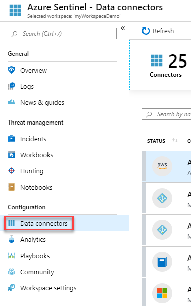
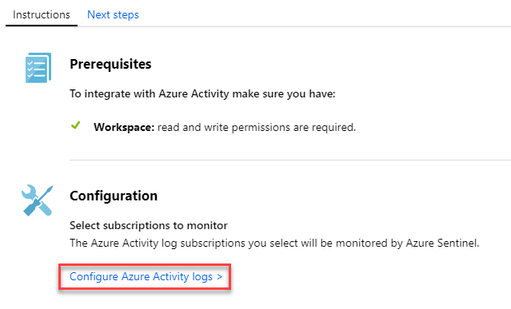

---
lab:
    title: 'Azure Sentinel'
    module: '모듈 04 - 보안 운영 관리'
---

# 랩: Azure Sentinel

Azure Sentinel is your bird's-eye view across the enterprise. Put the cloud and large-scale intelligence from decades of Microsoft security experience to work. Make your threat detection and response smarter and faster with artificial intelligence (AI)

## Exercise 1: On-board Azure Sentinel

To on-board Azure Sentinel, you first need to enable Azure Sentinel, and then connect your data sources. Azure Sentinel comes with a number of connectors for Microsoft solutions, available out of the box and providing real-time integration, including Microsoft Threat Protection solutions, Microsoft 365 sources, including Office 365, Azure AD, Azure ATP, and Microsoft Cloud App Security, and more. In addition, there are built-in connectors to the broader security ecosystem for non-Microsoft solutions. You can also use common event format, Syslog or REST-API to connect your data sources with Azure Sentinel.  

After you connect your data sources, choose from a gallery of expertly created workbooks that surface insights based on your data. These workbooks can be easily customized to your needs.

### Task 1: Enable Azure Sentinel

1.  In the Azure portal, search for Azure Sentinel. 

       

1.  Click **+Add**.
1.  Create a new workspace in a new resource group using the East US region if necessary.

    **Note**:   - Default workspaces created by Azure Security Center will not appear in the list; you can't install Azure Sentinel on them.   - Azure Sentinel can run on workspaces in any GA region of Log Analytics except the China, Germany and Azure Government regions. Data generated by Azure Sentinel (such as incidents, bookmarks, and alert rules, which may contain some customer data sourced from these workspaces) is saved either in West Europe (for workspaces located in Europe) or East US (for all US-based workspaces, as well as any other region except Europe).

6.  Click **Add Azure Sentinel**.
  

### Task 3: Connect data sources

Azure Sentinel creates the connection to services and apps by connecting to the service and forwarding the events and logs to Azure Sentinel. For machines and virtual machines, you can install the Azure Sentinel agent that collects the logs and forwards them to Azure Sentinel. For Firewalls and proxies, Azure Sentinel utilizes a Linux Syslog server. The agent is installed on it and from which the agent collects the log files and forwards them to Azure Sentinel. 

1.  In the Azure Portal select All resources and select the Log Analytics workspace you created in the previous task.

1.  On the menu, select **Data connectors**. This page lets you see the full list of connectors that Azure Sentinel provides and their status. Select the connector you want to connect and select **Open connector page**. 

       

1.  Select **Azure Activity** and click **Open connector page**.

1.  Select **Configure Azure Activity logs**.

     

1.  On the specific connector page, make sure you have fulfilled all the prerequisites and follow the instructions to connect the data to Azure Sentinel. It may take some time for the logs to start syncing with Azure Sentinel. After you connect, you see a summary of the data in the **Data received** graph, and connectivity status of the data types.

   

1.  Select your Azure subscription then click **Connect**.

     
 

**Results**: You have now completed this lab.
