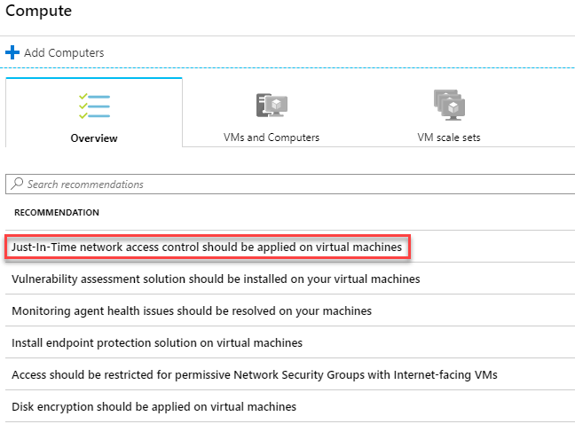
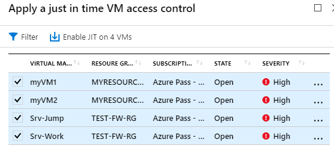
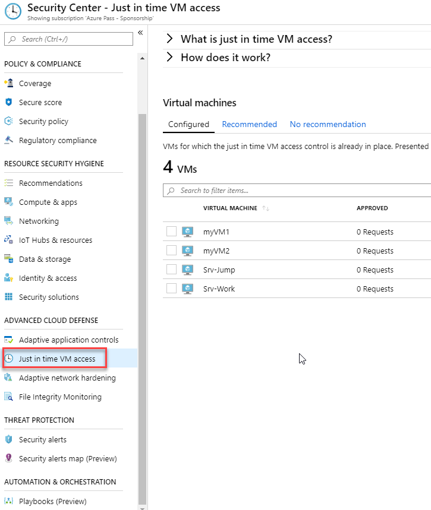
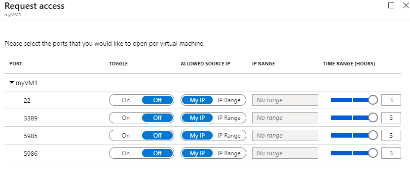

---
lab:
    title: 'LAB 09_JIT'
    module: '모듈 04 - 보안 운영 관리'
---

# 랩: JIT

JIT (Just-In-Time) 가상 머신(VM) 액세스를 사용하여 Azure VM에 대한 인바운드 트래픽을 제어하고 공격에 대한 노출을 줄이면서 필요할때 VM에 쉽게 액세스 할 수 있습니다.

무차별 대입 공격은 일반적으로 VM에 액세스하기 위한 수단으로 관리 포트를 대상으로 합니다. 성공하면 공격자가 VM을 제어하고 환경에 발판을 마련 할 수 있습니다.

무차별 대입 공격에 대한 노출을 줄이는 한 가지 방법은 포트가 열려있는 시간을 제한하는 것입니다. 관리 포트를 항상 열 필요는 없습니다. 예를 들어 관리 또는 유지 관리 작업을 수행하기 위해 VM에 연결되어 있는 동안에만 열어야 합니다. JIT(Just-In-Time)가 활성화되면 보안 센터는 네트워크 보안 그룹 (NSG) 및 Azure 방화벽 규칙을 사용하여 공격자가 대상 포트를 관리할 수 ​​없도록 관리 포트에 대한 액세스를 제한합니다.

> **참고**: 이 실습을 하기 위해서 보안 센터 표준 계층을 사용해야 합니다.

### 연습 1: just-in-time을 사용하여 가상 머신 액세스 관리

VM에서 JIT 정책을 구성하는 방법에는 세 가지가 있습니다.

- Azure 보안 센터에서 JIT 액세스 구성
- Azure VM 블레이드에서 JIT 액세스 구성
- 프로그래밍 방식으로 VM에서 JIT 정책 구성

#### 작업 1: Azure VM 배포

1. <a href="https://portal.azure.com" target="_blank"><span style="color: #0066cc;" color="#0066cc">Azure Portal</span></a>에 로그인 하고 다음을 참고하여 Windows Server 2016 Datacenter를 배포합니다.

    - **기본 사항**

    | 설정 | 값 |
    | --- | --- |
    | 구독 | 이 랩에서 사용할 구독 |
    | 리소스 그룹 | **az5000409** |
    | 가상 머신 이름 | **az5000409vm** |
    | 지역 | **(아시아 태평양)한국 중부** |
    | 이미지 | **Windows Server 2016 Datacenter** |
    | 크기 | **Standard DS1 v2** |
    | 사용자 이름 | **student** |
    | 암호 | **Pa55w.rd1234** |
    | 공용 인바운드포트 | **HTTP, RDP** |

    > **참고**: 다음을 이용하여 Cloud Shell의 PowerShell 모드에서 간단하게 배포할 수 있습니다.

       ```powershell
       New-AzResourceGroup -Name "az5000409" -Location "koreacentral"
       ```

       ```powershell
       New-AzVm -ResourceGroupName "az5000409" -Name "az5000409vm" -Location "koreacentral" -VirtualNetworkName "az5000409-vnet" -SubnetName "Default" -SecurityGroupName "az5000409vm-sg" -PublicIpAddressName "az5000409vm-ip" -OpenPorts 80,3389
       ```

       - 인증을 입력하라는 명령 프롬프트가 출력되면 사용자 이름을 **student**, 암호를 **Pa55w.rd1234**로 입력합니다.

#### 작업 2: Azure 보안 센터에서 JIT 액세스 구성

1. Azure Portal에서 **보안 센터**를 탐색합니다.

1. **일반** 섹션에서 **시작**을 클릭하고 상단에 **에어진트 설치** 탭으로 이동합니다.

1. JIT를 활성화 할 구독을 선택하고 **에이전트 설치** 버튼을 클릭합니다.

     

     > **참고**: 에이전트가 배포되기까지 최대 5 분을 기다려야 할 수 있습니다.

1. **일반** 섹션에 있는 **개요**를 클릭합니다.

1. **리소스 보안 예방 조치**에 있는 **컴퓨팅 및 앱 리소스**를 클릭합니다.

     

1. **컴퓨팅** 블레이드에서 **권장 구성**을 확인합니다.

1. **가상 머신에서 Just-In-Time 네트워크 액세스 제어를 적용해야 합니다**를 클릭합니다.

     

1. **Just-In-Time VM 액세스 제어 적용** 블레이드가 뜨면 모든 가상 컴퓨터를 선택한 후 **VM x대에서 JIT 사용**을 클릭합니다.

     

1. **JIT VM 액세스 구성** 블레이드가 뜨면 **저장** 버튼을 클릭하여 JIT 구성을 완료합니다.

  - 이 블레이드에서는 다음과 같은 Azure 보안센터에서 제어해야 할 포트를 권장합니다.:
      - 22 - SSH
      - 3389 - RDP
      - 5985 - WinRM 
      - 5986 - WinRM
 
     

1. **보안 센터** 블레이드로 돌아가 **Just-In-Time VM 액세스**를 클릭합니다.

     

     **Just-in-time VM 액세스** 창이 열립니다.
      
     **Just-in-time VM 액세스**는 VM의 상태에 대한 정보를 제공합니다.

     - **구성됨** - 적시에 VM 액세스를 지원하도록 구성된 VM입니다. 제시된 데이터는 지난 주에 대한 것이며 각 VM에 대해 승인 된 요청 수, 마지막 액세스 날짜 및 시간 및 마지막 사용자를 포함합니다.

     - **권장** - 적시에 VM 액세스를 지원할 수 있지만 구성되지 않은 VM. 이러한 VM에 대해 적시에 VM 액세스 제어를 사용하는 것이 좋습니다.
    
     - **권장 사항 않음** - VM을 권장하지 않는 이유는 다음과 같습니다.
    
          - `누락 된 NSG` -적시 솔루션에는 NSG가 있어야합니다.
          - `클래식 VM` -보안 센터 적시에 VM 액세스는 현재 Azure Resource Manager를 통해 배포 된 VM 만 지원합니다. JIT (Just-In-Time) 솔루션에서는 클래식 배포를 지원하지 않습니다.
          - `기타` - 구독 또는 리소스 그룹의 보안 정책에서 JIT (Just-In-Time) 솔루션을 끄거나 VM에 공개 IP가없고 NSG가 없는 경우 VM이이 범주에 속합니다.

> **참고** : VM에 JIT VM 액세스를 사용하도록 설정하면 Azure 보안 센터는 연결된 네트워크 보안 그룹 및 Azure 방화벽과 연결된 선택된 포트에 대해 "모든 인바운드 트래픽 거부" 규칙을 만듭니다. 선택한 포트에 대해 다른 규칙을 만든 경우 기존 규칙은 새로운 "모든 인바운드 트래픽 거부" 규칙보다 우선합니다. 선택한 포트에 기존 규칙이 없으면 Network Security Groups 및 Azure Firewall에서 새로운 "모든 인바운드 트래픽 거부" 규칙이 우선 순위를 갖습니다.

#### 작업 3: ASC를 통한 JIT 액세스 요청

1. Azure Portal에서 **보안 센터**의 **Just in time VM 액세스**를 탐색하여 **구성 됨** 탭으로 이동합니다.

1. 리스트에 출력된 **가상 머신**에서 액세스를 요청하려는 VM 하나를 클릭하면 VM 옆에 확인 표시가 나타납니다.

     - **연결 세부 정보** 열의 아이콘은 NSG 또는 FW에서 JIT가 활성화되어 있는지 여부를 나타냅니다. 둘 다 활성화 된 경우 방화벽 아이콘만 나타납니다.

     - **연결 세부 정보** 열은 VM 및 열린 포트를 연결하는 데 필요한 정보를 제공합니다.

          

1. **액세스 요청** 버튼을 클릭하여 **액세스 요청** 블레이드로 이동합니다.

     

1. **액세스 요청**에서 각 VM에 대해 열려는 포트와 포트가 열려있는 소스 IP 주소 그리고 포트가 열리는 시간 창을 구성합니다. JIT (Just-In-Time) 정책으로 구성된 포트에 대한 액세스만 요청할 수 있습니다. 각 포트에는 JIT (Just-In-Time) 정책에서 파생된 최대 허용 시간이 있습니다.

1. **포트 열기** 버튼을 클릭합니다.

> **참고**: 액세스를 요청하는 사용자가 프록시 뒤에있는 경우 **내 IP** 옵션이 동작하지 않을 수 있습니다. 이럴 때 조직의 전체 IP 주소 범위를 정의해야 할 수도 있습니다.

#### 작업 4: ASC를 통해 JIT 액세스 정책 편집

해당 VM을 보호하기 위해 새 포트를 추가 및 구성하거나 이미 보호 된 포트와 관련된 다른 설정을 변경하여 VM의 기존 JIT (Just-In-Time) 정책을 변경할 수 있습니다.

1. Azure Portal에서 **보안 센터**의 **Just in time VM 액세스**를 탐색하여 **구성 됨** 탭으로 이동합니다.

1. **구성 됨** 탭에 출력된 VM 목록에서 정책 수정을 원하는 VM의 행의 오른쪽에서 3개의 점을 클릭하여 **Edit**를 클릭합니다.

1. **JIT VM 액세스 구성**에서 이미 보호 된 포트의 기존 설정을 편집하거나 새 사용자 정의 포트를 추가 할 수 있습니다.
  
     

#### 작업 5: ASC에서 JIT 액세스 활동 감사

로그 검색을 사용하여 VM 활동에 대한 통찰력을 얻을 수 있습니다.

1. Azure Portal에서 **보안 센터**의 **Just in time VM 액세스**를 탐색하여 **구성 됨** 탭으로 이동합니다.

1. **구성 됨** 탭에 출력된 VM 목록에서 로그를 확인하기 원하는 VM의 행의 오른쪽에서 3개의 점을 클릭하여 **작업 로그**를 클릭합니다.

     

     **활동 로그** 시간, 날짜 및 구독과 함께 해당 VM에 대한 이전 작업의 필터링된 보기를 제공합니다.

상단에 **CSV로 다운로드**를 클릭하면 로그 정보를 다운로드 할 수 있습니다.

필터를 수정하고 **적용** 버튼을 클릭하여 로그를 필터링 할 수 있습니다.

#### 작업 6: Azure VM 블레이드를 통해 VM에서 JIT 액세스 구성

여러 VM에서 just-in-time 액세스 할 수 있도록 VM 내에서 just-in-time 액세스 할 수 있도록 VM을 설정할 수 있습니다.

1. Azure Portal에서 **가상 머신**을 탐색합니다.

1. just-in-time 액세스로 제한하려는 VM을 클릭합니다.

1. **설정** 섹션에 있는 **구성**을 클릭합니다.

1. **구성** 창이 뜨면 Just-In-Time 액세스 아래에 있는 **Just-In-Time 사용** 버튼을 클릭하여 Just-In-Time 액세스를 활성화 합니다.

    그러면 다음 설정을 사용하여 VM에 Just-In-Time 액세스를 사용할 수 있습니다.

     - Windows 서버:
          - 원격 데스크톱 포트 3389
          - 최대 3시간 액세스 허용
          - 허용 된 소스 IP 주소가 Any로 설정
    
     - Linux 서버:
          - SSH 포트 22
          - 최대 3시간 액세스 허용
          - 허용 된 소스 IP 주소가 Any로 설정
     
     VM에 이미 JIT (Just-In-Time)가 활성화 되어있는 경우 구성 페이지로 이동하면 JIT (Just-In-Time)가 활성화가 되어 있으며 링크를 사용하여 Azure 보안 센터에서 정책을 열어서 볼 수 있습니다.

     

#### 작업 7: Azure VM 블레이드를 통해 VM에 대한 JIT 액세스 요청

1. Azure Portal에서 VM에 연결하려고하면 Azure는 해당 VM에 Just-In-Time 액세스 정책이 구성되어 있는지 확인합니다.

1. VM에 JIT 정책이 구성되어 있으면 **액세스 요청** 버튼을 클릭하여 VM에 설정된 JIT 정책에 따라 액세스 할 수 있습니다.

     

     다음 기본 매개 변수를 사용하여 액세스가 요청됩니다.

     - **원본 IP**: 'Any' (*) (변경 불가능)
     - **시간**: 3시간 (변경 불가능) 
     - **포트 번호** Windows의 경우 RDP 포트인 3389 / Linux의 경우 SSH 포트인 22 (변경 불가능)

     > **참고**: Azure 방화벽으로 보호되는 VM에 대한 요청이 승인되면 보안 센터는 사용자에게 VM에 연결하는 데 사용할 적절한 연결 세부 정보 (DNAT 테이블의 포트 매핑)를 제공합니다.

     - VM에 JIT를 구성하지 않은 경우 JIT 정책을 구성하라는 메시지가 표시됩니다.

          

### 연습 3: 랩 리소스 삭제

#### 작업 1: 보안 그룹 표준 구독 제거

1. Azure Portal에서 **보안 센터**를 탐색합니다.

1. **일반** 섹션에 있는 **가격 책정 및 설정**을 클릭합니다.

1. 나열된 구독에서 **가격 책정 계층**이 **표준**으로 되어있는 구독을 클릭합니다.

1. **가격 책정 계층** 블레이드가 뜨면 **무료(Azure 리소스 전용)** 타일을 클릭한 후 상단에 **저장**을 클릭하여 보안 그룹 표준 구독을 무료로 변경합니다.

#### 작업 2: Cloud Shell 열기

1. Azure 포털 상단에서 **Cloud Shell** 아이콘을 클릭하여 Cloud Shell 창을 엽니다.

1. Cloud Shell 인터페이스에서 **Bash**를 선택합니다.

1. **Cloud Shell** 명령 프롬프트에서 다음 명령을 입력하고 **Enter**를 눌러 이 랩에서 생성한 모든 리소스 그룹을 나열합니다.

   ```sh
   az group list --query "[?starts_with(name,'az500')].name" --output tsv
   ```

1. 출력된 결과가 이 랩에서 생성한 리소스 그룹만 포함되어 있는지 확인합니다. 이 그룹은 다음 작업에서 삭제됩니다.

#### 작업 3: 리소스 그룹 삭제하기

1. **Cloud Shell** 명령 프롬프트에서 다음 명령을 입력하고 **Enter**를 눌러 이 랩에서 생성한 모든 리소스 그룹을 삭제합니다.

   ```sh
   az group list --query "[?starts_with(name,'az500')].name" --output tsv | xargs -L1 bash -c 'az group delete --name $0 --no-wait --yes'
   ```

1. **Cloud Shell** 명령 프롬프트를 닫습니다.

> **결과**: 이 연습을 완료한 후 이 랩에서 사용된 리소스 그룹을 제거했습니다.
